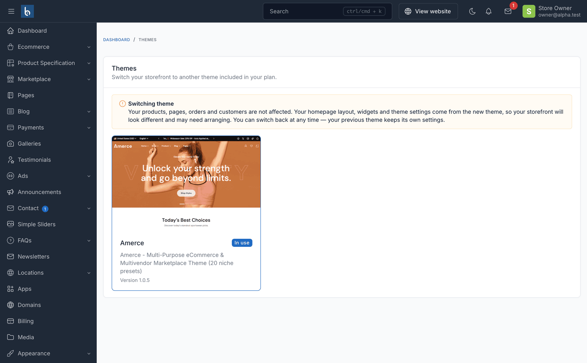

# Adding a storefront theme

The platform ships with **Amerce**. This is how you add another one — Shofy, Farmart,
Hasa, or any Botble ecommerce theme — so customers can pick it at signup and get that
theme's demo content.

A theme is one self-contained directory. Its storefront, screenshots and demo data all
live under `platform/themes/{slug}`:

```text
platform/themes/shofy/
├── theme.json                          name, version, required_plugins
├── screenshot.png                      the card customers see at signup
├── screenshot-home-1.jpg               per-preset artwork
├── public/                             compiled assets (published to public/themes/shofy)
├── database/sample/                    ← demo data
│   ├── database-home-1.sql
│   └── database-home-2.sql
└── ... views, layouts, partials, widgets
```

Copy that directory and you have everything. Delete it and nothing is orphaned.

Five steps. Steps 1–3 are done once per theme, on your own machine; 4–5 are on the
server.

```text
1. install the theme code            platform/themes/{slug}
2. install any plugins it needs      platform/plugins/*
3. add its demo dump(s)              platform/themes/{slug}/database/sample/
4. publish + register                php artisan tenancy:register-theme {slug} --publish
5. sell it                           assign the theme to plans in the operator console
```

Verify at any point with `php artisan tenancy:themes`.

## 1. Install the theme code

Copy the theme directory out of the product it ships in:

```bash
cp -R ~/products/shofy/platform/themes/shofy platform/themes/shofy
composer dump-autoload
```

The directory name is the theme's **slug** and is used everywhere — in the catalog, in
`public/themes/{slug}`, and in its own `database/sample`. It must be a bare lowercase
slug (`^[a-z0-9][a-z0-9-]*$`); anything else is rejected as a path-traversal risk.

Some products ship several themes (Shofy ships `shofy`, `shofy-beauty`,
`shofy-fashion`, `shofy-grocery`, `shofy-jewelry`). Each directory is a **separate
theme** here — copy and register only the ones you want to sell.

## 2. Install the plugins it requires

Read the theme's `theme.json`:

```json
{ "required_plugins": ["ecommerce", "some-plugin"] }
```

Every one of those must exist under `platform/plugins/`. Products carry different
plugin sets, so a theme from elsewhere routinely names one this platform doesn't have.
`tenancy:register-theme` **refuses** a theme with a missing requirement — a store on it
would fatal at boot.

```bash
cp -R ~/products/shofy/platform/plugins/some-plugin platform/plugins/some-plugin
composer dump-autoload
php artisan cms:plugin:activate some-plugin
```

## 3. Generate the demo dump

**This is the step that takes real work.**

Demo data is a **SQL dump**, not seeders. Sibling products ship their demo content as
`database/seeders/**` classes namespaced to their own product — those classes, their
plugin set and their install state don't survive being merged into this tree.
Provisioning imports a dump and nothing else.

Produce one on the theme's own product, then drop it **into the theme**:

```bash
# in a clean install of the source product, with its demo data seeded
php artisan db:seed                       # or the product's documented seeder command

mysqldump --no-tablespaces --single-transaction --default-character-set=utf8mb4 \
  -u root -p shofy_demo > database-home-1.sql

# then, in this platform
mkdir -p platform/themes/shofy/database/sample
cp database-home-1.sql platform/themes/shofy/database/sample/database-home-1.sql
```

Naming: `platform/themes/{theme}/database/sample/database-{preset}.sql`. The `{preset}`
part becomes the choice the customer sees at signup ("Home 1"). Ship one per demo
layout you want to offer. A theme with no dumps is still valid — its stores just start
empty.

Do this once and the theme is portable: zip `platform/themes/shofy` and it carries its
own demo data to any install of this platform.

::: tip Dumps are not web-reachable
`platform/` is not a web root, and publishing copies only the theme's `public/`
directory — so `database/sample` never reaches `public/`. There's a test pinning that.
:::

**What the dump must contain:** the full schema and the demo content, including the
`settings` table. It must be larger than 1KB — Botble's restore silently ignores
anything smaller, which would otherwise "succeed" into an empty store.

**Generate the dump on the theme you're shipping it for.** Theme options are stored per
theme, as `theme-{slug}-*` setting keys, and provisioning does not rename them. A dump
taken from a different theme (or from the same theme under a different directory name)
imports options nobody reads: the store boots on your theme with none of its options
set, falling back to built-in defaults. Check with:

```sql
SELECT `key` FROM settings WHERE `key` LIKE 'theme-%' LIMIT 5;
```

The slug in those keys must be the directory name you install the theme under.

**What provisioning rewrites for you**, so you don't need to clean it by hand:

| In the dump | What happens on import |
| --- | --- |
| Links to the source demo site (`*.botble.com`) | Rewritten to the customer's own domain |
| Demo email addresses (`@botble.com`) | Rewritten to `@example.com` (IANA-reserved, accepts no mail) |
| The demo's admin accounts | **Deleted**, and replaced with the store owner's |
| `theme` setting | Overwritten with the theme the customer chose |
| `activated_plugins` | Reconciled: plugins not installed here are dropped, ones the plan excludes are dropped, the theme's required plugins are added |
| Media files | Not shipped — missing images render as sized placeholders |

Preset slugs are unique **within a theme only** — two themes may both ship
`home-fashion`, and the platform keeps them apart. Every screen and command carries the
`(theme, preset)` pair.

### Overriding a theme's demo data

A theme gets replaced wholesale when you upgrade it, which would take your edits with
it. To keep demo content of your own, put it **outside** the theme:

```text
database/sample/{theme}/database-{preset}.sql     ← wins over the theme's own copy
```

Same filename, same rules. A dump here shadows the theme's version of the same preset,
and adds new presets the theme doesn't ship. Use it for house demo content you don't
want a theme update to touch; otherwise keep everything inside the theme, where it
travels with it.

## 4. Publish and register

```bash
php artisan tenancy:register-theme shofy --publish
```

Two things happen. **Publishing** copies `platform/themes/shofy/public` →
`public/themes/shofy`, plus the theme's `screenshot*.jpg` files (where the signup theme
cards get their artwork). **Registering** validates the theme and creates its
`catalog_items` row — refusing when the theme isn't installed, a required plugin is
missing, or assets couldn't be published. Each of those would otherwise produce a store
that can't be fixed from the customer's own admin.

Registration deliberately does **not** assign plans — that's a pricing decision, made
in step 5. Add `--inactive` to create the catalog row switched off.

```bash
php artisan tenancy:publish-theme-assets   # all themes, no registration
```

::: warning Publishing belongs in your deploy script
`public/themes` is shared by every store, so no customer request is ever allowed to
write there — which means an unpublished theme renders an unstyled shop and nothing
self-heals. Run `tenancy:publish-theme-assets` on every deploy.
:::

## 5. Make it sellable

In the operator console, open each plan that should include the theme and add it. Until
you do:

- **With no themes curated at all**, the platform fails open — every installed theme is
  offered to everyone. This is the default and matches a platform that has never used
  the catalog.
- **Once you curate the first theme**, gating switches on: a theme is only offered
  through a plan that includes it.

That's the one surprise worth remembering — curating a single theme changes the rule
for all of them.


## Verify

```bash
php artisan tenancy:themes
php artisan tenancy:preflight
```

`tenancy:themes` lists every installed theme with its preset count, whether assets are
published, whether its required plugins are present, its catalog status, and how many
stores run it. `tenancy:preflight` turns the same checks into hard failures for any
theme the catalog actively offers.

Then do a real signup on the central domain and confirm the new store renders the theme
with its demo content.

## What customers can and cannot do

A store owner can switch between the themes **their plan includes**, from **Themes** in
their admin. Switching:

- changes their storefront theme, its options and its widgets;
- leaves products, pages, orders and customers untouched;
- is reversible — theme options and widgets are stored per theme and never deleted, so
  switching back restores the previous look;
- **does not** re-import demo content. A store that switches theme keeps its own
  content, and its homepage layout comes from the new theme's defaults, so it may need
  arranging.



Store owners can never install, upload, remove or publish theme code. Botble's
Appearance → Theme screen stays blocked for them — it does all four, on shared files.

## Removing a theme

Deleting `platform/themes/{slug}` while stores are running it **breaks those stores** —
their views disappear. Before removing:

```bash
php artisan tenancy:themes      # the Stores column tells you who is on it
```

Deactivate the catalog row first (stops new signups choosing it), migrate the remaining
stores to another theme, and only then delete the directory. `tenancy:themes` reports
loudly when stores reference a theme that isn't installed.

## Troubleshooting

| Symptom | Cause | Fix |
| --- | --- | --- |
| Store renders unstyled | Assets not published | `tenancy:publish-theme-assets {slug}` |
| `register-theme` refuses: requires plugin(s) | Theme needs a plugin this tree lacks | Install it under `platform/plugins`, or drop the theme |
| Store provisions empty despite a preset | Dump under 1KB, or wrong path | Check `platform/themes/{theme}/database/sample/database-{preset}.sql` and its size |
| Preset missing from signup | Dump not found for that theme | Preset slugs are per theme — check the directory name |
| Demo images are grey placeholders | Media binaries aren't shipped | Expected — see step 3 |
| Theme cards have no artwork | `screenshot*.jpg` not published | Re-run `tenancy:publish-theme-assets` |
| `tenancy:themes` shows a theme no store can pick | Catalog gating is on, no plan includes it | Add it to a plan |
| Store's theme differs from the `tenancy:themes` row | Central/tenant drift after a failed switch | The store's own setting is authoritative; re-switch from the store's Themes screen |

## Related

- [Apps and themes catalog](./usage-apps-themes.md) — the offer/assign/enable model
- [Plans and quotas](./usage-plans.md) — assigning a theme to plans
- [Artisan commands](./commands.md) — full reference for `tenancy:themes`, `tenancy:register-theme`, `tenancy:publish-theme-assets`
