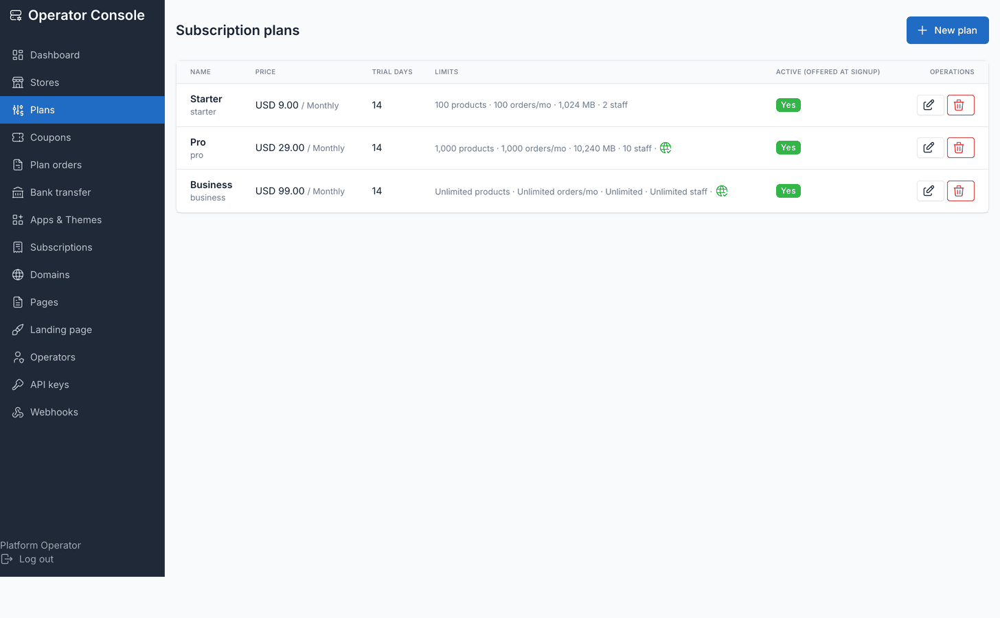
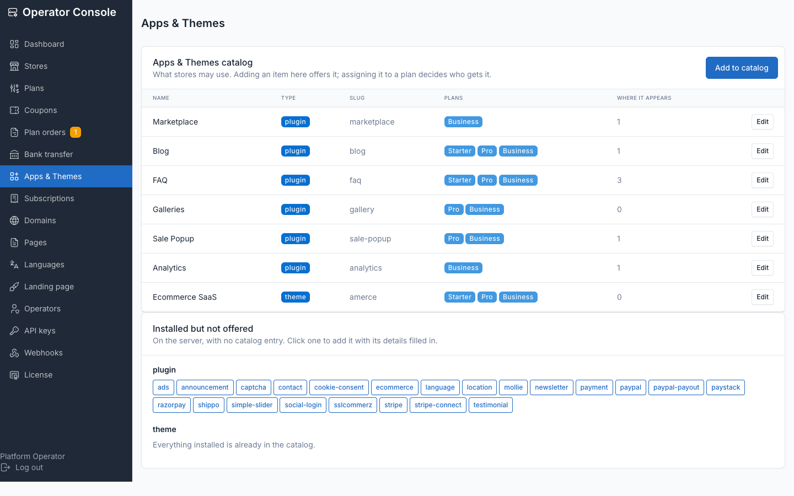
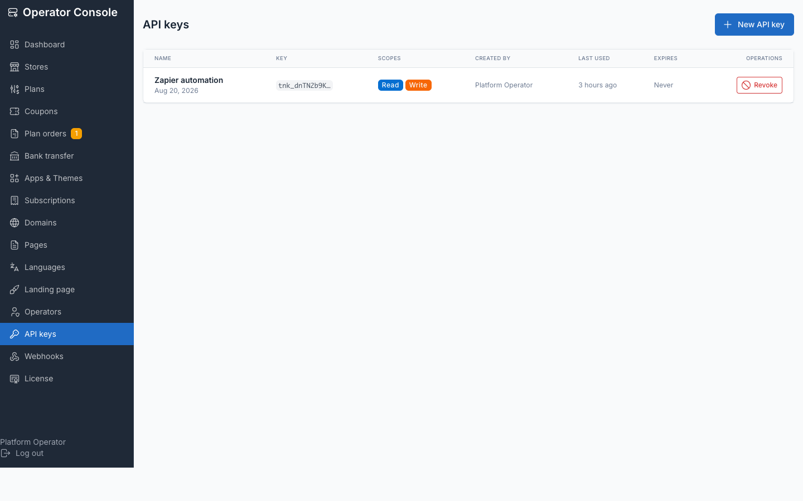
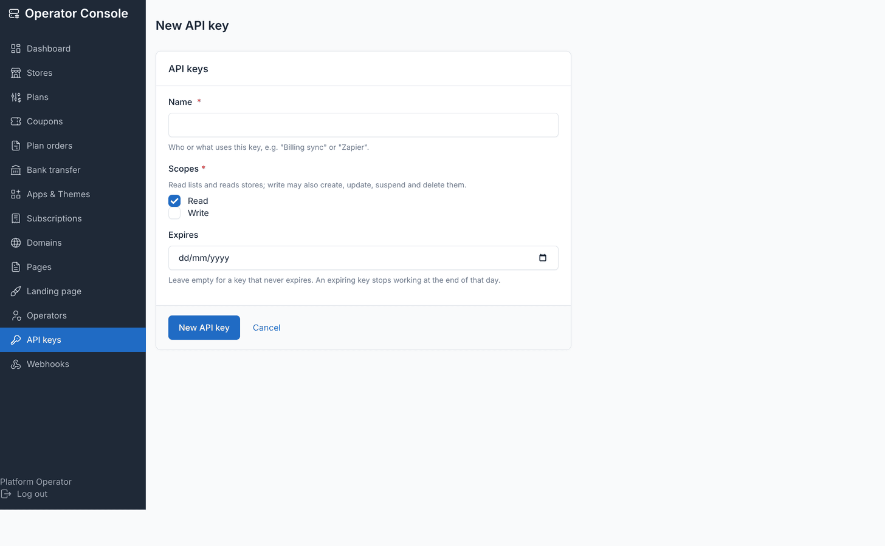

# Features

## Platform overview

Ecommerce SaaS gives you three perspectives on the same system: the operator manages the platform, store owners run their stores, and developers integrate via API.

## Multi-tenant database architecture

- Each store has its **own MySQL database** — no shared store tables
- No store-count limit in the software; capacity is set by your server, mainly MySQL connection and table limits — see [Sizing](./installation-requirements.md#sizing)
- Operators reach a store's admin only by impersonating its owner, and each impersonation is written to the application log

## Operator: Control the platform

The **Operator console** (`/admin/operator` on the central domain) is where you manage everything: create stores, manage plans and billing, curate the app catalog, review custom domains.

| Feature | Purpose |
|---|---|
| **Stores** | Create, suspend, resume, cancel, delete stores; impersonate owners; view usage |
| **Plans** | Design subscription tiers with limits (products, orders/month, storage, staff users; orders and storage are tracked, not enforced) and custom-domain access |
| **Subscriptions** | Assign, change, extend, cancel and reactivate subscriptions; each has an audit log |
| **Plan orders / Bank transfer** | Approve or reject plan orders (bank transfer; gateway orders approve themselves and show *Needs review* when a payment cannot be confirmed); set the transfer instructions. Stripe billing uses Stripe Checkout and the Billing Portal |
| **Plan billing gateways** | From 1.0.2: let store owners pay a plan period with PayPal, Razorpay, Paystack or Mollie |
| **Domains** | Review stores' custom domains and re-run verification |
| **Apps & Themes** | Decide which plugins and themes are offered, and which plans include each |
| **Add-ons** | License add-on plugins (POS Pro, Affiliate Pro, Loyalty Points, ...) once for every store (from 1.0.2) |
| **API keys / Webhooks** | Issue API keys for the control-plane API; configure signed webhook endpoints |
| **Pages / Landing page / Legal & cookies / Languages** | Run the marketing site: pages, brand and copy, company details, cookie consent, languages |
| **Operators** | Manage who can sign in to the console |

## Store owner: Run your store

Store owners log into their own **Store admin** (not the central console) and run their ecommerce business. They see the Botble ecommerce admin, minus platform-owner tooling.

| Feature | Purpose |
|---|---|
| **Products & Catalog** | Create products, manage inventory, set prices and attributes, organize categories |
| **Orders** | Process orders, print invoices, manage returns and refunds |
| **Customers** | Manage customer accounts and their order history |
| **Marketing** | Discount codes, promotions and flash sales |
| **Themes & Design** | Pick their theme at signup, switch among the themes their plan includes, manage pages and menus |
| **Apps** | Turn catalog apps and add-ons on/off, within what their plan includes |
| **Domains** | Connect and verify custom domains; the platform subdomain always keeps working |
| **Billing** | Subscribe, change plan, download invoices, manage card details in the Stripe Billing Portal, or pay by bank transfer or (from 1.0.2) PayPal, Razorpay, Paystack or Mollie |
| **Payment Methods** | Configure Stripe, PayPal, Mollie, Razorpay, and other checkout gateways for their storefront |
| **Settings** | Store details, appearance and shipping settings (email, media and cache settings stay with the platform owner) |

## Developer: Integrate programmatically

The **Control-plane API** (`/api/platform/v1`) lets you automate platform operations from your systems.

| Capability | Purpose |
|---|---|
| **Stores** | Create, read, update, suspend, resume, cancel and delete stores; read usage and a store's event log |
| **Plans and subscriptions** | List plans; assign, change, extend, cancel and reactivate a store's subscription |
| **Domains, apps, themes** | Add, verify, make primary and remove domains; enable/disable apps; switch theme |
| **Webhooks** | Manage endpoints for 27 events (`store.created`, `subscription.activated`, `domain.verified`, ...) with signed, retried delivery |

**39 API endpoints**, rate limiting per key and per IP, and HMAC-SHA256-signed outbound webhooks with a timestamp for replay protection. API keys are issued in the operator console.

See [Control-plane API](./api.md) and [Webhooks](./webhooks.md).

## Key highlights

### Frozen plan terms

When a store subscribes to a plan, its terms are **frozen at purchase**:
- Changing a plan's price, interval, trial, limits or custom-domain access **doesn't affect existing subscribers** (the apps and themes a plan includes are not frozen)
- A self-serve downgrade is refused, with the reason, when the store has more products or staff users than the smaller plan allows
- Deleting a plan retires it; its stores keep their frozen terms

### 43 languages

The platform's screens ship in 43 languages:
- The marketing site publishes in the languages you enable, with a language switcher and `hreflang` once more than one is on
- Lifecycle emails (such as trial reminders) are written in the language the customer signed up in

### Marketplace add-ons

Six add-ons implement the platform's add-on contract:
- **POS Pro** — point of sale in the store admin
- **E-Wallet** — customer wallets and gift cards
- **Affiliate Pro** — affiliate programs
- **Loyalty Points** — points and member levels
- **Live Chat** — chat widget on the storefront
- **SMS Gateways** — SMS and OTP

The operator licenses each once, centrally. Each store toggles it on/off within its plan. The platform side of this ships in 1.0.2. See [Add-ons](./addons-overview.md).

### Isolated storage and cache

Each store's files live under `storage/tenants/tenant<store-id>/`:
- Uploads are served through a tenant-aware asset route
- Cloud storage (S3, R2 and other S3-compatible services) is one platform-wide setting; each store gets its own path prefix in the bucket — see [Cloud storage](./cloud-storage.md)

Cache (Redis, Memcached, file, database) is isolated per store:
- By tag (Redis, Memcached support tagging per-store)
- By prefix (file and database stores use a per-store directory or key prefix)

### Self-serve provisioning

Customers sign up at `/start-your-store`, pick a plan, theme and preset, and confirm their email:
- The store's database is created and the chosen preset's demo data, if any, imported
- A "store is ready" email is sent
- The customer is carried through to their new store

No manual provisioning. See [Self-serve signup](./usage-signup.md).

## Legal and privacy tooling

- Seven legal page templates (terms, privacy, cookies, imprint, refunds, DPA, acceptable use), filled from company details — templates, not legal advice
- Cookie consent banner with Accept all / Reject all / Customise and a consent log with CSV export
- An audit log of each store's subscription changes; impersonations are written to the application log

## Learn more

- [Overview](./index.md) — introduction to multi-tenant ecommerce
- [Quick Start](./quick-start.md) — set up from the command line
- [Why Ecommerce SaaS](./why-ecommerce-saas.md) — design decisions and use cases
- [Architecture](./architecture.md) — how multi-tenancy works under the hood
