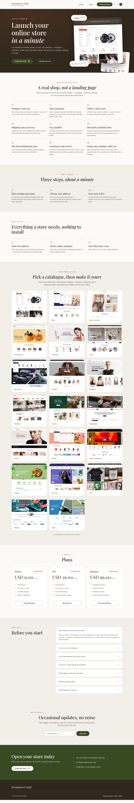
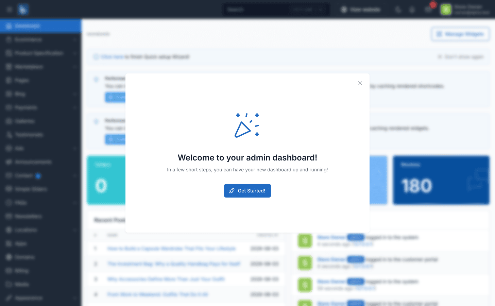

# Ecommerce SaaS — Multi-tenant Store Platform

## Introduction

Ecommerce SaaS turns [Botble CMS](https://botble.com) into a multi-tenant store platform.
One codebase serves many independent online stores. Each store gets its own **isolated
MySQL database**, its own storage, its own domain, its own storefront theme and its own
admin panel — provisioned in about a minute from a central control plane.

Themes are a **catalog, not a hardcoded choice**. You drop any Botble-published ecommerce theme into
`platform/themes/`, register it, and assign it to plans. Store owners pick their theme at
signup and the platform imports that theme's demo data. Amerce ships in the box.

Author: **[Botble Technologies](https://botble.com)**

Email: **contact@botble.com**

## Live Demo

A real running platform, not screenshots — the operator console and live stores are the
same install.

- **Marketing site and signup:** [saas.botble.com](https://saas.botble.com)
- **Operator console:** [saas.botble.com/saas-admin/operator](https://saas.botble.com/saas-admin/operator) — `operator@botble.com` / `12345678`
- **Example store — fashion:** [demo1.saas.botble.com](https://demo1.saas.botble.com) · [store admin](https://demo1.saas.botble.com/saas-admin) — `demo1@botble.com` / `12345678`
- **Example store — sneaker:** [demo2.saas.botble.com](https://demo2.saas.botble.com) · [store admin](https://demo2.saas.botble.com/saas-admin) — `demo2@botble.com` / `12345678`

The two stores run different themes' presets from the same codebase, on their own databases.
To see provisioning end to end, sign up on the marketing site and watch a new store get built
on its own subdomain.

::: tip Admin path on the demo
The demo sets `ADMIN_DIR=saas-admin`, so its admin lives at `/saas-admin` rather than the
default `/admin` used throughout these docs. Changing `ADMIN_DIR` is recommended for any
production install.
:::

## The two sides of the platform

Everything in these docs sits on one side or the other. Keep them straight and the rest
follows.

| | Platform owner | Store owner |
|---|---|---|
| Where | The **operator console** at `/admin/operator` on your central domain | The **store admin** at `/admin` on their own store domain |
| Sign-in | Its own branded login, separate from any store | Standard Botble admin login |
| Sees | Stores, plans, subscriptions, coupons, catalog, domains, operators, API keys, webhooks | Their products, orders, customers — plus Apps, Domains, Billing and Themes |
| Database | The central control-plane database | That store's own database, and nothing else |

## What you get

- **Database-per-tenant** — [stancl/tenancy](https://tenancyforlaravel.com) v3, a central DB
  for the control plane and one DB per store. Cache, filesystem, mail and settings are
  re-bootstrapped on every tenant switch, so nothing leaks between stores.
- **Self-serve provisioning** — public signup imports the chosen theme's demo preset into a
  fresh database, seeds one admin, and the store is live.
- **Plans and quotas** — products, storage, staff users, custom domains and the apps and
  themes a store may use (orders per month are tracked for the dashboard, not capped). Pricing
  and limits are **frozen at purchase**, so editing a plan never re-prices or re-limits the
  stores already on it; apps and themes added to a plan do reach them.
- **Billing** — [Laravel Cashier](https://laravel.com/docs/billing) with Stripe Checkout and
  the Billing Portal, or bank transfer for platforms with no Stripe. Operators can also
  assign, change, extend, cancel and reactivate a plan by hand, with a full audit trail.
- **Custom domains** — store owners attach their own domain, verified over DNS.
- **Apps and themes catalog** — you decide what each plan may use; store owners turn those
  apps on and off for their own store.
- **Control-plane API and webhooks** — a versioned REST API and 27 signed outbound events, so
  the platform fits into whatever you already run.
- **43 locales** — every string a store owner, shopper or operator sees is translatable.

## Where to start

| You want to | Read |
|---|---|
| Get the platform running | [Requirements](./installation-requirements.md) → [Installation](./installation.md) |
| Choose hosting and a server | [Choosing a server](./installation-hosting.md) |
| Check the license | [License](./license.md) |
| Understand the tenancy model | [How it works](./architecture.md) |
| Learn the console | [Operator console](./operator-console.md) |
| Sell plans | [Plans and quotas](./usage-plans.md) → [Billing with Stripe](./usage-billing-stripe.md) |
| Offer another theme | [Adding a storefront theme](./adding-a-theme.md) |
| Integrate your own systems | [Control-plane API](./api.md) → [Webhooks](./webhooks.md) |
| Help a store owner | [What store owners see](./store-owner-guide.md) |
| Find answers | [FAQ](./faq.md) |
| Fix something | [Troubleshooting](./troubleshooting.md) |

::: warning Two cron entries are not optional
`tenancy:webhooks-deliver` must run **every minute** or webhook retries never fire, and
`tenancy:publish-theme-assets` must run **on every deploy** or theme assets go missing.
See [Queue worker and cron](./cronjob.md).
:::

## Built on Botble CMS

Outside the tenancy layer this is stock Botble. Products, orders, customers, shipping, tax,
marketplace, SEO and everything else behave exactly as documented in the
[Botble CMS docs](/cms/) — store owners can follow those guides directly.

Thank you for purchasing our product. If you have a question beyond the scope of these docs,
contact us through our [user page](https://codecanyon.net/user/botble) and we will help.
