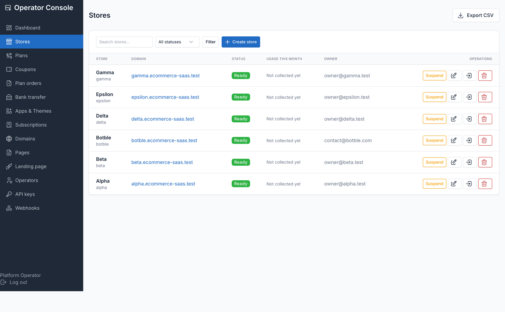
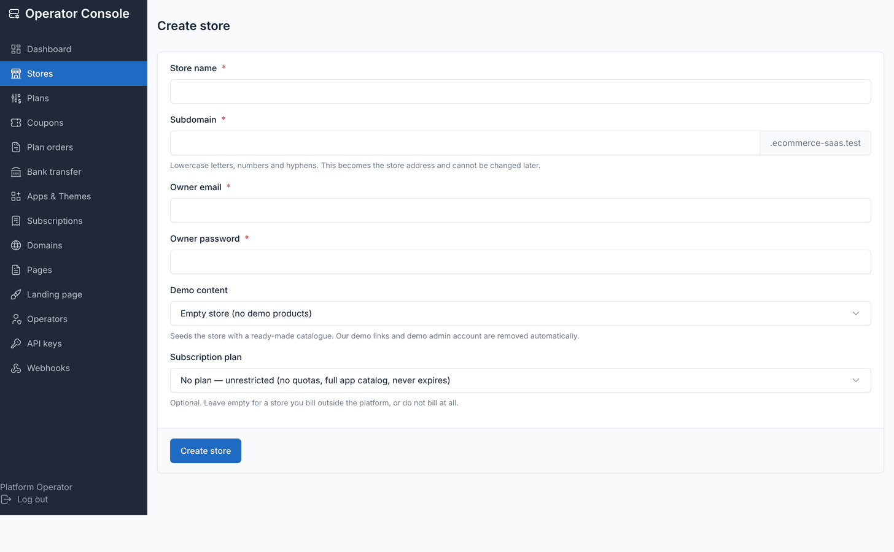
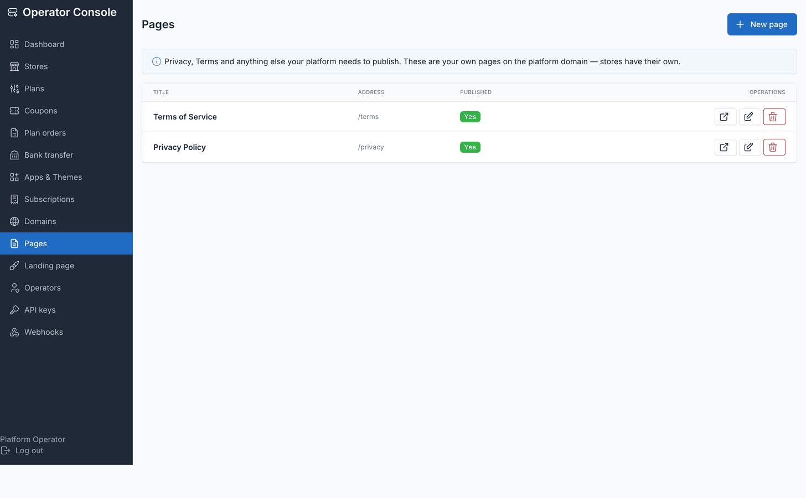

# Installation

Before you start, check [Requirements](./installation-requirements.md). Once the steps
below are done, preflight verifies the server can run the SaaS:

```bash
php artisan tenancy:preflight
```

Run it **after** migrating and publishing theme assets, and before creating your
first store. It asserts that the control-plane tables exist and that the active
theme's assets are published, so on a bare clone it reports failures that are
simply steps you have not reached yet.

## Configure the environment

```env
APP_URL=https://yourdomain.com

# Control-plane host(s). Never a store's host.
CENTRAL_DOMAINS=yourdomain.com

# The central database. Holds BOTH Botble's own tables (settings, pages, the
# landing site) AND the control plane — operators (admins) plus the tenant
# registry (tenants, domains, plans, subscriptions, usage, billing).
# `central` is the application's default connection; see config/database.php.
DB_CONNECTION=central
DB_DATABASE=saas_central
CACHE_STORE=database
QUEUE_CONNECTION=redis

# If using Redis for cache, do not share a db index with the queue; see "Redis configuration (if you use it)" below.
REDIS_CACHE_DB=1

# Tenant databases are named <prefix><id>, e.g. tenant_<uuid>.
TENANCY_DB_PREFIX=tenant_

# MUST stay empty. A cookie scoped to the parent domain is shared by every
# store subdomain, which means one store's session id is valid on another's.
SESSION_DOMAIN=
SESSION_DRIVER=database

# Optional: hostname customers point their CNAME at (defaults to CENTRAL_DOMAINS)
TENANCY_CNAME_HOST=

# The seeded operator account. SET THESE — the shipped defaults are
# operator@botble.com / operator / 12345678, which must never reach production.
OPERATOR_ADMIN_EMAIL=you@yourdomain.com
OPERATOR_ADMIN_USERNAME=youroperator
OPERATOR_ADMIN_PASSWORD=<a long random password>
```

::: danger Never set SESSION_DOMAIN
Leave `SESSION_DOMAIN` empty. A cookie scoped to the parent domain (e.g.
`.yourdomain.com`) is shared by every store subdomain, which means one
store's session id would be valid on another store — a cross-tenant session
leak. Each store must get its own, host-scoped session cookie.
:::

### Redis configuration (if you use it)

If you upgrade from the shipped `CACHE_STORE=database` to Redis later:

- **`maxmemory-policy noeviction`.** Under an LRU policy Redis can evict any tenant's
  keys independently of any other's, so one busy store can push a quiet one's cache
  out. If you must cap memory, cap it and let writes fail loudly instead.
- **Keep the cache on its own db index.** `REDIS_CACHE_DB=1` while the queue uses db
  `0`. Clearing the cache issues `FLUSHDB` against the cache db — point both at one
  index (or set `REDIS_QUEUE_CONNECTION=cache`) and *"Clear cache" deletes every
  queued job for every store*. This is a critical data loss hazard.
- **Set `APP_NAME`, or an explicit `CACHE_PREFIX`.** The cache prefix is derived from
  `APP_NAME`; two installs sharing one Redis under the default name collide.
- `REDIS_CLIENT=predis` is shipped and needs no PHP extension. `phpredis` is faster if
  you can install it.

## Create the database and migrate

The control plane is co-located with Botble in the central database, on the
`central` connection — which is also the application default. One database,
one migrate.

```bash
mysql -e "CREATE DATABASE saas_central CHARACTER SET utf8mb4 COLLATE utf8mb4_unicode_ci"

php artisan migrate --force   # Botble + the control-plane tables
php artisan db:seed --class="Botble\Tenancy\Database\Seeders\OperatorAdminSeeder" --force
```

`migrate` creates the control-plane tables (`admins`, `tenants`, `domains`,
`plans`, `tenant_subscriptions`, `tenant_usage`, `tenant_billing_events`)
alongside Botble's own and seeds three starter plans; the seeder creates the
operator account from `OPERATOR_ADMIN_EMAIL` / `OPERATOR_ADMIN_USERNAME` /
`OPERATOR_ADMIN_PASSWORD`.

::: danger Set the operator credentials before seeding
Omit those variables and the seeder falls back to `operator@botble.com`,
username `operator`, password `12345678` — the shipped demo values. The
operator console can create, suspend and delete every store on the platform.
:::

::: warning migrate:fresh drops the control plane too
Because the control-plane tables share the central database, a fresh migrate
wipes `tenants`, `domains` and `admins` while the tenant databases themselves
survive — leaving provisioned stores orphaned. Re-link them without
re-provisioning:

```bash
php artisan db:seed --class="Botble\Tenancy\Database\Seeders\RebuildTenantRegistrySeeder" --force
```

It only re-registers databases that already exist; it never creates one.
:::

### Fonts for the public pages

The central domain's public pages (landing, signup, sign-in, the waiting
page, and the parked page shown on suspended stores) use two self-hosted
webfonts — Playfair Display and Inter. Nothing is fetched from a CDN.

```bash
php artisan cms:publish:assets            # or: vendor:publish --tag=cms-public --force
php artisan tenancy:publish-theme-assets  # storefront themes -> public/themes
```

`composer install` runs the first of these for you. If it is skipped the
pages still render correctly — their CSS is inline by design, so only the
typeface changes, falling back to Georgia and the system sans.
`tenancy:publish-theme-assets` belongs in your deploy script — see
[Queue worker and cron](./cronjob.md).

## Activate the plugins

Plugins are activated **platform-wide**, once, by you — never per store. The activated set
lives in the central `settings.activated_plugins` row, and that is what actually loads the
plugin code. A store's own `activated_plugins` setting is only a toggle *over that set*, so
a freshly provisioned store can list `ecommerce` in its settings and still have no ecommerce
code loaded.

```bash
php artisan cms:plugin:activate ecommerce
```

Activate every plugin your themes and plans rely on. Order matters wherever a plugin declares
`require` in its `plugin.json`: `payment` before `stripe`, `ecommerce` before `marketplace`,
`language` before `language-advanced`.

::: danger Skipping this breaks every storefront
Storefronts return 500 with `Call to undefined function get_all_currencies()` while the
operator console keeps working and `tenancy:preflight` reports all checks passed — preflight
does not inspect the activated set. Verify with:

```bash
mysql saas_central -e "SELECT value FROM settings WHERE \`key\`='activated_plugins'"
```
:::

## Sign in to the operator console

The central panel uses its own `admins` guard — NOT Botble users. Sign in at
`https://yourdomain.com/admin` (it redirects to the branded operator login)
with the `OPERATOR_ADMIN_EMAIL` / `OPERATOR_ADMIN_PASSWORD` from the
environment step.


Once signed in you land on the console dashboard — store counts by state,
MRR, active subscriptions, trials, past-due and domains awaiting
verification. Manage additional operators from **Operators** in the console.
See the [Operator console](./operator-console.md) guide for a full tour.


## Run the worker and cron

Provisioning is queued, so **nothing gets provisioned without a worker** — a
store registered through the browser sits on "Preparing…" forever until a
worker picks the job up.

```bash
php artisan queue:work --queue=default --tries=1 --timeout=900
```

**No worker? (local dev, or a small single-server deploy)** set:

```env
TENANCY_PROVISION_SYNC=true
```

Provisioning then runs inline during the signup request (~1–2s) so stores go
live immediately without a worker. Leave it `false` in production and run the
worker above under a process manager.

The crontab that drives scheduled maintenance, usage collection, billing and
webhook retries is documented in full in
[Queue worker and cron](./cronjob.md) — set that up before you rely on
billing suspension or webhook retries.

Before creating a store, make sure wildcard DNS and TLS are in place — see
[Wildcard DNS and TLS](./installation-dns-tls.md).

## Create your first store

Either from **Operator console → Stores → Create store**:





Or from the command line:

```bash
php artisan tenancy:create-tenant acme \
  --name="Acme Store" --email=owner@acme.com --preset=home-fashion
```

Presets seed a ready-made catalogue from the theme's own `database/sample/`.
Demo URLs and the demo admin account are stripped automatically —
provisioning **fails** rather than shipping a store that still references
them.

## The platform's own pages

The control-plane domain serves the platform, not a shop:

| URL | Purpose |
|---|---|
| `https://yourdomain.com/` | Landing page — pitch, plans, "create your store" |
| `https://yourdomain.com/start-your-store` | Self-serve registration |
| `https://yourdomain.com/sign-in` | "Find my store" — owner email → their store's login |
| `https://yourdomain.com/admin` | Your control plane (Stores) |

Botble's theme owns `GET /`, so without the landing middleware the central
domain would render the active **storefront** theme instead. Replace the
landing copy with your own marketing site from the console, or set
`TENANCY_LANDING_ENABLED=false` to serve your own page there. Publish your
Terms, Privacy and other central pages from the console's **Pages** screen —
they're Markdown, and HTML is stripped when they render.



A registrant is signed straight into their new store when provisioning
finishes — no second login.

## Next steps

- [Wildcard DNS and TLS](./installation-dns-tls.md) — before your first store goes live
- [Queue worker and cron](./cronjob.md) — the full crontab
- [Billing with Stripe](./usage-billing-stripe.md) — optional, add your keys when you want to charge
- [Operator console](./operator-console.md) — a full tour of the console
