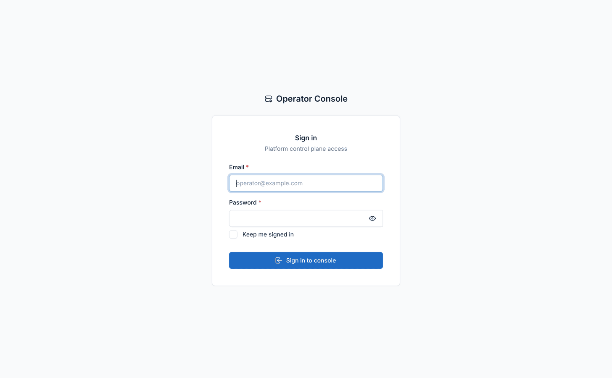
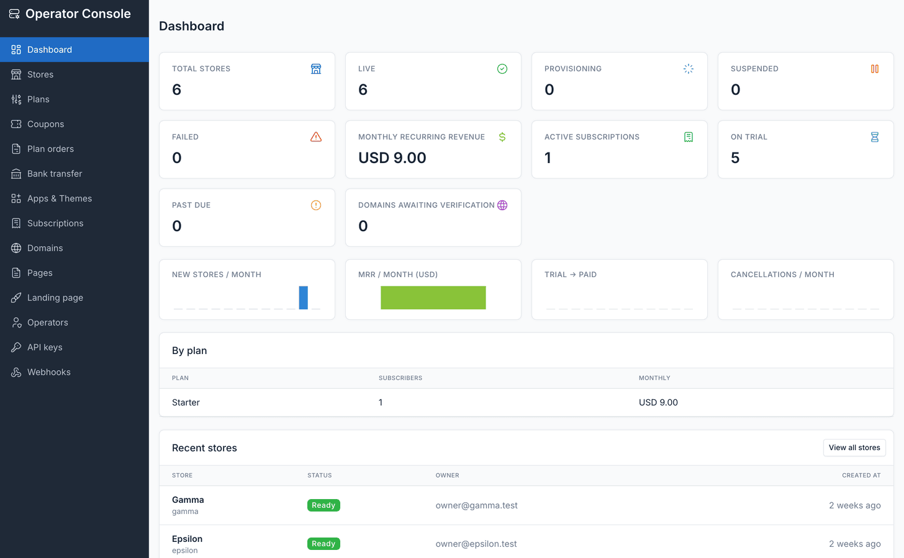
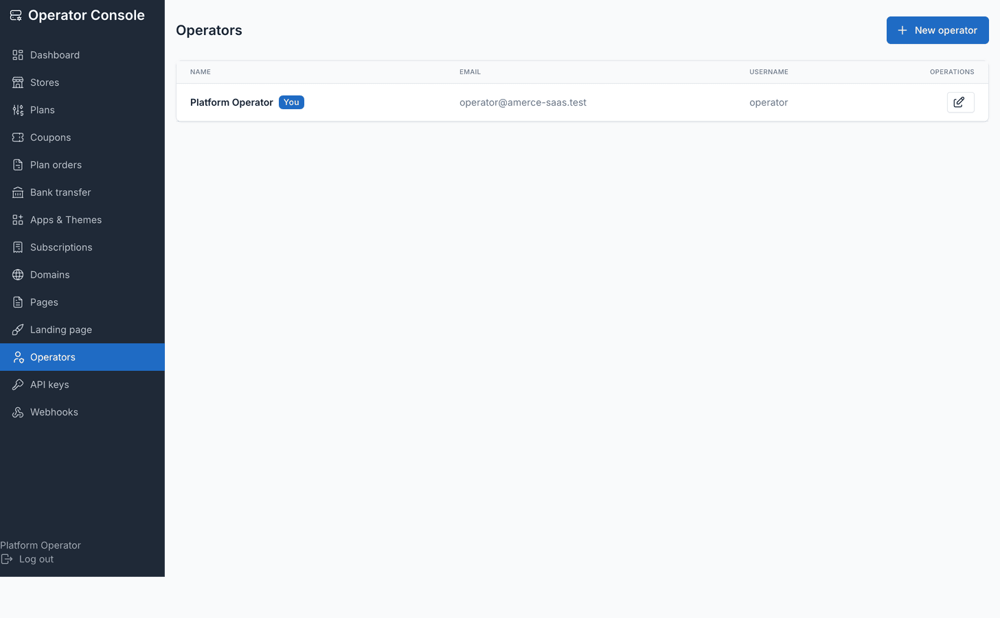

# Operator console

The **operator console** is where the platform owner runs the SaaS. It lives at
**`/admin/operator`** on the central domain — a distinct, branded panel with its own
layout and its own sign-in, not the regular Botble storefront-admin shell store owners
get. It authenticates against the standalone `admins` guard (a separate table from
Botble's `users`), so a store owner's login never opens it and an operator account
never opens a store's admin.

::: warning Central domain only
Every operator-console route carries `CentralDomainsOnly` middleware, which **404s**
rather than redirecting. Visit `/admin/operator` on a store's own domain and you get a
plain 404 — the console does not exist there.
:::

From the regular Botble central admin, a **Stores** sidebar entry (`ti ti-server-cog`)
links straight into the console dashboard. You can also go directly to
`/admin/operator/login`.

## Sidebar

| Section | What it does |
|---|---|
| Dashboard | Store counts, MRR, subscription health and recent activity — see below |
| [Stores](./usage-stores.md) | Create, edit, suspend, impersonate and delete stores; export the listing to CSV |
| [Plans](./usage-plans.md) | Define subscription tiers: price, interval, trial, quotas, entitlements |
| [Coupons](./usage-coupons.md) | Signup promo codes that grant extra trial days |
| [Plan orders](./usage-bank-transfer.md) | Bank-transfer requests awaiting approval or rejection |
| [Bank transfer](./usage-bank-transfer.md) | Turn offline payment on, set the account details and receipt prefix |
| [Apps & Themes](./usage-apps-themes.md) | Curate the catalog of plugins and themes stores may use, and assign it to plans |
| [Subscriptions](./usage-subscriptions.md) | Assign, change, extend, cancel or reactivate a store's plan by hand |
| [Domains](./usage-domains.md) | Oversight of every custom domain and its verification state |
| [Pages](./usage-marketing-site.md) | Central pages — Terms, Privacy, About — published on the marketing site |
| [Landing page](./usage-marketing-site.md) | Hero copy, testimonials, brand assets and the marketing sections |
| Operators | Platform super-admin accounts for the console itself — see below |
| [API keys](./api.md) | Bearer credentials for the control-plane REST API |
| [Webhooks](./webhooks.md) | Outbound event endpoints and their delivery logs |

## Dashboard

### Store-count tiles

| Tile | Meaning |
|---|---|
| Total stores | Every store row, any status |
| Live | `ready` — provisioning succeeded, storefront serves normally |
| Provisioning | Provisioning job currently running (`pending` + `provisioning`) |
| Suspended | Manually suspended, or billing past the grace period |
| Failed | Provisioning failed; the database is kept for diagnosis, not auto-retried |

Cancelled stores have no tile of their own — filter for them on the
[Stores](./usage-stores.md) list instead.

### Billing tiles

| Tile | Meaning |
|---|---|
| Monthly recurring revenue (MRR) | Sum of active subscriptions' prices |
| Active subscriptions | Subscriptions in `trialing`, `active` or `past_due` |
| On trial | Subscriptions currently trialing |
| Past due | Payment failed, inside the grace period before suspension |
| Domains awaiting verification | Custom domains added but not yet DNS-verified |

### Trends and tables

Four per-month sparklines: new stores, MRR, trial-to-paid conversion, and
cancellations. New-store, conversion and cancellation trends are derived from data
already recorded, so they work retroactively. **MRR history is different** — it is
captured daily by `tenancy:billing-maintenance`, because nothing stores a historical
price (plans get edited and retired, so replaying today's prices over past months
would produce a confident, wrong chart). The MRR chart starts at first capture and
cannot be back-filled.

The **by-plan table** lists subscriber count and monthly revenue per plan; subscribers
paying in a different currency are excluded from the MRR figure and called out with a
count. **Recent stores** lists the newest signups with a link to the full Stores list.

## Operators

Operator accounts are the console's own super-admins — the equivalent of a platform
super-user, unrelated to any store's staff. **Console → Operators → New operator** asks
for a first name, last name, email, username and password; editing one leaves the
password unchanged unless you fill it in.

You cannot delete your own account, and you cannot delete the last remaining operator
— the console refuses both rather than locking everyone out.

