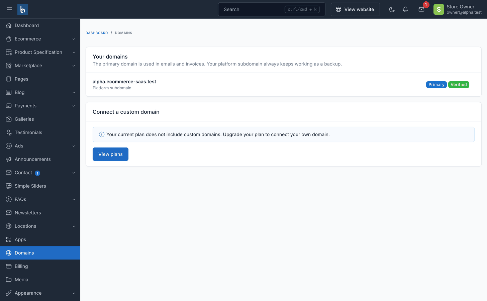
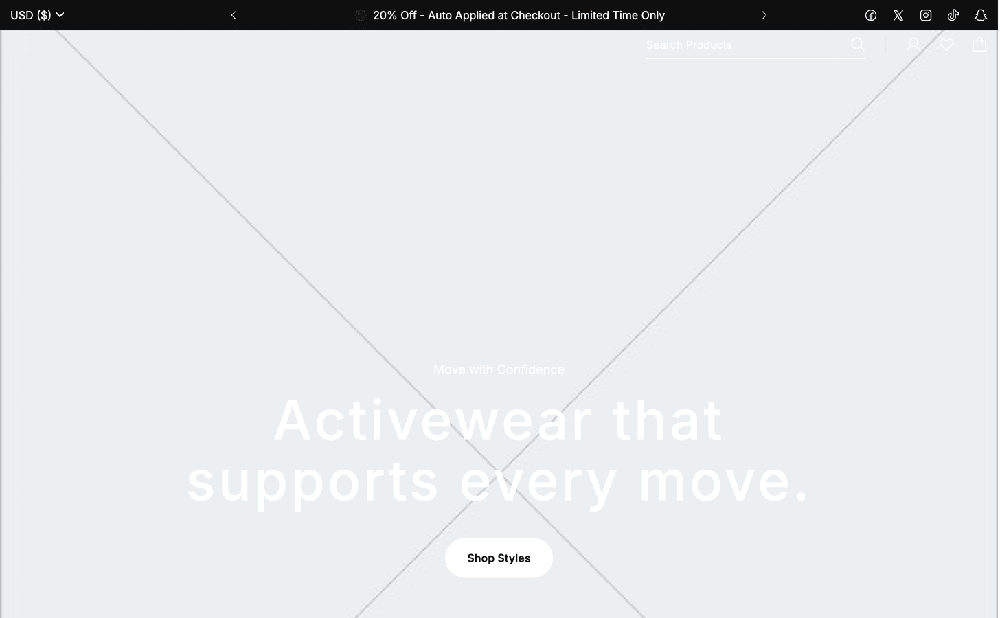

# What store owners see

A store owner's admin lives at **`/admin`** on their own store's domain — a stock
Botble ecommerce admin, plus four screens this platform adds, minus the screens that
would let a store touch shared platform infrastructure.

## The four tenancy screens

| Screen | What it's for |
|---|---|
| [Apps](./usage-apps-themes.md) | Turn plan-included apps on and off for this store |
| [Domains](./usage-domains.md) | Connect and verify a custom domain |
| [Billing](./usage-billing-stripe.md) | Current plan, invoices, Stripe Checkout / Billing Portal |
| Themes | Switch the storefront's theme, when more than one is available |

### Apps

The replacement for Botble's Plugins screen, which stores never see (installing code
touches the shared filesystem — a platform-owner action, not a store one). Apps only
lists what the operator's catalog offers this store's plan, each with an On/Off
toggle. Turning one on writes only that store's own `activated_plugins` setting; no
migrations run and nothing shared is touched. The menu item itself is hidden entirely
for a store whose plan includes nothing from the catalog.

### Domains

Self-serve custom-domain management, gated by the plan's `allows_custom_domain`
entitlement. See [Custom domains](./usage-domains.md) for the DNS records and
verification flow.

### Billing

Current plan card and invoice history, with Stripe Checkout and the Stripe Billing
Portal for self-serve plan changes and card updates when the platform has Stripe
configured. Without Stripe keys the screen degrades to an informational "your plan"
page.

### Themes

The replacement for Botble's Appearance → Theme screen, which stays blocked for the
same reason Plugins does — switching theme code touches the shared filesystem. This
screen only lets a store switch among the themes its plan entitles it to, and only
appears once there's an actual choice (more than one theme available); each theme's
options are namespaced per theme, so a switch is fully reversible.

## What a store owner cannot do

A store owner is a Botble super-user by role, so these restrictions are enforced by
hiding the menu items **and** blocking the routes (a typed URL 404s too), not by ACL
permissions alone:

- **No Plugins, System, Backups, License or Optimize screens** — that tooling manages
  the shared server, not a single store's data.
- **No Theme code screen** — cannot install, remove or switch a theme's underlying
  files (only its own **Themes** screen, scoped to the catalog).
- **No platform-owner Settings sections** — Email, Media, Cache and License settings
  stay with the platform owner; the store keeps its own general, appearance and
  phone-number settings.

## Everything else is stock Botble

Products, orders, customers, marketing, and the rest of the storefront admin are
unmodified Botble ecommerce — see the [Botble CMS docs](/cms/) for how those screens
work. The storefront itself renders through whichever theme the store is on (Amerce
ships in the box).

## See also

- [Apps & Themes](./usage-apps-themes.md) — how the operator curates what appears here
- [Billing (Stripe)](./usage-billing-stripe.md) — the billing screen in full
- [Custom domains](./usage-domains.md) — DNS records and verification
