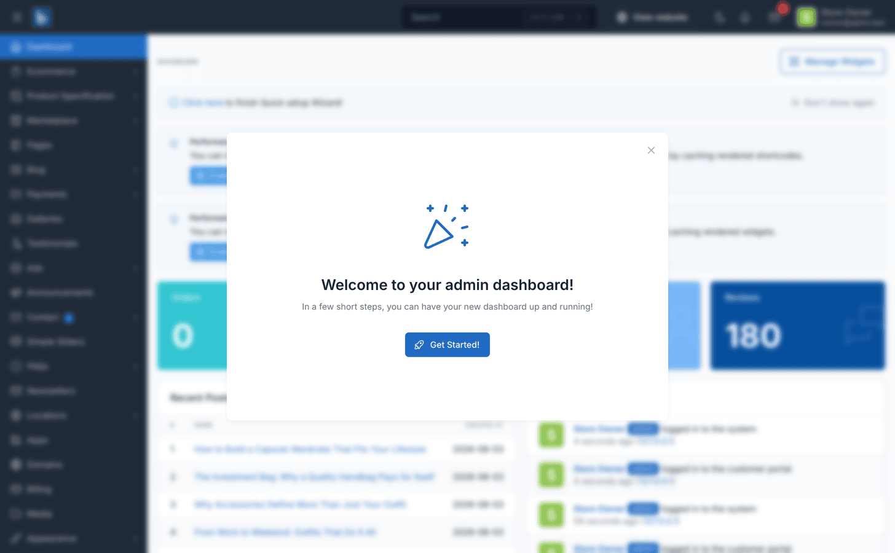
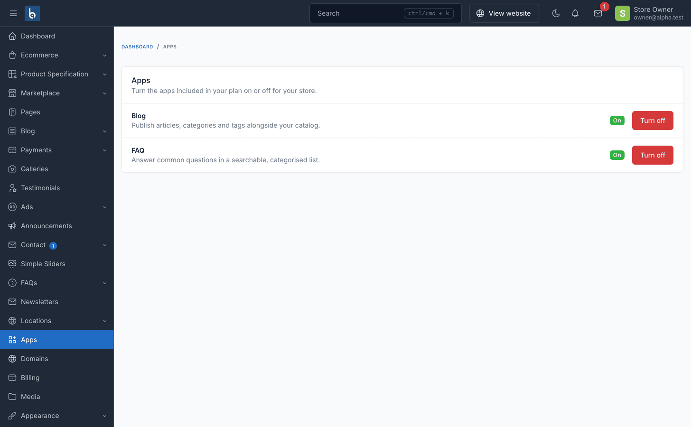
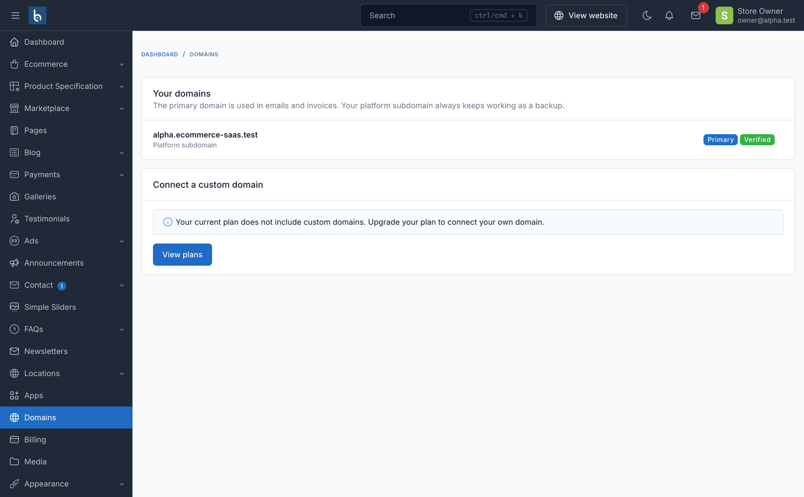
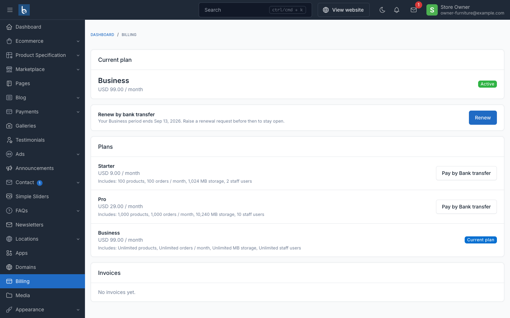
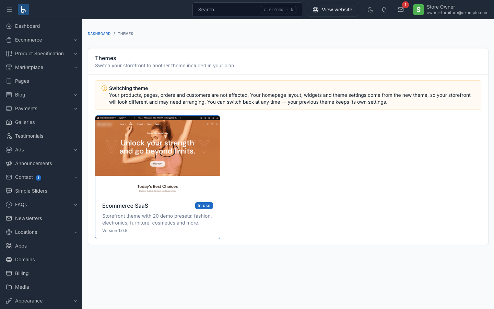
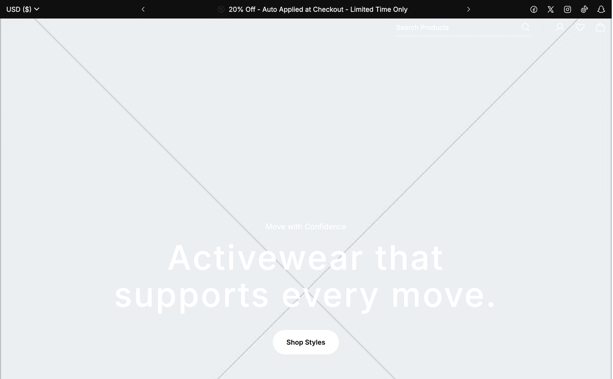

# What store owners see

A store owner's admin lives at **`/admin`** on their own store's domain — a stock
Botble ecommerce admin, plus four screens this platform adds, minus the screens that
would let a store touch shared platform infrastructure.

## The four tenancy screens

| Screen | What it's for |
|---|---|
| [Apps](./usage-apps-themes.md) | Turn plan-included apps on and off for this store |
| [Domains](./usage-domains.md) | Connect and verify a custom domain |
| [Billing](./usage-billing-stripe.md) | Current plan, invoices, Stripe Checkout / Billing Portal |
| Themes | Switch the storefront's theme, when more than one is available |

### Apps

The replacement for Botble's Plugins screen, which stores never see (installing code
touches the shared filesystem — a platform-owner action, not a store one). Apps only
lists what the operator's catalog offers this store's plan, each with an On/Off
toggle. Turning one on writes only that store's own `activated_plugins` setting; no
migrations run and nothing shared is touched. The menu item itself is hidden entirely
for a store whose plan includes nothing from the catalog.

**What store owners do here:**
- View the list of available apps included in their plan
- Turn apps on (app's menu items and screens appear) or off (hidden from their admin)
- Each app toggle is independent — turning one off doesn't affect others
- When an app is off, its menu items are hidden and its screens return 404

**Add-ons that can appear here** once the platform owner installs and offers them:
- **POS Pro** — point of sale in the store admin
- **E-Wallet** — customer wallets and gift cards
- **Affiliate Pro** — affiliate programs
- **Loyalty Points** — points and member levels
- **Live Chat** — storefront chat widget
- **SMS Gateways** — SMS and OTP

See [Add-ons Overview](./addons-overview.md) for more details on each add-on.

### Domains

Self-serve custom-domain management, gated by the plan's `allows_custom_domain`
entitlement. See [Custom domains](./usage-domains.md) for the DNS records and
verification flow.

**What store owners do here:**
- Connect their own custom domain (e.g., `shop.example.com`) if their plan allows
- View the exact DNS records to add (a TXT record for ownership, a CNAME for traffic)
- Verify domain ownership with **Check now**
- Connect several custom domains (up to `TENANCY_MAX_CUSTOM_DOMAINS`, default 5) and choose the primary one
- Default subdomain (e.g., `mystore.yourdomain.com`) always works, even without a custom domain

**Prerequisites:**
- Store's plan must have **Allow custom domains** ticked
- Domain must be registered and accessible to add DNS records
- DNS records must be added before verification

**Typical workflow:**
1. Store owner enters their domain name
2. Platform shows exact DNS records to add (CNAME + TXT)
3. Store owner updates DNS at their registrar
4. Store owner clicks **Check now**; pending domains are also re-checked by `tenancy:verify-domains` on cron
5. The TLS certificate is issued by your web server (e.g. Caddy on-demand TLS) — see [Wildcard DNS and TLS](./installation-dns-tls.md)

### Billing

Current plan card and invoice history, with Stripe Checkout and the Stripe Billing
Portal for self-serve plan changes and card updates when the platform has Stripe
configured. Without Stripe, bank transfer or a plan billing gateway the screen degrades
to an informational "your plan" page.

**What store owners do here:**
- View current plan, price, interval and subscription status (trial days left, payment due, suspended)
- Subscribe or change plan through Stripe Checkout
- Downgrade to a smaller plan (refused while the store has more products or staff users than it allows)
- Download Stripe invoices
- Update card details, review upcoming charges or cancel in the Stripe Billing Portal
- Pay or renew by bank transfer, when the platform offers it
- Pay or renew with PayPal, Razorpay, Paystack or Mollie, when the platform offers them (from 1.0.2). Each payment buys one period; pay again before it ends

**Billing methods available (depends on platform configuration):**
- **Stripe** — Stripe Checkout and the Stripe Billing Portal
- **Bank transfer** — offline; the operator approves the payment by hand
- **PayPal, Razorpay, Paystack, Mollie** (from 1.0.2) — one period per payment, approved automatically
- **None of these** — the operator assigns plans from the console; the Billing screen says online payment is not enabled

**Typical workflow:**
1. New store owner signs up on a plan, with the trial the plan defines
2. Trial reminder emails go out before the trial ends (7, 3 and 1 days before by default)
3. Before the trial ends, they subscribe through Stripe Checkout, a bank-transfer request, or a plan billing gateway (from 1.0.2)
4. They can change plan later from the same screen

### Themes

The replacement for Botble's Appearance → Theme screen, which stays blocked for the
same reason Plugins does — switching theme code touches the shared filesystem. This
screen only lets a store switch among the themes its plan entitles it to, and only
appears once there's an actual choice (more than one theme available); each theme's
options are namespaced per theme, so a switch is fully reversible.

**What store owners do here:**
- See the themes included in their plan
- Switch to a different theme (reversible)
- Customize theme options (colors, fonts, homepage layout, etc.)

**Important notes:**
- Only one theme can be active at a time per store
- The first theme was chosen at signup (optionally with a preset demo layout)
- Theme customizations are saved per theme, so switching back retains previous settings
- Store owners cannot install new themes (platform owner manages theme installation)

**Typical workflows:**
1. Store owner picks "Amerce" theme at signup with the "Fashion Store" preset
2. They customize storefront appearance (colors, fonts, homepage content)
3. Later, if more themes are available, they can switch to another theme
4. Their "Amerce" customizations are saved and can be restored by switching back

## What a store owner cannot do

A store owner is a Botble super-user by role, so these restrictions are enforced by
hiding the menu items **and** blocking the routes (a typed URL 404s too), not by ACL
permissions alone:

- **No Plugins, System, Backups, License or Optimize screens** — that tooling manages
  the shared server, not a single store's data.
- **No Theme code screen** — cannot install, remove or switch a theme's underlying
  files (only its own **Themes** screen, scoped to the catalog).
- **No platform-owner Settings sections** — Email, Media, Cache and License settings
  stay with the platform owner; the store keeps its own general, appearance and
  phone-number settings.

## Everything else is stock Botble

Products, orders, customers, marketing, and the rest of the storefront admin are
unmodified Botble ecommerce — see the [Botble CMS docs](/cms/) for how those screens
work. The storefront itself renders through whichever theme the store is on (Amerce
ships in the box).

**Store owners have full access to:**
- **Products** — create, edit, organize products; manage inventory and pricing
- **Orders** — process orders, manage refunds, print invoices, handle returns
- **Customers** — customer profiles, order history, reviews
- **Marketing** — discount codes and flash sales
- **Appearance** — theme options, menus and pages (switching theme is on the **Themes** screen; custom CSS/JS/HTML is blocked)
- **Settings** — store name, logo, address, shipping methods
- **Reports** — sales analytics, customer insights, product performance
- **Payment Methods** — configure Stripe, PayPal, Mollie, and other checkout gateways

**What they cannot access:**
- Platform owner console (Operator screens)
- System administration (plugins, cache, backups), and the Email and Media settings
- License management
- Platform-wide settings

## Operator reference for store owner workflows

If you're the platform operator supporting store owners:

| Use case | Store owner does | You do (if needed) |
|---|---|---|
| Store owner needs access to their admin | Signs in at `/admin` on their store's domain | **Log in as owner** from **Operator console → Stores** to look around for them |
| Store owner wants to add a custom domain | **Domains** → Add domain (follow the DNS instructions) | Check the certificate was issued; re-run verification from **Operator console → Domains** |
| Store owner wants to enable an add-on | **Apps** → switch it on | Make sure it is in the catalog, their plan is ticked, and it is licensed in **Operator console → Add-ons** (from 1.0.2) |
| Store owner wants to upgrade their plan | **Billing** → choose a plan (Stripe Checkout, bank transfer or a plan billing gateway) | Approve the bank-transfer order, if they paid that way; gateway orders approve themselves |
| Store owner's trial is ending | Automatic reminder emails (7, 3 and 1 days before, by default) | Follow up if they have not subscribed |
| Store owner reports an issue | Contact support | Investigate from operator console; impersonate to reproduce if needed |

## See also

- [Quick Start](./quick-start.md) — CLI setup (for operators)
- [Apps & Themes](./usage-apps-themes.md) — how the operator curates what appears here
- [Billing (Stripe)](./usage-billing-stripe.md) — setting up plan billing
- [Custom domains](./usage-domains.md) — DNS records and verification
- [Add-ons Overview](./addons-overview.md) — marketplace extensions store owners can toggle
