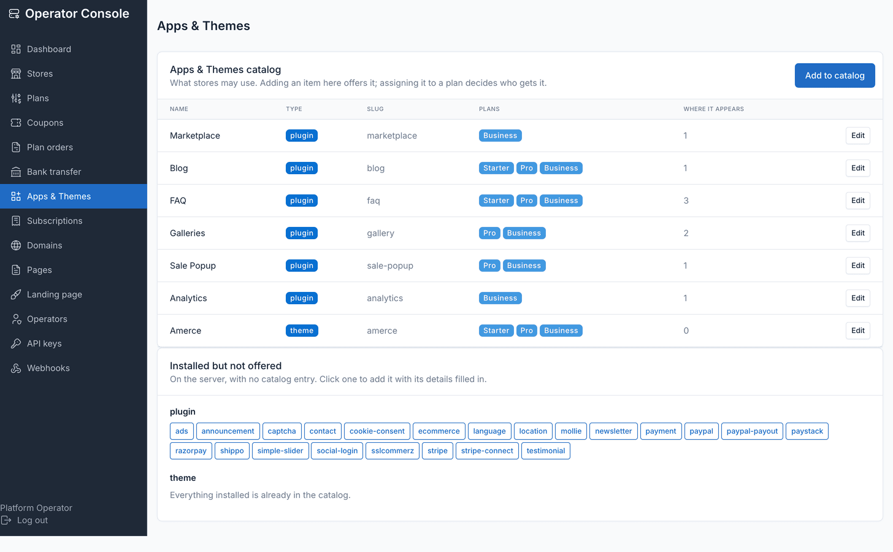
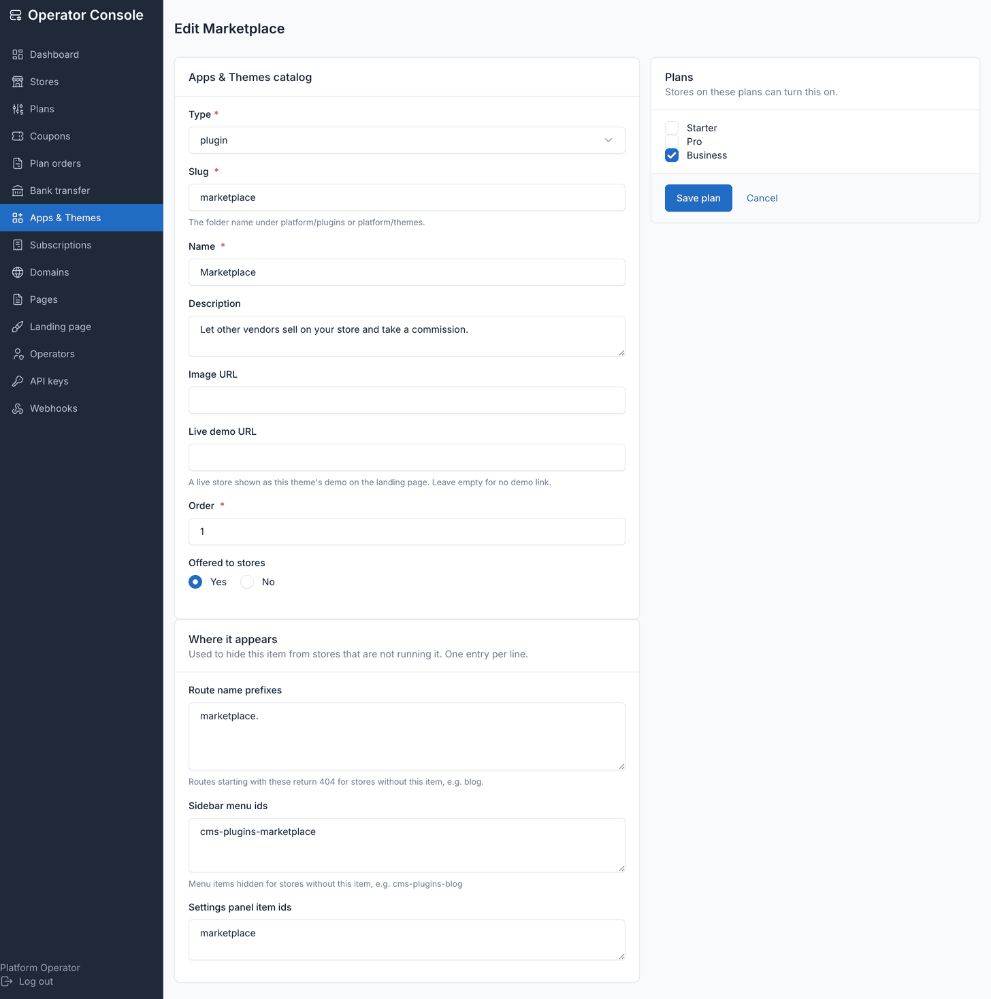
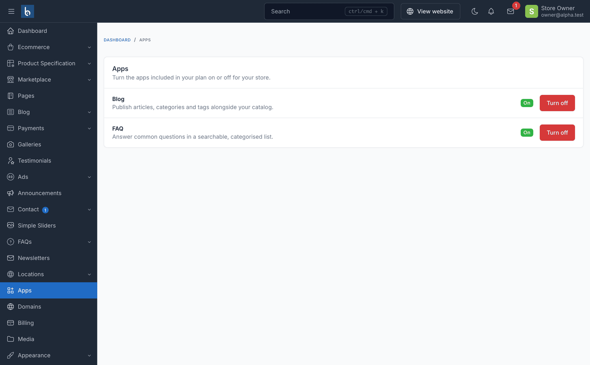

# Apps and themes catalog

Stores can turn apps on and off for themselves, within a list you control. Botble's own
**Plugins** screen stays blocked for store owners — it installs, uploads and removes
code from a filesystem every store shares, which is a platform-owner action, not a
store one.

## The model

```text
code on disk  ->  catalog_items  ->  plan_catalog_items  ->  store's activated_plugins
(you install)     (you offer)        (you price)             (the owner toggles)
```

One `catalog_items` row describes one app (plugin) or theme:

| Field | Purpose |
|---|---|
| `type` | `plugin` or `theme` |
| `slug` | Directory name under `platform/plugins/` or `platform/themes/`; must match `^[a-z0-9][a-z0-9-]*$` |
| `name`, `description`, `image`, `demo_url` | What stores and the marketing site show for it |
| `route_prefixes` | Route-name prefixes to 404 when the app is off — the enforcement |
| `menu_ids` | Sidebar `DashboardMenu` ids to hide when the app is off — cosmetic |
| `settings_panel_items` | Settings tile ids to hide when the app is off — cosmetic |
| `is_active` | Whether the row is currently offered at all |
| `sort_order` | Display order |

A row also tracks whether its code is still on disk (`existsOnDisk()`), checked against
`plugin_path()` or `theme_path()` for plugins and themes respectively. Entitlement is:

```text
(plan allowlist  UNION  grants)  MINUS  revokes  MINUS  denylist
  INTERSECT  active catalog rows  INTERSECT  what is actually on disk
```

`tenant_catalog_grants` overrides the plan in **both** directions — grant an app to one
store without inventing a plan, or pull one from a store that abused it.

**A store with no subscription gets the whole catalog**, not an empty one — it matches
how `EnsureTenantIsActive` already treats an unbilled store as entitled to serve (the
admin-provisioned path, a platform run without billing). A plan with an *empty*
allowlist is different and stays empty: that's a deliberate operator choice, not an
absent one.

## Adding an app to the catalog

1. **Operator console → Apps & Themes**. Items already installed on the server but not
   yet offered are listed at the bottom under **Installed but not offered** — click one
   and the form pre-fills from its `plugin.json` (or `theme.json` for a theme).
2. Check **Where it appears** — these three fields are what hides the app from stores
   not running it:
   - **Route name prefixes** — routes starting with these 404 when the app is off. Get
     them from `php artisan route:list` (e.g. `blog.`, `public.blog`). The pre-filled
     proposal is a heuristic — confirm it.
   - **Sidebar menu ids** — the app's `DashboardMenu::registerItem` ids (e.g.
     `cms-plugins-blog`).
   - **Settings panel item ids** — only if the app adds a Settings tile.

   Shared infrastructure prefixes (`media.`, `settings.`, `system.`, …) are never
   proposed — 404ing one of those would break a store's whole admin panel.
3. Tick the plans that should include it. Save.
4. For stores that already exist, run `php artisan tenancy:backfill-plugins` (dry run)
   to see who would change, then add `--write` to apply. Add `--enable-all` to also
   switch on every entitled app a store is currently missing.





Some slugs can never be offered, whatever you click: platform tooling (`tenancy`,
`plugin-management`, `backup`, `request-log`, `audit-log`) and plugins that write
outside the store database (`translation`, `language-advanced`). The list is
`packages.tenancy.general.catalog.denylist` — saving one of them is a validation error,
not a silent skip.

**The catalog is opt-in and fails open.** While it's empty, nothing is gated at all —
the platform behaves exactly as before this feature existed. Curating a catalog is
safe to do gradually, one item at a time.

## Offering vs. enabling

Three separate layers, three separate actors:

| Layer | Who | Where |
|---|---|---|
| Install the code | you, on the server | composer / file upload, as today |
| Offer it (catalog) | you | **Operator console → Apps & Themes** |
| Include it in a tier | you | the same screen, **Plans** checkboxes |
| Turn it on for one store | the store owner | their admin → **Apps** |
| Switch storefront theme | the store owner | their admin → **Themes** |



Offering an app makes it something a store's plan *can* include. Enabling it is the
store owner flipping a switch for the app their plan already grants — see
[Adding a storefront theme](./adding-a-theme.md) for the theme side of this.

## Why stores don't get Botble's Plugins screen

That screen installs from the marketplace, uploads zips and deletes directories. All
three write code to a filesystem every store shares — one store owner could take down
the platform, or read another store's data through an uploaded plugin.

Two more reasons specific to multi-tenancy:

1. `PluginService::activate()` skips `runMigrations()` when the provider class is
   already loaded. Under multi-tenancy it always is — registered at boot from the
   central database — so the *second* store to activate an app would silently get no
   tables.
2. It rewrites `bootstrap/cache/plugins.php`, which describes the whole install, not
   one store.

So the tenant-side **Apps** screen is a separate, narrow thing: toggle what your plan
already includes. Nothing more.

## Why enabling is only a settings write

Everything expensive already happened at provisioning: `TenantProvisioner` migrates
**every** plugin directory on disk into the new store's database, whether or not it's
active, and asset publishing is global and identical for all stores. The only per-store
state is `activated_plugins`, which already lives in the store's own database.

That's why a toggle runs no migration, writes nothing under `public/`, and cannot
affect a neighbouring store.

## Why gating happens at request time

Plugin service providers are registered during app boot, from the central database,
before any tenancy middleware has identified the tenant. Every catalog app therefore
has its routes registered on **every** request, whatever the store chose. So "off" is
enforced after identification, in two places:

| Layer | Class | Role |
|---|---|---|
| Routes | `BlockDisabledPluginRoutes` | 404s the app's route prefixes — the real enforcement |
| Menus | `RestrictTenantAdminServiceProvider` | hides its sidebar and settings entries — cosmetic |

Store owners are Botble super-users, so ACL permissions can't restrict them — the route
block is permission-independent, which is what makes it the actual boundary. It answers
404 rather than 403, so an owner gets no signal a screen exists behind an upgrade.

## Failure modes

| Situation | Result |
|---|---|
| Catalog empty | Nothing is gated — platform behaves as before the feature existed |
| Catalog row whose code was removed | Filtered out; the store never sees it |
| Plan downgrade | The app stops running; its data is untouched; upgrading restores it |
| Store has no subscription | Gets the whole catalog (matches `EnsureTenantIsActive`) |
| Plan with an empty allowlist | Gets nothing — a deliberate operator choice |
| Forged slug POSTed by a store owner | `CatalogException` — the manager checks entitlement, not the form |
| Denylisted slug assigned to a plan | Validation error at save |
| Central DB unreachable, or code deployed before its migration | Gating degrades to off (fail open) rather than 500ing every storefront; enabling an app still throws, so nobody gains one they aren't entitled to |

## Aligning existing stores

```bash
php artisan tenancy:backfill-plugins              # dry run — report only
php artisan tenancy:backfill-plugins --write      # apply
php artisan tenancy:backfill-plugins --write --enable-all --tenant=acme
```

Run it after curating the catalog or reassigning apps to a plan — it's the only command
that reconciles what stores already have enabled against what their plan currently
grants. See [Artisan commands](./commands.md) for its full option list.

## Related

- [Plans and quotas](./usage-plans.md) — assigning catalog items to a plan
- [Adding a storefront theme](./adding-a-theme.md) — the theme side of the catalog
- [Artisan commands](./commands.md) — `tenancy:backfill-plugins` and the theme commands
