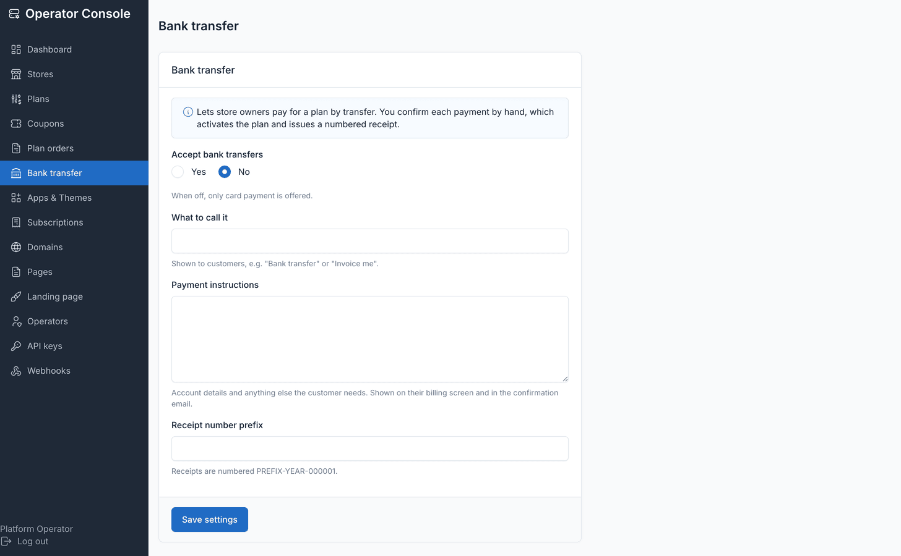
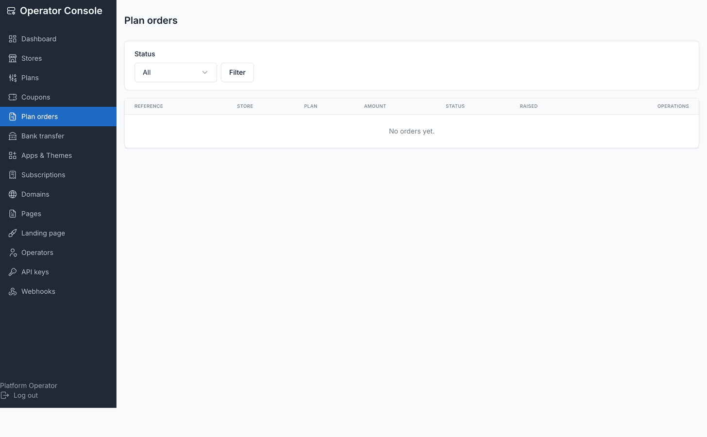

# Bank transfer (offline payments)

Off by default. Bank transfer covers platforms with no Stripe account, or customers a
platform owner chooses to invoice manually.

## Enable it

**Operator console → Bank transfer**. Fields:

| Field | Purpose |
|---|---|
| Enabled | Turns the offline option on for store owners |
| Method label | What the customer sees the payment option called (defaults to a generic label) |
| Instructions | Bank details and anything else the customer needs in order to pay |
| Receipt number prefix | e.g. `INV` — locked once the first receipt is issued |



Bank transfer is refused for a store that already has a live Stripe subscription —
paying twice by two rails is a reconciliation problem, and the operator couldn't
approve it anyway.

## What the customer sees

On their **Billing** screen, a store owner picks a plan and raises a **request**.
Nothing is entitled at that point — the whole premise is that the money hasn't arrived
yet. Pending lives on the ORDER, never on the subscription: a trialing store keeps
trialing (and can still lapse), a suspended store stays suspended, a store on Starter
keeps Starter while a Pro request is under review. One open request per store; the
customer can withdraw it themselves. As their period nears its end or goes past-due, a
**Renew** button raises a pre-filled request for their current plan — without it the
nightly billing sweep would suspend them with no way to pay again.

## The plan-orders queue

**Operator console → Plan orders** lists every request, pending first.



Open a request to review it: store, plan, amount, the customer's reference, and any
note they left.

## Approving

Approving is the local twin of Stripe's `invoice.paid`. It:

- Activates the plan on the subscription
- Recomputes the current period from the plan's interval
- Reopens a suspended or cancelled store
- Issues a numbered receipt

## Rejecting

Records a reason (required) that's sent to the customer verbatim, and issues nothing.

## The payment document / receipt

These are **receipts, not tax invoices** — one gross amount, no tax lines. Operators in
VAT jurisdictions issue their own. Print from the browser; there's no PDF export.

Receipt numbers have no holes by construction: a `PO-…` reference is assigned when the
request is raised (what the customer quotes on the transfer), while the
`INV-YEAR-000001` number is assigned only on payment — so a rejected or withdrawn
request never consumes a number. The prefix locks the moment the first receipt is
issued, because a series that changes prefix mid-run isn't a series any more.

Every purchase from either rail — Stripe or bank transfer — lands in the same ledger.
Stripe rows carry figures lifted verbatim from the webhook, never reconstructed from
the plan (which would show list price where Stripe prorated), and get no receipt
number and no document, because Stripe already issued one.

## The operator digest

```bash
php artisan tenancy:notify-pending-orders
```

Emails every operator daily while requests are waiting for review — deliberately not
deduped, because it's a work queue, not a one-off notification. `--dry-run` reports
without sending. Cron it daily so a paid transfer is never left unnoticed; see
[cron setup](./cronjob.md).

## Related

- [Subscriptions](./usage-subscriptions.md) — the billing state a fulfilled order lands in
- [Cron jobs](./cronjob.md) — `tenancy:notify-pending-orders` and the rest of the schedule
