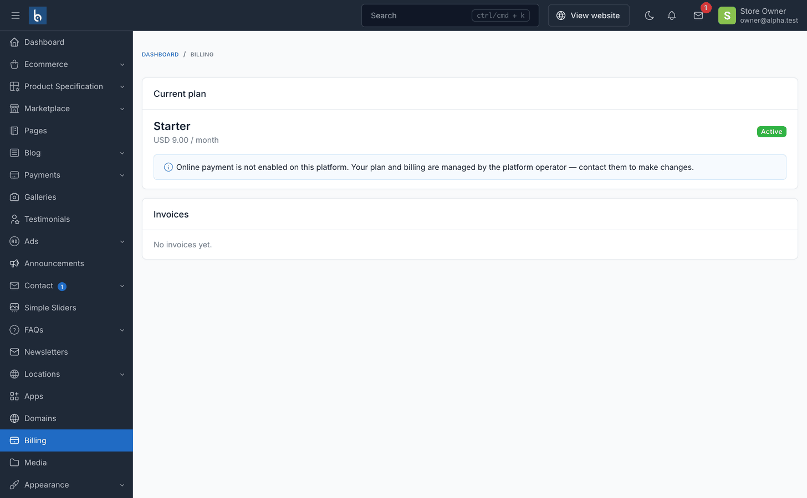

# Billing with Stripe

Billing runs on [Laravel Cashier](https://laravel.com/docs/billing) (Stripe) and is
**optional**. Self-serve signup works without any Stripe keys at all: the customer
picks a plan, the store starts on that plan's trial, and provisioning begins
immediately. Add your own keys when you want to charge.

::: warning
The platform owner supplies their own Stripe keys. Without `STRIPE_KEY` /
`STRIPE_SECRET` configured, the platform runs in **operator-managed** mode — plans are
assigned, changed and extended from the console (see
[Subscriptions](./usage-subscriptions.md)) — or in **bank-transfer** mode if you turn
that on (see [Bank transfer](./usage-bank-transfer.md)).
:::

## Configuration

```env
STRIPE_KEY=pk_live_...
STRIPE_SECRET=sk_live_...
STRIPE_WEBHOOK_SECRET=whsec_...

TENANCY_ALLOW_PROMOTION_CODES=true # let customers enter Stripe promo codes at checkout
TENANCY_COUPONS_ENABLED=true       # signup coupons (extra trial days) — see usage-coupons.md

TENANCY_PLATFORM_CURRENCY=USD      # currency MRR is reported in; other currencies are
                                    # excluded from the total, never converted
TENANCY_BILLING_GRACE_DAYS=14      # days a past-due store keeps serving
TENANCY_RETENTION_DAYS=30          # days a cancelled store's data is kept
```

## Pair plans to Stripe prices

Create products and prices in your Stripe dashboard, then set each plan's
`stripe_price_id` in **Operator console → Plans → Edit plan**. Do this for **every
plan you sell** — see [Plans and quotas](./usage-plans.md) for the full field list.
When a customer upgrades or downgrades in Stripe, `customer.subscription.updated`
carries the new price and the store is moved onto the matching local plan so its
quotas follow. A price that matches no plan is logged and ignored, leaving the store on
its current limits rather than silently losing them.

## The webhook endpoint

Point exactly **one** Stripe webhook endpoint at:

```text
https://yourdomain.com/_tenancy/stripe/webhook
```

This is the only webhook endpoint the platform uses — Cashier's default
`/stripe/webhook` route is disabled (`Cashier::ignoreRoutes()`) because it is neither
central-domain-scoped nor fail-closed. The tenancy endpoint translates events into
lifecycle transitions **and** forwards each one to Cashier's own handler, keeping
Cashier's local `subscriptions` tables in sync behind the same signature checks.

Subscribe to at least:

```text
invoice.paid
invoice.payment_succeeded
invoice.payment_failed
customer.subscription.created
customer.subscription.updated
customer.subscription.deleted
customer.updated
customer.deleted
payment_method.automatically_updated
invoice.payment_action_required
```

Duplicates are ignored — Stripe retries deliveries, and a replayed failure must not
restart the grace clock.

## Checkout and the Billing Portal

The store owner's **Billing** screen (`/admin/tenancy/billing`) offers:

- **Stripe Checkout** to subscribe or change plan (a plan change swaps the existing
  subscription rather than creating a second one)
- The **Stripe Billing Portal** for card updates, cancellation and invoice history
- Invoice downloads



Checkout returns land on a signed central callback
(`/_tenancy/billing/return/{tenant}`) that syncs state immediately; webhooks remain the
source of truth after that. Without Stripe keys configured the screen degrades to an
informational "your plan" page instead of erroring.

## Trials

A new subscriber gets the plan's `trial_days`. A signup coupon (see
[Signup coupons](./usage-coupons.md)) can add extra days on top before Stripe is ever
involved — the extended trial length is what carries into Checkout, so the first
charge lands only when the (extended) trial actually ends.

## Failed payments and the grace period

`trialing`, `active` and `past_due` all serve traffic. A failed Stripe invoice moves
the store to `past_due`, which keeps serving for `TENANCY_BILLING_GRACE_DAYS` (default
14) — so one failed webhook never takes a paying store offline. Suspension after the
grace period is a deliberate daily decision made by `tenancy:billing-maintenance`, not
a webhook side effect. See [cron setup](./cronjob.md).

## Cancellation, retention and purge

A cancelled subscription keeps the store's data for `TENANCY_RETENTION_DAYS` (default
30). Resubscribing inside that window reopens the store automatically.
`tenancy:billing-maintenance` purges stores past retention.

## Lifecycle emails

Sent to the store's `owner_email` via the **central** mail configuration (never the
store's own SMTP settings):

| Email | Trigger |
|---|---|
| Store ready | After provisioning finishes |
| Trial ending | `TENANCY_TRIAL_REMINDER_DAYS` (default `7,3,1`) days before trial end |
| Payment failed | Once per failed Stripe invoice |
| Suspension | From `tenancy:billing-maintenance` |
| Cancellation / deletion warning | Ahead of the retention purge |

Time-based ones (trial ending, cancellation warning) are sent by
`tenancy:send-lifecycle-emails` — cron it daily. Every send is claimed first in a
dedupe table keyed by tenant + type + a per-email key (invoice id for payment-failed,
trial tier + date for trial-ending, day for suspension) **before** queueing, so re-runs
and webhook retries never double-send.

## How Stripe and entitlement divide the work

Two tables, on purpose:

| | Owns | Populated |
|---|---|---|
| `tenant_subscriptions` | Entitlement: status, trial, grace period, suspension | Always — signup, admin provisioning, webhooks |
| `subscriptions` / `subscription_items` (Cashier) | Stripe billing: payment methods, invoices, the Billing Portal | Only when Stripe is configured and a real subscription exists |

The storefront gate reads **only** `tenant_subscriptions`, which is what lets a store
serve with no Stripe account at all. A trial store that never entered card details
simply has no row in Cashier's tables — no placeholder Stripe ids are ever created.

## Related

- [Subscriptions](./usage-subscriptions.md) — billing states and operator actions
- [Bank transfer](./usage-bank-transfer.md) — the non-Stripe payment path
- [Cron jobs](./cronjob.md) — `tenancy:billing-maintenance`, `tenancy:send-lifecycle-emails`
