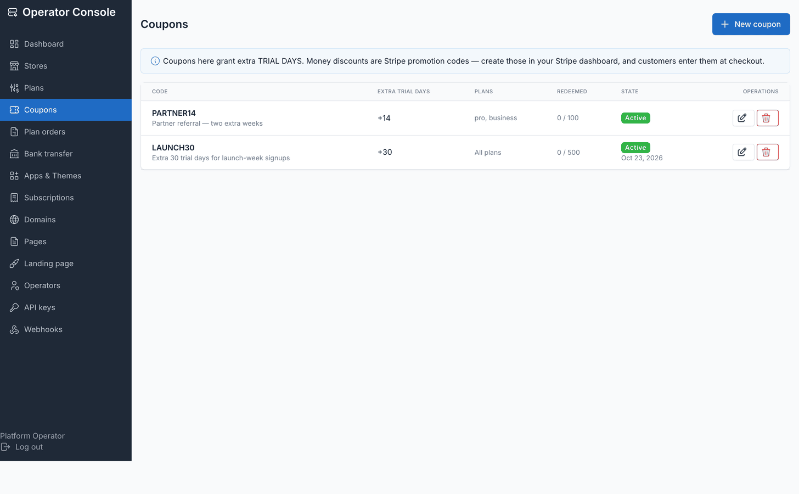
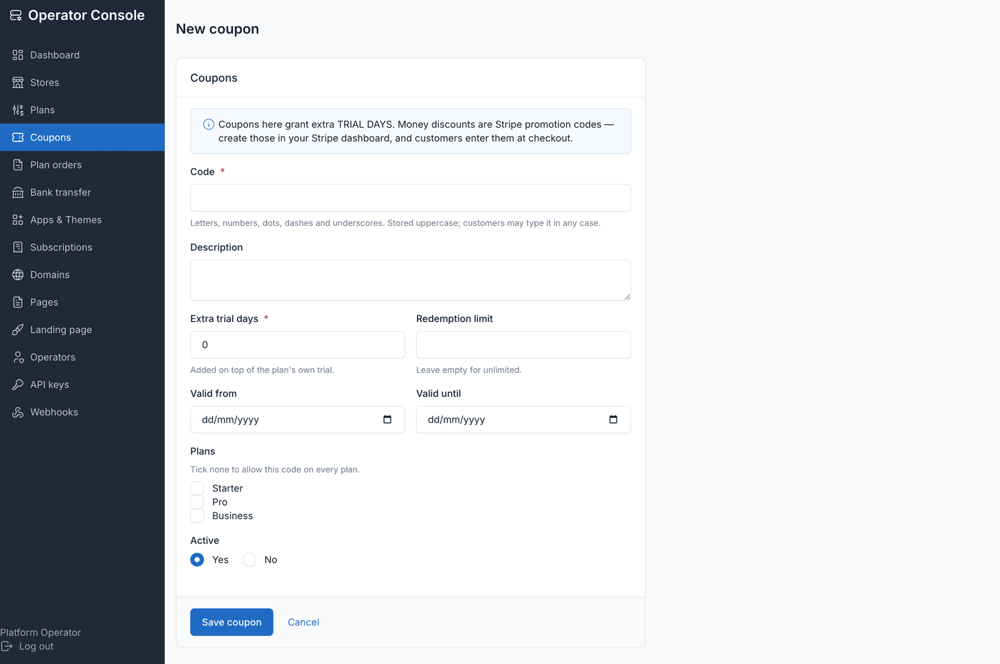

# Signup coupons

**Operator console → Coupons** manages signup promo codes.

::: warning Trial days only, never a money discount
A coupon here grants extra **trial days** and nothing else. Money discounts —
percent or amount off, duration, minimum amounts — are **Stripe promotion codes**,
created in your own Stripe dashboard and entered by the customer at Checkout, not
rows in this table.

Trial length is the one discount primitive that's entirely local, has no invoice
consequence, and can't be contradicted by Stripe — which is what a launch promo
usually means in practice anyway. This package deliberately never mirrors a Stripe
promotion code locally: a local copy of a Stripe object drifts the moment either side
changes.
:::

## Tying a coupon to a Stripe promotion code

A coupon's `stripe_promotion_code` field is how the two mechanisms connect: it doesn't
carry any pricing logic itself, it's a reference you can set so a coupon and its
matching Stripe promotion code stay associated in your own records. The discount math
still happens entirely in Stripe.

Toggle whether customers can enter Stripe promotion codes at all with
`TENANCY_ALLOW_PROMOTION_CODES` (default on). Signup coupons can be hidden entirely
with `TENANCY_COUPONS_ENABLED=false`.

## Fields

**Coupons → Create coupon**:

| Field | Purpose |
|---|---|
| Code | Uppercased on save; what the customer types at signup |
| Description | Operator-facing note |
| Trial days | Extra days added on top of the plan's own trial |
| Stripe promotion code | Optional reference tying this coupon to a Stripe promotion code |
| Plan scope | Which plans the coupon applies to; empty selection means **every plan** |
| Max redemptions | Optional cap; leave blank for unlimited |
| Redemptions | Read-only counter of how many times it's been used |
| Starts at / expires at | Optional active window |
| Active | Turns the coupon off without deleting it |

## How redemption works

A code adds its trial days on top of the plan's own trial. Checkout already carries
the remaining trial into Stripe, so the first charge lands only when the extended
trial ends.

Coupons are **validated** when the signup form is submitted — so a bad or expired code
is corrected before the visitor commits to anything — but **redeemed only when the
confirmation link is clicked**. An unconfirmed signup must not burn a redemption. If a
coupon is fully claimed in the gap between form submission and email confirmation, the
store still launches, just on the plan's ordinary trial: bouncing a customer at the
moment they click their confirmation link, over a promotion someone else won by a
moment, is worse than quietly under-delivering the bonus.

## Related

- [Plans and quotas](./usage-plans.md) — the trial days a coupon adds on top of
- [Billing with Stripe](./usage-billing-stripe.md) — where the actual promotion code and discount live
- [Signup](./usage-signup.md) — where a customer enters a coupon code
