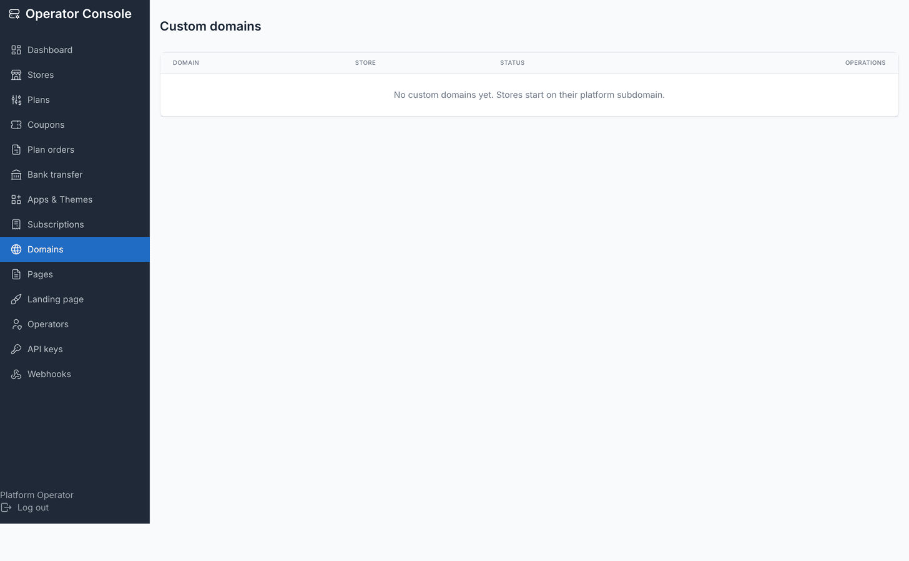

# Custom domains

Every store gets a subdomain on the platform's domain for free — that subdomain is the
tenant's primary key, so it cannot be renamed or freed without dropping the store's
database. On top of it, a store can connect one or more custom domains of its own.

## Adding a custom domain

From the store owner's **Domains** screen, entering a hostname (e.g.
`shop.yourbrand.com`, or a root domain) adds it in an unverified state. The screen then
shows the exact DNS records to publish:

1. **TXT record** — the only accepted proof of ownership. Publish a TXT record at
   `_ecommerce-verify.<domain>` containing the token shown on screen.
2. **CNAME record** — routes traffic. Point the domain at the platform's CNAME target
   shown on screen.

A CNAME alone is deliberately **not** proof of ownership — a former customer who
deletes their store but leaves a stale CNAME behind must not let someone else claim
the hostname. Both records are needed; DNS changes can take up to an hour to
propagate.

## Verifying

Verification checks the TXT record over DNS. It happens two ways:

- **Automatically** — `php artisan tenancy:verify-domains` re-checks every pending
  custom domain. Cron it regularly; an unverified domain is deliberately unroutable
  and gets no certificate.
- **On demand** — the store owner clicks **Check now** on their Domains screen
  (throttled, since each check is a blocking DNS lookup), or an operator clicks
  **Verify** on the console's Domains screen.

## Choosing the primary domain

Once verified, a domain can be made **primary** — that is what's used in emails and
invoices. The platform subdomain keeps working as a backup no matter what is set as
primary. A domain must be verified before it can be made primary.

## Removing a domain

A domain can be removed once another one is set as primary — the current primary
domain cannot be removed directly, so a store is never left with no way to reach it
from a link already sent out.

## TLS

Certificates are issued on demand via Caddy (`Caddyfile.example` in the repo) once a
domain verifies over DNS — see [Installation: DNS & TLS](./installation-dns-tls.md)
for the reverse-proxy configuration.

## Plan gate

Adding a custom domain requires the store's plan to include the `allows_custom_domain`
entitlement; the console's Plans screen shows this as **Allow custom domains** on the
plan form. The platform also caps how many a single store can hold
(`TENANCY_MAX_CUSTOM_DOMAINS`, default 5). Domains verified before a plan downgrade are
grandfathered — the gate only blocks *adding* a new one, never removes one already
connected.

## See also

- [Installation: DNS & TLS](./installation-dns-tls.md) — server-side Caddy setup
- [Plans](./usage-plans.md) — the `allows_custom_domain` entitlement
- [Commands](./commands.md) — `tenancy:verify-domains` and other maintenance commands
