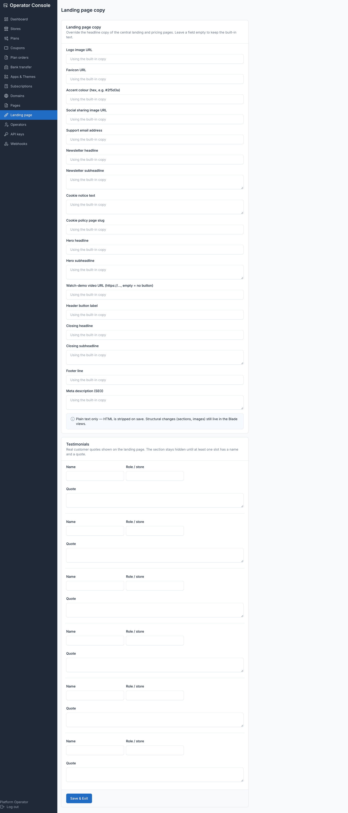
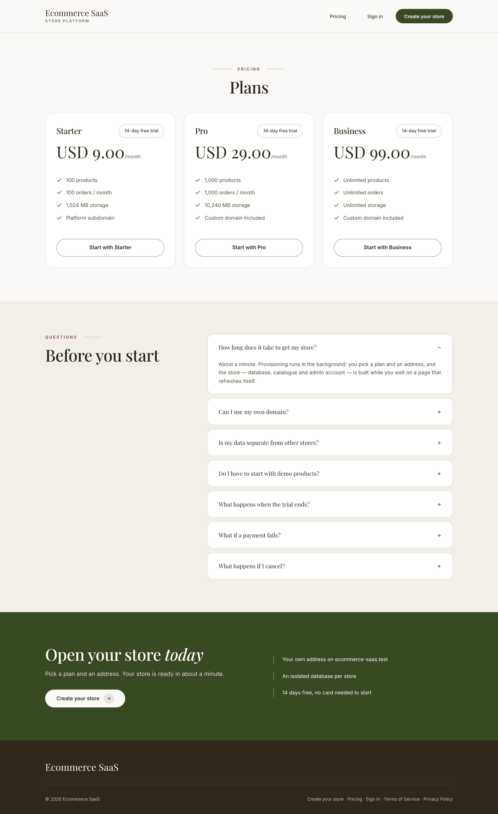

# Marketing site

The control-plane domain serves the public-facing side of the platform: the landing
page, `/pricing`, and any pages you publish. None of this is Botble page content — it
is served by middleware with pass-through, not routes, because every route in
`routes/central.php` carries `CentralDomainsOnly`, which 404s rather than falling
through. Registering `/pricing` or `/sitemap.xml` as an ordinary route there would 404
that path on every storefront instead.

## Landing page

**Operator console → Landing page** edits the copy and brand assets shown on the
homepage:

- **Brand** — logo URL, favicon URL, accent colour (hex), social-sharing (OG) image,
  support email. These are plain URL and hex fields on purpose — the console ships no
  media picker, because Botble's image component needs the `web` guard, which
  operators do not hold.
- **Hero** — headline, subheadline, an optional "Watch demo" video URL, and the header
  button label.
- **Testimonials** — up to a handful of name / role / quote slots. The section stays
  hidden until at least one slot has both a name and a quote.
- **Closing section**, **footer line**, and a **meta description** for SEO.

The **stats** section (stores launched, orders processed, designs available) is real
data pulled from the control plane, and appears only once the platform has passed
`TENANCY_LANDING_MIN_STORES` (default 10) stores — a fresh install with a handful of
test stores does not advertise a fake-looking number.

A **newsletter** block appears once the `newsletter` plugin is active centrally,
posting to that plugin's own route. A **cookie notice** appears once you set its text;
it records dismissal in the browser's `localStorage`, so the banner itself sets no
cookie.

## Pricing page

`/pricing` lists every active plan. It shows a Monthly/Yearly toggle only when plans of
both intervals actually exist — otherwise it's a single list.

## Theme demo links

Each theme's **Live demo URL**, set on its catalog row (Apps & Themes), surfaces as a
"Visit live demo" link wherever the landing page shows that theme.

## Central pages

**Operator console → Pages** publishes standalone pages on the central domain — Terms,
Privacy, About, and so on. Content is Markdown; any HTML in it is stripped when
rendered, because the console has no rich editor and an unsanitised HTML field on a
public page buys nothing. Published pages are linked from the site footer.

`sitemap.xml` and `robots.txt` are also served on the central domain. `robots.txt`
switches to `Disallow: /` automatically when the landing page is turned off, so an
install running the platform with no public marketing site is never indexed.

## See also

- [Plans](./usage-plans.md) — what feeds the pricing page and plan cards
- [Apps & Themes](./usage-apps-themes.md) — where a theme's demo URL is set
