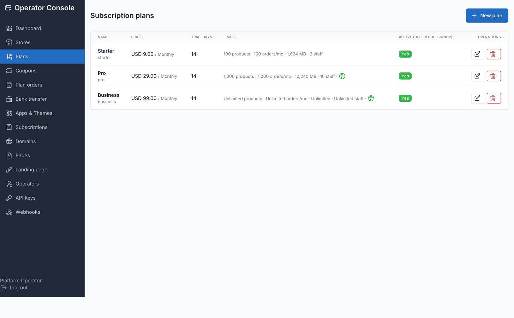
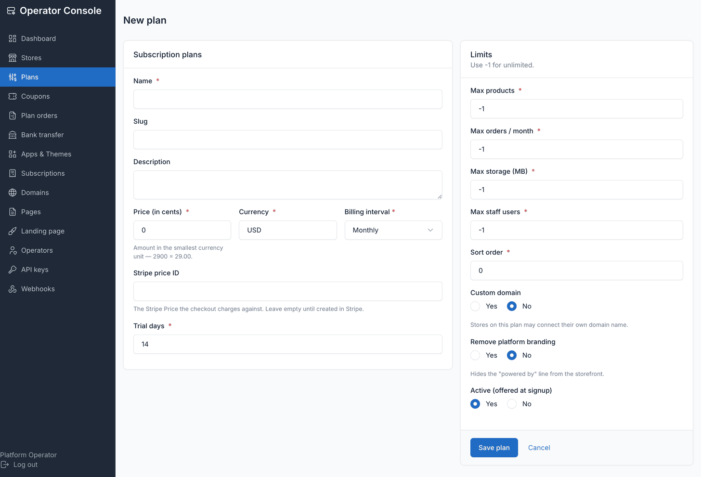
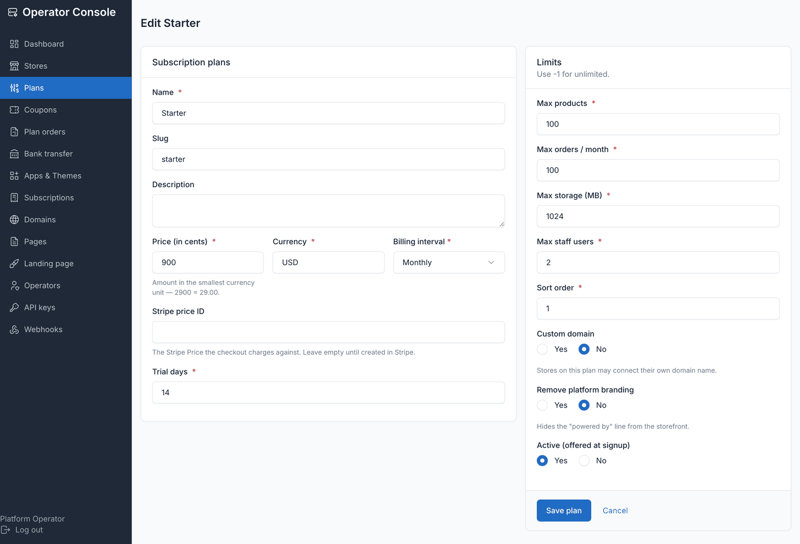

# Plans and quotas

A plan is a subscription tier the platform owner defines. **Operator console → Plans**
is the only in-app editor — three starter plans (Starter/Pro/Business) are seeded on
install and are placeholders; edit them before you go live.

## Plan fields

Open **Plans → Create plan** or edit an existing one:

| Field | Purpose |
|---|---|
| Name | Shown to customers on `/pricing`, signup and the Billing screen |
| Slug | Stable identifier; auto-generated from the name if left blank, must stay unique |
| Description | Short marketing copy shown on the plan card |
| Price + currency + interval | `price_cents` in the smallest currency unit, a 3-letter `currency`, and `month` or `year` |
| Stripe price id | Pairs this plan to a Stripe Price — see below |
| Trial days | Days a new subscriber gets before the first charge |
| Max products | `-1` = unlimited |
| Max orders/month | `-1` = unlimited; collected for the dashboard, not enforced |
| Max storage (MB) | `-1` = unlimited; collected for the dashboard, not enforced |
| Max staff users | `-1` = unlimited |
| Allows custom domain | Gates the store owner's **Domains** screen |
| Features | Checkboxes for registered plan feature flags (e.g. `remove_branding`) |
| Active | Inactive plans are hidden from signup, `/pricing` and the Billing screen |
| Sort order | Display order everywhere plans are listed |

Limits use `-1` for unlimited, never `NULL` — a quota check never has to special-case
null. Only **products** and **staff users** are actually enforced (on model creation,
so the API and imports are covered too, not just the UI); orders and storage are
dashboard numbers only.

## Apps and themes on a plan

Which apps and themes a plan includes lives on the same edit screen, under **Plans**
checkboxes in **Apps & Themes** (see [Apps and themes](./usage-apps-themes.md)). Unlike
price and limits, this assignment is **not frozen** — adding an app to a tier reaches
every store already on it immediately. Removing access from one store without touching
the plan is a separate per-store override, not a plan edit.

## Pairing a plan to Stripe

Set `stripe_price_id` on every plan you sell with Stripe. When a customer changes plan
in Stripe Checkout or the Billing Portal, the `customer.subscription.updated` webhook
carries the new Stripe price, and the store is moved onto the matching local plan so
its quotas follow. A price that matches no plan is logged and ignored — the store keeps
its current limits rather than losing them. See
[Billing with Stripe](./usage-billing-stripe.md) for the full webhook setup.

## What happens when a store hits a quota

Quotas are enforced on model creation, not in the UI — a store owner also has API and
import access. Hitting the products or staff-users ceiling refuses the create with an
explanation; existing rows are untouched. Orders and storage limits are shown on the
dashboard but block nothing.

## What a downgrade does

Nothing is deleted, ever. Moving a store to a smaller plan disables what no longer
fits:

- **Apps** the smaller plan doesn't include stop running and disappear from the
  store's admin — their tables, rows and settings stay exactly as they were, and
  upgrading brings them straight back.
- **Products or staff users** over the new ceiling are kept as-is; the store simply
  cannot create more until it's back under the limit.

A downgrade is **blocked**, not silently allowed, when a store has more products or
staff users than the target plan permits — the customer's own Billing screen refuses
the switch and names the number that's the problem, because those are the only two
quotas actually enforced. An **operator** moving a store down from the console is
warned instead of blocked — usually the resolution to a billing dispute — and the
store keeps what it has.

## Why a downgrade into a smaller plan is refused

Blocking (for self-serve) rather than silently truncating protects the customer: a
store with 900 products switching itself to a 100-product tier would otherwise keep
all 900 but be unable to create number 901, with no screen ever explaining why. Naming
the blocker up front is cheaper than the support ticket.

## Frozen plan terms

::: tip Frozen at purchase
The terms a store buys — price, interval, trial, all four limits, custom-domain
access — are frozen onto its subscription the moment it's put on the plan. Editing a
plan **never** retroactively re-prices or re-limits existing subscribers; raising a
price or lowering a limit only applies to *new* subscribers. The operator console
shows a **Grandfathered** badge on any store whose frozen terms differ from the plan's
current settings, with an **Apply current plan terms** button to move it onto today's
deal — see [Subscriptions](./usage-subscriptions.md).

Deleting a plan **retires** it rather than failing: its subscribers keep their frozen
terms and keep working, and MRR still counts them at the price they actually pay. A
plan can be retired without breaking the stores on it.
:::

## Related

- [Subscriptions](./usage-subscriptions.md) — the billing state machine and operator actions
- [Apps and themes](./usage-apps-themes.md) — curating what a plan includes
- [Billing with Stripe](./usage-billing-stripe.md) — pairing prices, checkout, webhooks
