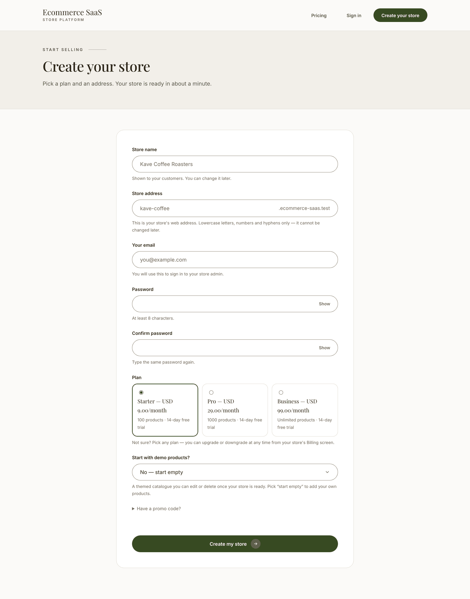
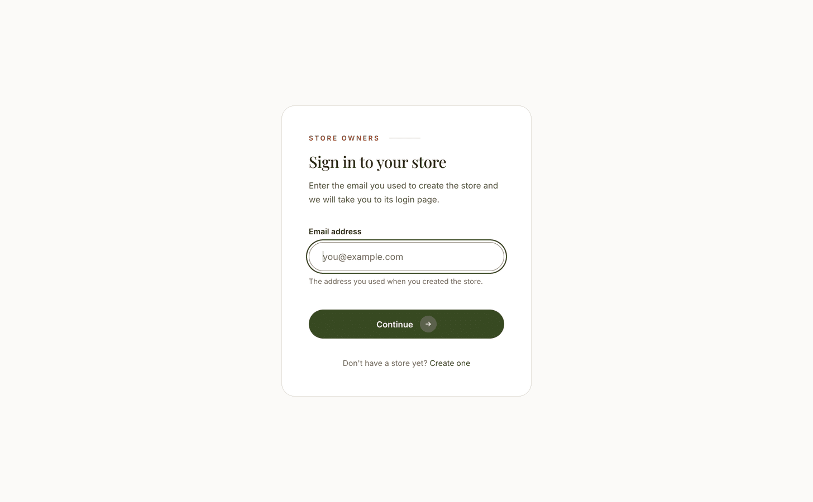

# Self-serve signup

**`/start-your-store`**, served on the central domain, is how a customer creates their
own store without an operator's help.

## The form

The customer picks a plan, a theme (and optionally one of that theme's presets), a
subdomain and a store name, and enters their email and password. Only active plans and
themes the platform has entitled to those plans are offered — the same registry and
entitlement check the submission is validated against, so the form can never offer a
combination validation would then reject. If demo images for a theme preset are
missing, the picker falls back to sized placeholders instead of showing broken images.

A hidden honeypot field runs on every submission with no configuration needed. Captcha
(the `captcha` plugin, reCAPTCHA or a math challenge) is optional — activate it
centrally and configure it under Settings → Others → Captcha; with nothing configured,
signup still works.

## Email verification

By default the form does not provision anything by itself. Submitting it creates a
24-hour reservation holding the chosen subdomain and email, and sends a confirmation
link. Only clicking that link creates the database, imports the demo dump and
consumes the subdomain — the point being that signup is the one place an anonymous
request costs real, unrecoverable resources.

| Setting | Default | Purpose |
|---|---|---|
| `TENANCY_SIGNUP_VERIFY_EMAIL` | `true` | Verify before provisioning |
| `TENANCY_SIGNUP_VERIFY_TTL_HOURS` | `24` | How long a reservation holds its address |
| `TENANCY_SIGNUP_CAPTCHA` | `true` | Use the Captcha plugin when it is configured |
| `TENANCY_SIGNUP_PER_IP_PER_HOUR` | `3` | Per-IP signups per hour |
| `TENANCY_SIGNUP_GLOBAL_PER_HOUR` | `60` | Ceiling across all callers; `0` disables |
| `TENANCY_SIGNUP_BLOCKED_EMAIL_DOMAINS` | *(empty)* | Comma-separated domains to refuse |

::: warning Check mail before disabling verification
`tenancy:preflight` fails if verification is on and mail goes nowhere (`log` or
`array` mailer) — otherwise every signup stops at "check your email" and no store can
ever be created. Run it after any mail configuration change.
:::

Set `TENANCY_SIGNUP_VERIFY_EMAIL=false` to provision immediately on submit instead —
useful for existing installs or a platform that invites customers directly. Both paths
go through the same launch service, so they cannot drift apart.

## The pending screen

After the confirmation link is clicked (or immediately, with verification off), the
customer lands on a pending page while provisioning runs in the background, then is
carried through to their new store once it reports `ready`.

## Finding a store

**`/sign-in`** maps an owner's email address to their store, for an owner who has
forgotten their store's URL. An address that owns several stores gets a chooser rather
than being sent silently to whichever one sorts first.

## See also

- [Plans](./usage-plans.md) — what a customer is choosing between at signup
- [Coupons](./usage-coupons.md) — signup promo codes that grant extra trial days
- [Adding a theme](./adding-a-theme.md) — how a theme becomes selectable at signup
