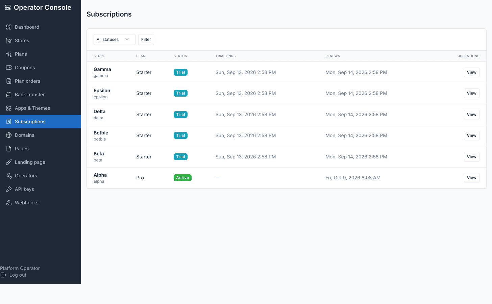
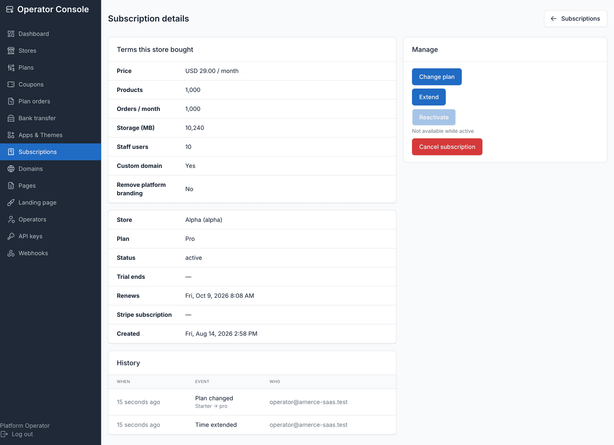

# Subscriptions

**Operator console → Subscriptions** is the read view over every store's billing
state. The transitions themselves come from Stripe webhooks, the nightly maintenance
command, or an operator action here — this screen is where you watch and, for stores
Stripe doesn't manage, intervene.

## The list and its filters

Filter by status (`trialing`, `active`, `past_due`, `suspended`, `cancelled`). Stores
with **no subscription row** — created with `tenancy:create-tenant` rather than
self-serve signup — are listed separately with an **Assign** form, because that state
is supported: unrestricted, never expires, and is how a platform billing elsewhere
runs. **Export** downloads a CSV priced from each store's frozen terms, not the plan's
current list price.

## Billing states

| Status | Storefront serves? | Meaning / how it's reached |
|---|---|---|
| `trialing` | yes | On trial; access ends when `trial_ends_at` passes and no payment converts it |
| `active` | yes | Paying (or admin-assigned with no billing) |
| `past_due` | yes | A Stripe payment failed; serves for `TENANCY_BILLING_GRACE_DAYS` (default 14) before suspension |
| `suspended` | no (402 parked page) | Grace period expired, trial expired, or a manual suspend |
| `cancelled` | no (402 parked page) | Subscription cancelled; data kept for `TENANCY_RETENTION_DAYS` (default 30) |

A store that cancels and resubscribes inside the retention window reopens
automatically. The admin panel itself stays reachable for suspended stores on purpose
— an owner whose card failed must be able to sign in and fix it.

## Terms this store bought, versus the live plan

Open a subscription to see both:

- **Terms this store bought** — the frozen `plan_data` snapshot: price, interval,
  trial, all four limits, custom-domain access, taken the moment the store was put on
  the plan. This is what the store is actually charged and limited to.
- **Live plan** — the plan row as it stands today, which may have since changed.

When the two differ, the console shows a **Grandfathered** badge. **Resync plan** (the
`resync-plan` action) re-freezes the plan's current terms onto the subscription —
un-grandfathering it. This is a purely local decision Stripe knows nothing about; it
does not touch Stripe.

## Operator actions

| Action | Legal from | What it does |
|---|---|---|
| **Assign** | no subscription, suspended, cancelled | Puts a store on a plan outright, with no payment. For comp accounts, migrated customers, platforms invoicing outside the product. Reopens a suspended/cancelled store. |
| **Change plan** | trialing, active, past_due | Moves a live store to a different tier: writes the new plan and its frozen terms, touches nothing else. Not a renewal — it does not extend the trial or paid period. |
| **Extend** | trialing, active, past_due | Adds days to the trial (if trialing) or the paid period (otherwise). Extends from the current end date if it's still in the future, otherwise from now. Does not touch `past_due_since` — the grace clock keeps running. |
| **Cancel** | trialing, active, past_due, suspended | Ends the subscription locally. |
| **Reactivate** | suspended, cancelled | Brings a store back: clears suspension/cancellation stamps, recomputes the period end from the plan's interval, sets status to active. Refused if the subscription has no plan at all. |

Use **Assign** for a store's first plan; use **Change plan** for a live one — assign is
deliberately not offered for a live store because it would reset the paid period.

## Audit trail

Every state change is recorded in the billing history timeline on the subscription
page, with the before/after status and **who caused it**: Stripe, an operator, a
nightly command, or the store owner. Suspensions carry their reason
(`trial_expired` or `grace_expired`). Rows travel with the tenant when a cancelled
store is eventually purged.

## Stripe-backed stores are managed in Stripe

::: warning
Every operator write above is **refused** while a live Stripe subscription exists, and
the console says why. When Stripe manages a store, its `tenant_subscriptions` row is a
*projection* of the Stripe subscription — `invoice.paid` rewrites status and period
end, `customer.subscription.updated` rewrites the plan. A local-only cancel would
survive until the next renewal invoice and then silently revert; a local-only plan
change would revert on the next subscription event while billing the customer for a
plan they're no longer on. Manage these stores in the Stripe dashboard — the webhook
syncs the change back here.

Manual management through the console exists for the stores Stripe doesn't touch: comp
accounts, invoice-billed customers, trial extensions, and platforms running with no
Stripe keys at all.
:::

**Known gap:** a subscription cancelled in Stripe whose `customer.subscription.deleted`
event never arrives leaves the store frozen out of both surfaces — the console still
sees a live Stripe subscription and refuses local edits, but Stripe no longer bills it.
Resend the event from the Stripe dashboard to unstick it.

## Related

- [Plans and quotas](./usage-plans.md) — plan fields, frozen terms, downgrades
- [Billing with Stripe](./usage-billing-stripe.md) — how Stripe drives these states
- [Bank transfer](./usage-bank-transfer.md) — the offline path onto a plan
