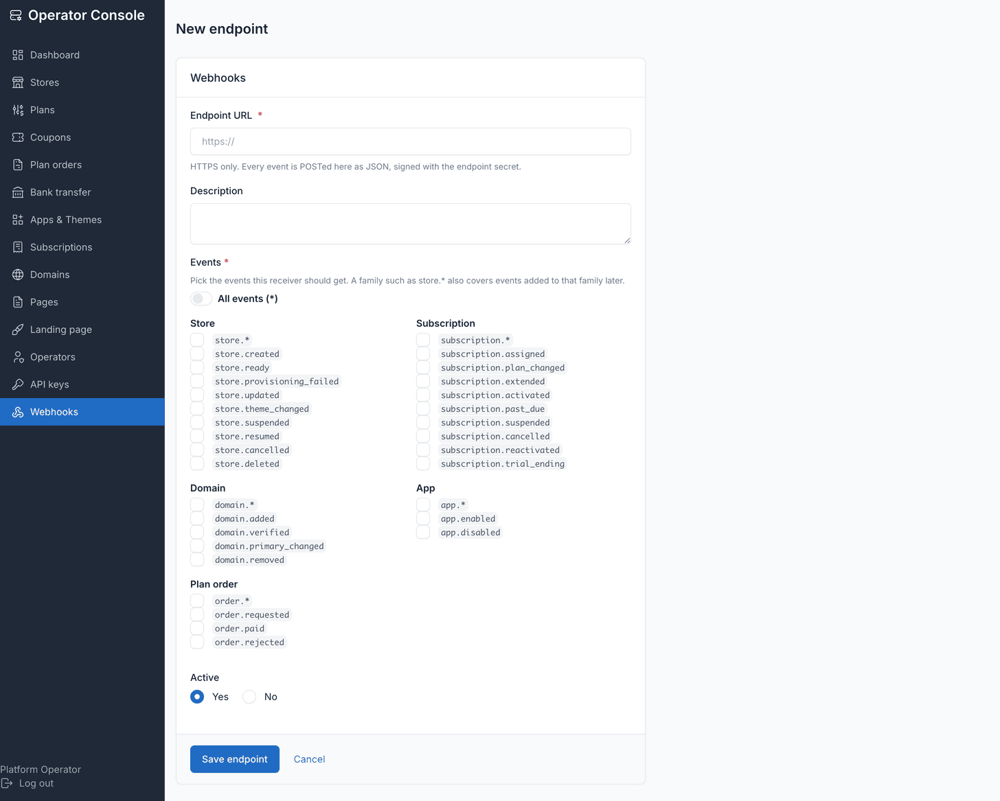
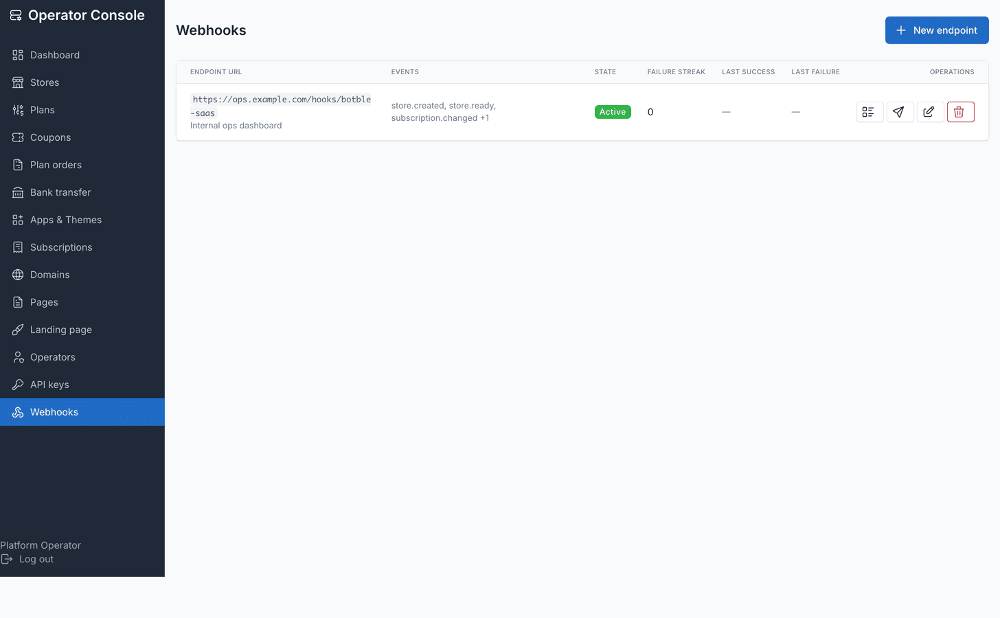
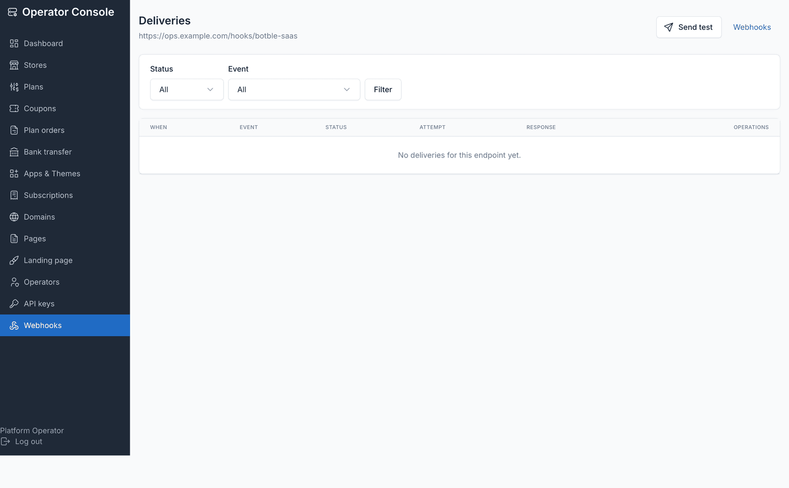

# Webhooks

Outbound webhooks tell an integration about a change it did not make itself — a store
finished provisioning, a subscription went past due, a domain verified. Pair them with
the [control-plane API](./api.md) so an integration can both act on the platform and
hear about changes made elsewhere (the console, Stripe, a signup).

## Adding an endpoint

**Operator console → Webhooks → New endpoint.**



| Field | Notes |
| --- | --- |
| URL | Must be HTTPS |
| Events | Exact event names, a resource wildcard (`store.*`, `subscription.*`, `domain.*`, `app.*`, `order.*`), or `*` for everything including events added later |
| Description | Free text, shown in the endpoint list |

The URL must not point at the platform's own network: a central domain or any label
under one, a registered store domain, `localhost`, or a private / loopback / link-local
/ reserved address are all refused (`422 validation_failed`). The hostname is
**resolved** — at creation and again before every send — so a name that merely points
at a private address is refused too, and a DNS record re-pointed inward after creation
is caught at send time: that delivery fails with `error: unsafe_host` (no request is
made) and retries on the normal schedule. Redirects are never followed at delivery
time.

```env
TENANCY_WEBHOOKS_ALLOW_PRIVATE_HOSTS=true
```

Lifts the address check for a local receiver during development — never set it in
production.

::: warning
The signing secret is shown **once**, at creation (and again on a rotation). It is not
stored anywhere you can read back later.
:::



## Event catalogue

27 subscribable events, plus `ping` (deliverable only via the test button /
`POST /webhooks/{id}/test`, never subscribable).

| Event | Fired when | `data` beyond `store` |
| --- | --- | --- |
| `store.created` | The row exists; provisioning has not run yet. Fires **before** the plan is assigned, so it never carries `subscription` — `subscription.assigned` follows as the next event | — (`meta.source`) |
| `store.ready` | Provisioning finished; the storefront is live | `provisioning{preset,theme,apps,plugin_migration_paths}` |
| `store.provisioning_failed` | Provisioning threw | `error{message,class}` |
| `store.updated` | `name` / `owner_email` changed | `changes{field:{from,to}}` |
| `store.theme_changed` | The storefront theme was switched | `theme{from,to}` |
| `store.suspended` | The store was taken offline | `subscription?`, `meta.log` |
| `store.resumed` | The store was brought back online | `subscription?`, `meta.log` |
| `store.cancelled` | The subscription was cancelled; retention starts | `subscription`, `retention_days` |
| `store.deleted` | The store and its database were dropped | `subscription?`, `meta.reason` |
| `subscription.assigned` | A plan was attached to a store with none | `subscription`, `meta.log` |
| `subscription.plan_changed` | Upgrade or downgrade | `subscription`, `meta.log` |
| `subscription.extended` | The period was extended manually | `subscription`, `meta.log` |
| `subscription.activated` | Became active (trial converted, payment cleared) | `subscription`, `meta.log` |
| `subscription.past_due` | A payment failed; the grace period started | `subscription`, `meta.log` |
| `subscription.suspended` | The grace period ran out | `subscription`, `meta.log` |
| `subscription.cancelled` | Cancelled | `subscription`, `meta.log` |
| `subscription.reactivated` | Revived within retention | `subscription`, `meta.log` |
| `subscription.trial_ending` | A trial reminder email went out | `subscription`, `trial{ends_at,days_left}` |
| `domain.added` | A custom domain was attached | `domain` |
| `domain.verified` | DNS verification passed (first time only) | `domain` |
| `domain.primary_changed` | The primary domain moved | `domain`, `previous_primary?` |
| `domain.removed` | A domain was detached | `domain` |
| `app.enabled` | A store turned an app on | `app{slug}` |
| `app.disabled` | A store turned an app off | `app{slug}` |
| `order.requested` | A bank-transfer order was raised | `order{}` |
| `order.paid` | An offline order was approved | `order{}`, `subscription` |
| `order.rejected` | An offline order was rejected | `order{}` |
| `ping` | The test button / `POST /webhooks/{id}/test` | `message`, `endpoint_id` (no `store`) |

## Payload

```json
{
  "id": "01K4A6QF8Z5T7M1N0J2W3D4E5F",
  "type": "store.ready",
  "created_at": "2026-09-02T10:53:44+00:00",
  "api_version": "2026-09-02",
  "data": {
    "store": {"id": "acme", "name": "Acme Supply", "status": "ready",
              "access_state": "serving", "root_url": "https://acme.example.com",
              "billing_provider": "local"},
    "provisioning": {"preset": "fashion", "theme": "amerce",
                     "apps": ["ecommerce", "payment"], "plugin_migration_paths": 21}
  },
  "meta": {"actor": {"type": "api_key", "id": 3, "name": "Billing sync"}}
}
```

- `data.store` is byte-for-byte the `store` resource the [REST API](./api.md) returns —
  one shape, two transports.
- `null` values are dropped, so a missing store is an **absent** `store` key rather than
  `"store": null` (`ping`, and events for a store that no longer exists).
- `id` is the delivery's `event_id`. It is stable across retries — **use it to
  de-duplicate**.
- `meta.actor` is who caused the change (`api_key`, `admin`, `system`, `customer`).

## Headers

| Header | Value |
| --- | --- |
| `Content-Type` | `application/json` |
| `User-Agent` | `<App name>-Webhooks/2026-09-02` |
| `X-Tenancy-Event` | the event name, e.g. `store.ready` |
| `X-Tenancy-Delivery` | the delivery id — same as the payload's `id` |
| `X-Tenancy-Signature` | `t=<unix seconds>,v1=<hex hmac-sha256>` |

## Verifying the signature

The signature is an HMAC-SHA256 over `"<timestamp>.<raw body>"` keyed with the
endpoint's secret. **Verify against the raw request body**, before any JSON parsing or
re-encoding, and reject a timestamp more than **300 seconds** from your clock — that is
what stops a captured delivery being replayed later (replay protection).

Verify. Do not trust the source IP: the platform's egress address is not a secret.

**PHP**

```php
function tenancyWebhookVerify(string $secret, string $body, string $header, int $tolerance = 300): bool
{
    $parts = [];

    foreach (explode(',', $header) as $pair) {
        [$key, $value] = array_pad(explode('=', trim($pair), 2), 2, null);

        if ($key !== null && $value !== null) {
            $parts[$key] = $value;
        }
    }

    $timestamp = $parts['t'] ?? null;
    $signature = $parts['v1'] ?? null;

    if ($timestamp === null || $signature === null || ! ctype_digit($timestamp)) {
        return false;
    }

    if (abs(time() - (int) $timestamp) > $tolerance) {
        return false;
    }

    return hash_equals(hash_hmac('sha256', $timestamp . '.' . $body, $secret), $signature);
}

// Laravel receiver
Route::post('/tenancy', function (Illuminate\Http\Request $request) {
    if (! tenancyWebhookVerify(env('TENANCY_WEBHOOK_SECRET'), $request->getContent(), (string) $request->header('X-Tenancy-Signature'))) {
        abort(400);
    }

    $event = $request->json()->all();
    // De-duplicate on $event['id'] — a retry repeats it.

    return response()->noContent();
});
```

**Node**

```js
const crypto = require('crypto');

function tenancyWebhookVerify(secret, body, header, tolerance = 300) {
  const parts = Object.fromEntries(
    header.split(',').map((pair) => pair.trim().split('=', 2)).filter((p) => p.length === 2),
  );

  const timestamp = parts.t;
  const signature = parts.v1;

  if (!timestamp || !signature || !/^\d+$/.test(timestamp)) return false;
  if (Math.abs(Math.floor(Date.now() / 1000) - Number(timestamp)) > tolerance) return false;

  const expected = crypto.createHmac('sha256', secret).update(`${timestamp}.${body}`).digest('hex');
  const a = Buffer.from(expected, 'utf8');
  const b = Buffer.from(signature, 'utf8');

  return a.length === b.length && crypto.timingSafeEqual(a, b);
}

// Express receiver — note express.raw(), NOT express.json()
const express = require('express');
const app = express();

app.post('/tenancy', express.raw({ type: '*/*' }), (req, res) => {
  const body = req.body.toString('utf8');

  if (!tenancyWebhookVerify(process.env.TENANCY_WEBHOOK_SECRET, body, req.get('X-Tenancy-Signature') || '')) {
    return res.sendStatus(400);
  }

  const event = JSON.parse(body);
  console.log(event.type, event.id);

  // De-duplicate on event.id — a retry repeats it.
  res.sendStatus(200);
});

app.listen(3000);
```

## Retries, exhaustion and auto-disable

Any 2xx is a success. Everything else — a 3xx (redirects are never followed), a 4xx, a
5xx, a timeout, a TLS error — is a failure. Reply fast and do the work asynchronously:
`TENANCY_WEBHOOK_TIMEOUT` (default 10s) is a **hard total** timeout for the whole
request, the connection itself must open within the connect timeout, and the response
body is read only up to the ~1 KB excerpt — a slow or endless body cannot hold a worker.

Retry schedule, in seconds after the failed attempt:

| Retry | Delay | Roughly |
| --- | --- | --- |
| 1 | `60` | 1 minute |
| 2 | `300` | 5 minutes |
| 3 | `1800` | 30 minutes |
| 4 | `7200` | 2 hours |
| 5 | `43200` | 12 hours |

After the last slot the delivery is marked **`exhausted`** and is never retried
automatically. The console's Retry button, or
`POST /api/platform/v1/webhooks/deliveries/{id}/retry`, can still force it.

After **25 consecutive failures** across events (`TENANCY_WEBHOOK_DISABLE_AFTER`) the
endpoint stops receiving: `disabled_at` is stamped and `is_active` stays exactly as the
operator left it — the console switch is still **on**, there is nothing to turn off.
Deliveries that came due during the disabled window are closed as `exhausted` with
`error: endpoint_disabled` and are **not** replayed when the endpoint comes back — force
the ones that still matter with a manual retry.

## The retry cron — not optional

::: danger
`tenancy:webhooks-deliver` is the **only** retry driver. The queued job makes the
**first** attempt of each delivery and nothing else. Without this cron entry, a failed
delivery is **never** retried and a delivery whose worker died is never picked up
again.
:::

```cron
* * * * * cd /path/to/app && php artisan tenancy:webhooks-deliver
```

Add it next to `tenancy:billing-maintenance` on every deploy — see
[Queue worker and cron](./cronjob.md).

Retries are deliberately data on the row (`next_attempt_at`) rather than queue delays,
so an install on the `sync` queue driver retries exactly as reliably as one with a
worker.

Overlapping runs are safe: the sweep takes a cache lock, and a second invocation that
finds it held exits immediately instead of contending for the same rows. The same run
also prunes history — deliveries in a terminal state (`delivered`, `exhausted`) older
than `TENANCY_WEBHOOKS_RETENTION_DAYS` (default `30`; `0` disables pruning) are deleted.

Options: `--limit=` (default 100 rows per run) and `--endpoint=` to sweep one endpoint.

## Re-enabling an auto-disabled endpoint

Fix the receiver, then re-enable it: open the endpoint and **save it with the Active
switch still on**, or:

```bash
curl -s -X PATCH https://platform.example.com/api/platform/v1/webhooks/4 \
  -H "Authorization: Bearer $KEY" -H 'Content-Type: application/json' \
  -d '{"is_active": true}'
```

Saving with `is_active` true clears `disabled_at` and resets `consecutive_failures` to
`0`. A single successful delivery also resets the counter.

Deliveries that came due while the endpoint was off stay `exhausted` even after it is
re-enabled — the cron only sweeps rows with a `next_attempt_at`, so replay the ones
that still matter with a manual retry.

## Reading a delivery failure

**Operator console → Webhooks → an endpoint → Deliveries.**



| `status` | Meaning |
| --- | --- |
| `pending` | Never attempted yet, a retry is scheduled, **or an attempt is in flight** |
| `delivered` | A 2xx was received |
| `failed` | The last attempt failed; `next_attempt_at` holds the next retry |
| `exhausted` | Every scheduled retry failed, **or the endpoint was not receiving when the attempt came due** (`error: endpoint_disabled`); only a manual retry can revive it |

`error` is `http_<status>` for a rejected POST, `endpoint_disabled` when the endpoint
was not receiving, `unsafe_host` when the hostname resolved to a private / reserved
address at send time (no request was made), or the exception class and message for a
timeout / DNS / TLS failure. `response_excerpt` is capped at the first ~1 KB of the
body; the receiver's body is never read beyond that cap.

Rows in a terminal state (`delivered`, `exhausted`) are **pruned** by
`tenancy:webhooks-deliver` once older than `TENANCY_WEBHOOKS_RETENTION_DAYS` (default
`30`; `0` keeps them forever) — this history is a window, not an archive, export it if
you need it longer.

An `endpoint_disabled` row made no request, so it hands its attempt number back: a
disabled window costs no retry budget.

## Retrying by hand

Console: **Retry** on the delivery row. API:
`POST /api/platform/v1/webhooks/deliveries/{id}/retry`. Both attempt **inline** and
answer with the outcome.

An attempt reserves the row by bumping `attempt`, flipping `status` to `pending` and
leasing `next_attempt_at` into the near future, so a retry while an attempt is in
flight answers `409 delivery_not_retryable` rather than sending the event twice. Once
the lease lapses (a worker killed mid-request) the row is retryable again — by hand and
by the cron sweep.

## Rotating a secret

**Rotate secret** on the endpoint, or:

```bash
curl -s -X POST https://platform.example.com/api/platform/v1/webhooks/4/rotate-secret \
  -H "Authorization: Bearer $KEY"
```

```json
{"data": {"id": 4, "secret": "whsec_xxxxxxxxxxxxxxxxxxxxxxxxxxxxxxxxxxxxxxxx"}}
```

The old secret stops validating **immediately** — there is no grace window — so update
the receiver in the same maintenance window.

::: warning
**`APP_KEY` rotation invalidates every webhook secret.** Endpoint secrets are stored
with Laravel's `encrypted` cast, so rotating `APP_KEY` makes them undecryptable and
every delivery then fails with a decryption error. After any `APP_KEY` rotation, rotate
the secret of every webhook endpoint and update the receivers. API keys are unaffected
— they are sha256 hashes, not encrypted values.
:::

## Testing an endpoint

**Send test** on the endpoint fires a `ping` — it always contacts the endpoint, even
one that is switched off or auto-disabled (that is how you check a repaired receiver
before re-enabling it). The first attempt is made inline, so the row you land on
already carries the receiver's answer. `ping` is not subscribable and has no `store` in
`data`.

## Tuning

| Setting | Default | Purpose |
| --- | --- | --- |
| `TENANCY_WEBHOOK_TIMEOUT` | `10` | Hard total timeout, in seconds, for one delivery request |
| `TENANCY_WEBHOOK_QUEUE` | *(default queue)* | Queue for the first attempt of each delivery |
| `TENANCY_WEBHOOK_DISABLE_AFTER` | `25` | Consecutive failures before an endpoint is switched off |
| `TENANCY_WEBHOOKS_RETENTION_DAYS` | `30` | Days after which `delivered` / `exhausted` rows are pruned by the sweep; `0` keeps them forever |
| `TENANCY_WEBHOOKS_ALLOW_PRIVATE_HOSTS` | `false` | Allow endpoints that resolve to private / reserved addresses — local development only |

If a delivery keeps failing and you cannot see why, check
[Troubleshooting](./troubleshooting.md) next.

See the [control-plane API](./api.md) for the full endpoint and delivery reference, and
[Queue worker and cron](./cronjob.md) for wiring up `tenancy:webhooks-deliver`.
