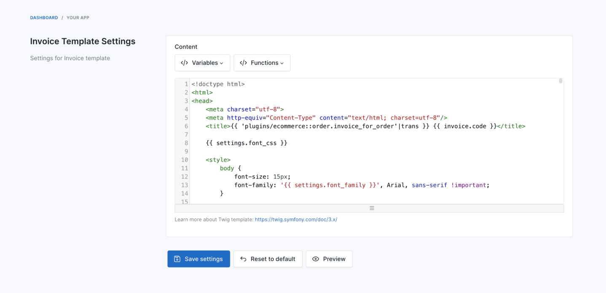

# Invoice Template

## Customize the template

There are two options to customize the invoice template:

### Customize in admin panel (recommended)

Go to `Settings` -> `Ecommerce` -> `Invoice Template` to customize the invoice template.



### Customize directly file

Copy file `platform/plugins/ecommerce/resources/templates/invoice.tpl` to `storage/app/templates/ecommerce/invoice.tpl` to start customizing it.

## Bangladesh font

To display Bangladesh text in invoice, need to use font **FreeSerif**.

- Download `FreeSerif.tff` font
  from https://github.com/byrongibson/fonts/blob/master/backup/truetype.original/freefont/FreeSerif.ttf.
- Upload `FreeSerif.tff` to folder `/public`.
- Copy file `platform/plugins/ecommerce/resources/templates/invoice.tpl`
  to `storage/app/templates/ecommerce/invoice.tpl` to start customize.
- Change in CSS:

```blade
<style>
    @font-face {
        font-family: FreeSerif;
        src: url('{{ url(' FreeSerif.ttf ') }}');
    }
    
    body {
        font-size: 15px;
        font-family: FreeSerif, Arial, sans-serif !important;
    }
</style>
```

## Japanese font

- Option 1: Select font `M Plus Rounded 1c` for invoice font in Admin -> Ecommerce -> Settings.

- Option 2: Customize invoice template like this:

```html
<link rel="preconnect" href="https://fonts.googleapis.com">
<link rel="preconnect" href="https://fonts.gstatic.com" crossorigin>
<link href="https://fonts.googleapis.com/css2?family=M+PLUS+Rounded+1c&display=swap" rel="stylesheet">

<style>

    body {
        font-size: 15px;
        font-family: 'M PLUS Rounded 1c', 'DejaVu Sans', Arial, sans-serif !important;
    }

    ...
    .bold, strong {
        font-weight: normal;
    }

    ...
    .total {
        color: #fb7578;
        font-weight: normal
    }

    ...
</style>
```

- Option 3: Using font **CyberCJK**.

Customize template like this:

```CSS
@font-face {
    font-family: CyberCJK;
    src: url("http://eclecticgeek.com/dompdf/fonts/cjk/Cybercjk.ttf") format("truetype");
}

body {
    font-size: 15px;
    font-family: CyberCJK, Arial, sans-serif !important;
}
```

## Sinhala font

- Download font **kaputaunicode** from http://www.kaputa.com/slword/kaputaunicode.htm.
- Upload `kaputaunicode.tff` to folder `/public`.
- Copy file `platform/plugins/ecommerce/resources/templates/invoice.tpl`
  to `storage/app/templates/ecommerce/invoice.tpl` to start customize.
- Change in CSS:

```blade
<style>
    @font-face {
        font-family: kaputaunicode;
        src: url('{{ url(' kaputaunicode.ttf ') }}');
    }
    
    body {
        font-size: 15px;
        font-family: kaputaunicode, Arial, sans-serif !important;
    }
</style>
```