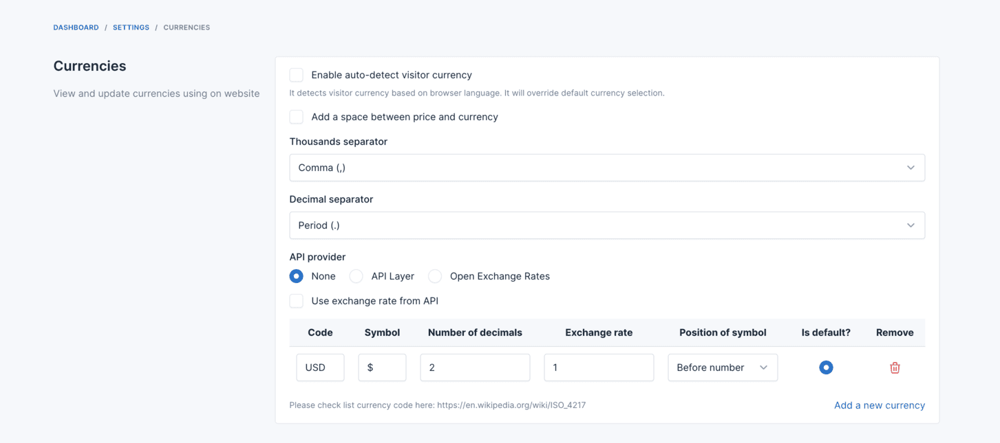
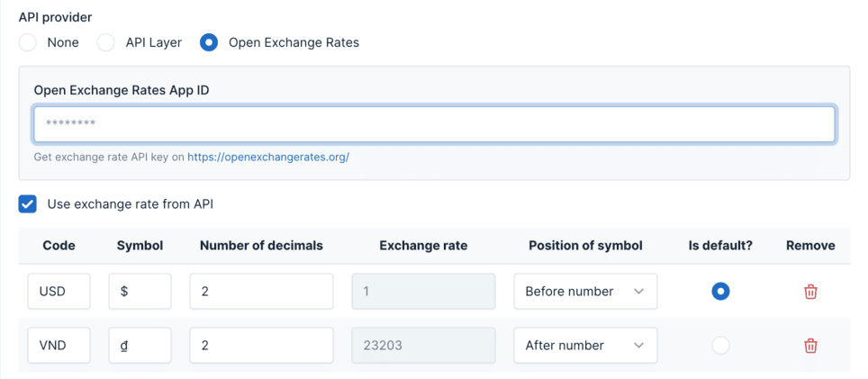

# Currencies

Currencies in the Ecommerce allows you to manage the currencies used in your online store.
Here, you can set up exchange rates for different currencies, enabling customers to view prices in their preferred
currency.

## Currency Settings

To change currency settings go to `Settings` -> `Ecommerce` -> `Currencies`.

## Currency Exchange Rates

### Automatically Updating Exchange Rates

Without the **Use exchange rate from API** feature, the customer needs to do their own research on the exchange rate and
manually update the exchange rate in the currency settings.

We provide two options for automatically updating the exchange rate:

* **[API Layer](https://apilayer.com)**
* **[Open Exchange Rates](https://openexchangerates.org)**

In the **API provider** field, select the API provider you want to use and enter their API key.

### Manually Updating Exchange Rates

If you prefer to manually update the exchange rate, select `None` in the **API provider** field and disable the **Use
exchange rate from API** feature.

::: warning
For the default currency, the exchange rate must be 1.
:::
