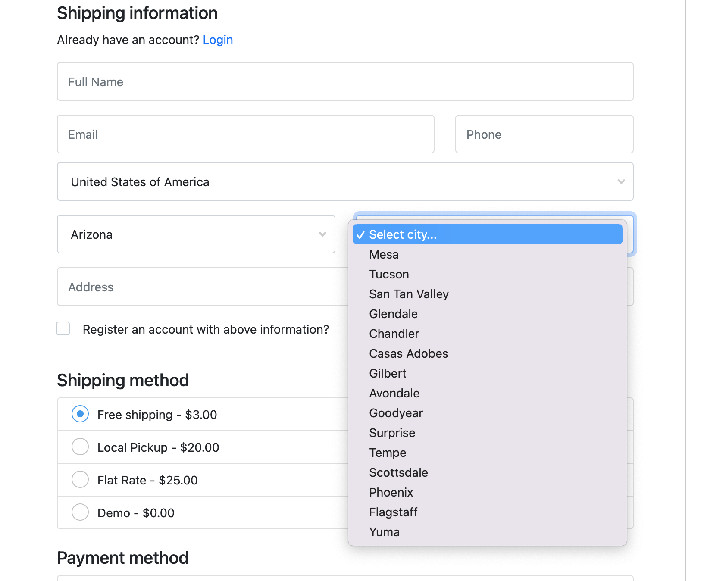
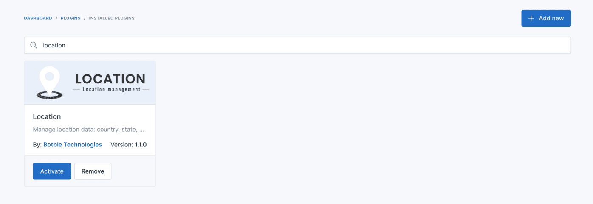
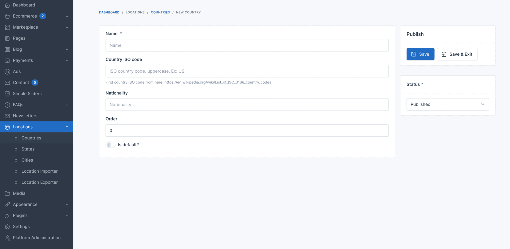
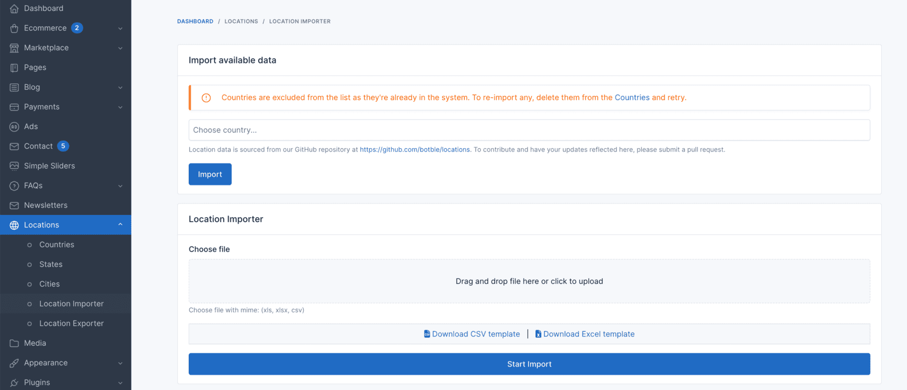
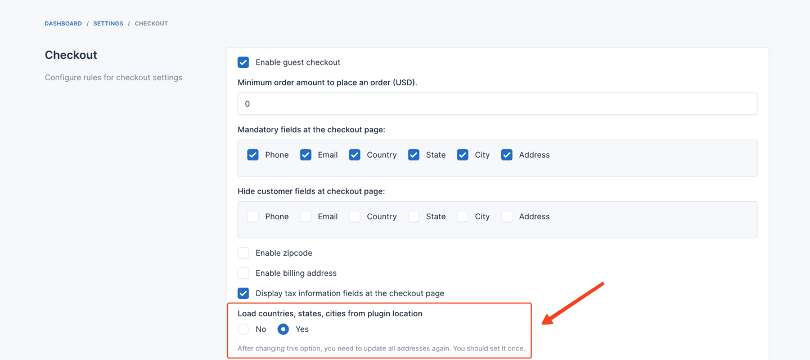

# Location

It is used to change city & state field in the checkout page to dropdown list.

## Active plugin

In admin panel, go to `Plugins` -> `Installed` find the **Location** plugin, and click **Activate**.

## Add countries, states, cities

You can add manually from `Admin` -> `Locations`.

Or you can import from file CSV

## Enable location in checkout page

In admin panel, go to `Settings` -> `Ecommerce` -> `Checkout` and enable **Load countries, states, cities from plugin
location?**.

