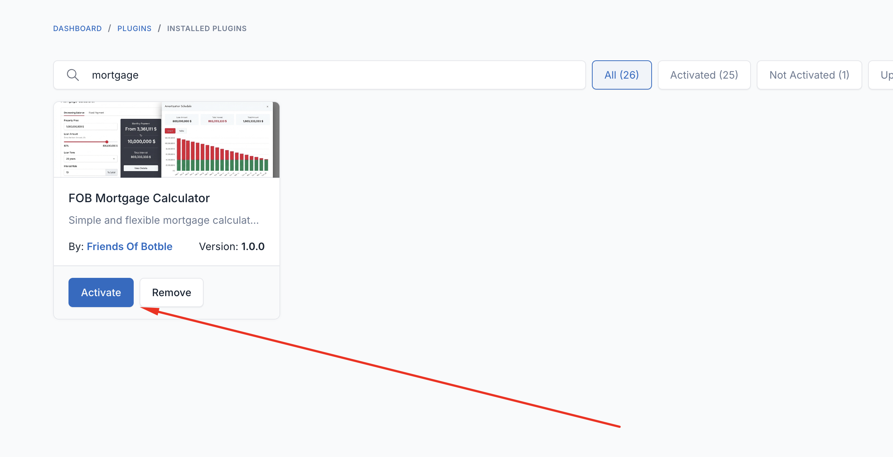
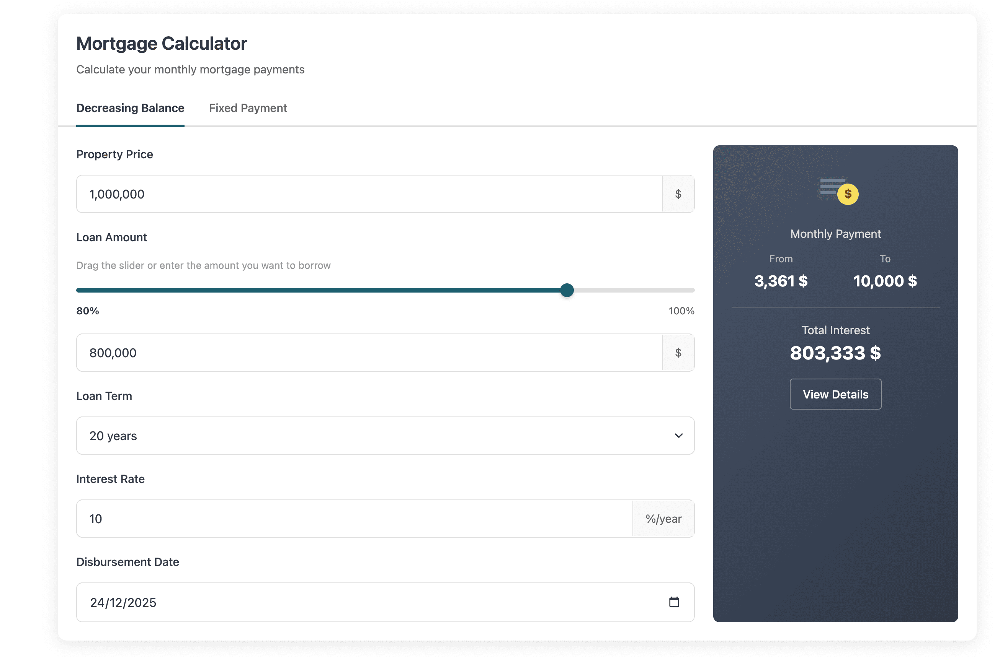
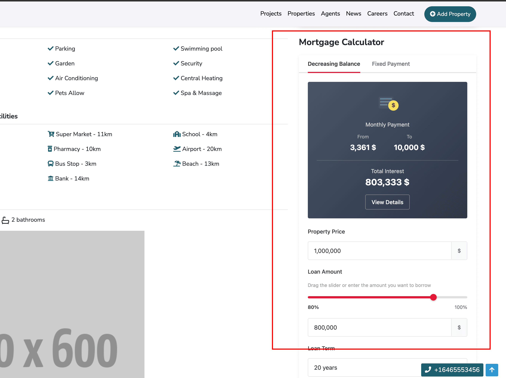

# Mortgage Calculator

The FOB Mortgage Calculator plugin provides a flexible and customizable mortgage calculator for your real estate website. It supports both shortcode and widget implementations.

## Activation

::: tip INFO
Go to **Admin** -> **Plugins** and activate the **FOB Mortgage Calculator** plugin.
:::



Once activated, you can use the mortgage calculator via shortcode or widget.

## Using Shortcode

The shortcode allows you to embed the mortgage calculator on any page or post.

### Basic Usage

Add the shortcode to your page content:

```
[mortgage-calculator][/mortgage-calculator]
```

### Full Example with Options

```
[mortgage-calculator
    style="default"
    layout="horizontal"
    form_style="modern"
    form_size="xl"
    form_alignment="center"
    form_margin="50px 0"
    form_title="Mortgage Calculator"
    form_description="Calculate your monthly mortgage payments"
    primary_color="#1d5f6f"
][/mortgage-calculator]
```

### Adding to a Page

::: tip INFO
Go to **Admin** -> **Pages** -> Edit your page
:::

1. Open the page editor and click the **UI Block** button to open the shortcode modal


2. Select **Mortgage Calculator** from the list


3. Configure the shortcode parameters as needed and click **Insert**


4. Save the page

**Result on frontend:**



## Using Widget

The mortgage calculator is also available as a sidebar widget.

::: tip INFO
Go to **Admin** -> **Appearance** -> **Widgets**
:::

1. Find **Mortgage Calculator** in the available widgets list and drag it to your desired sidebar


2. Configure the widget settings


3. Save the widget

**Result on frontend:**



## Shortcode Parameters

| Parameter | Type | Default | Description |
|-----------|------|---------|-------------|
| `style` | string | `default` | Style variant: `default` or `compact` |
| `layout` | string | `horizontal` | Layout: `horizontal` or `vertical` |
| `form_style` | string | `default` | Form style: `default`, `modern`, `minimal`, `bold`, `glass` |
| `form_size` | string | `lg` | Form width: `full`, `xxl`, `xl`, `lg`, `md`, `sm` |
| `form_alignment` | string | `center` | Alignment: `start`, `center`, `end` |
| `form_margin` | string | - | CSS margin values (e.g., `50px 0`) |
| `form_padding` | string | - | CSS padding values (e.g., `30px 20px`) |
| `form_title` | string | - | Header title text |
| `form_description` | string | - | Header description text |
| `default_price` | number | - | Pre-filled property price |
| `default_term` | number | `20` | Default loan term in years |
| `default_rate` | number | `10` | Default interest rate (%) |
| `default_down_payment_type` | string | `percent` | Down payment type: `percent` or `amount` |
| `default_down_payment_value` | number | `20` | Down payment value (% or fixed amount) |
| `show_extra_costs` | boolean | `false` | Enable extra cost fields (taxes, insurance, HOA) |
| `currency` | string | `$` | Currency symbol |
| `price_from` | string | `none` | Price source: `none` or `property` |
| `primary_color` | string | `#e31837` | Primary UI color (hex) |
| `background_color` | string | - | Background color (hex) |
| `enable_lazy_loading` | string | `no` | Enable lazy loading: `yes` or `no` |

## Form Styles

The calculator supports 5 different form styles:

- **default** - Standard appearance
- **modern** - Clean, contemporary design
- **minimal** - Simplified, less visual elements
- **bold** - Strong, prominent styling
- **glass** - Glassmorphism effect with transparency

## Form Sizes

Control the width of the calculator:

- **full** - 100% width
- **xxl** - Extra extra large
- **xl** - Extra large
- **lg** - Large (default)
- **md** - Medium
- **sm** - Small

## Supported Currencies

The calculator supports multiple currency symbols:

| Code | Symbol |
|------|--------|
| USD | $ |
| EUR | € |
| GBP | £ |
| VND | ₫ |
| JPY | ¥ |
| CNY | ¥ |
| KRW | ₩ |
| INR | ₹ |
| THB | ฿ |
| AUD | A$ |
| CAD | C$ |
| SGD | S$ |
| MYR | RM |
| IDR | Rp |
| PHP | ₱ |

## Calculation Methods

The calculator provides two calculation methods:

1. **Decreasing Balance** - Monthly payments decrease over time as the principal is paid down
2. **Fixed Payment** - Equal monthly payments throughout the loan term

Users can switch between these methods using the tabs in the calculator interface.

## Features

- **Amortization Schedule** - View detailed payment breakdown by month
- **Chart Visualization** - Visual representation of principal vs interest
- **Responsive Design** - Works on all screen sizes
- **RTL Support** - Right-to-left language support
- **Lazy Loading** - Optional lazy loading for better page performance

## Example Configurations

### Homepage Calculator

```
[mortgage-calculator
    style="default"
    layout="horizontal"
    form_style="modern"
    form_size="xl"
    form_alignment="center"
    form_margin="50px 0"
    form_title="Mortgage Calculator"
    form_description="Calculate your monthly mortgage payments"
    primary_color="#1d5f6f"
    background_color="#f7f7f7"
    enable_lazy_loading="yes"
][/mortgage-calculator]
```

### Compact Sidebar Calculator

```
[mortgage-calculator
    style="compact"
    layout="vertical"
    form_style="minimal"
    form_size="full"
][/mortgage-calculator]
```

### Property Page Calculator

```
[mortgage-calculator
    price_from="property"
    form_style="glass"
    show_extra_costs="true"
][/mortgage-calculator]
```

## Using with Page Seeder

If you're setting up a new site and want to include the mortgage calculator programmatically, add it to your `PageSeeder.php`:

```php
use Illuminate\Support\Facades\Html;

$pages = [
    [
        'name' => 'Home',
        'content' =>
            Html::tag('div', '[search-box ...][/search-box]') .
            Html::tag('div', '[mortgage-calculator style="default" layout="horizontal" form_style="modern" form_size="xl" form_alignment="center" form_margin="50px 0" form_title="Mortgage Calculator" form_description="Calculate your monthly mortgage payments" primary_color="#1d5f6f" background_color="#f7f7f7" enable_lazy_loading="yes"][/mortgage-calculator]'),
        'template' => 'homepage',
    ],
];
```

## Troubleshooting

### Calculator not displaying

1. Ensure the plugin is activated in **Admin** -> **Plugins**
2. Clear the cache: `php artisan optimize:clear`
3. Check that the shortcode syntax is correct

### Styles not loading

1. Publish plugin assets: `php artisan vendor:publish --tag=public`
2. Clear browser cache
3. Run `npm run prod` if using custom builds

### Widget not appearing

1. Verify the widget is added to an active sidebar
2. Check that the sidebar is rendered in your theme template
