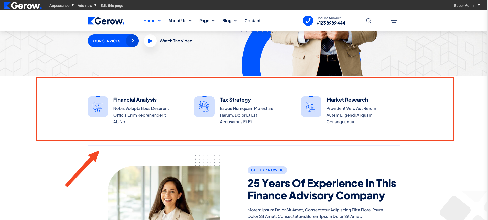
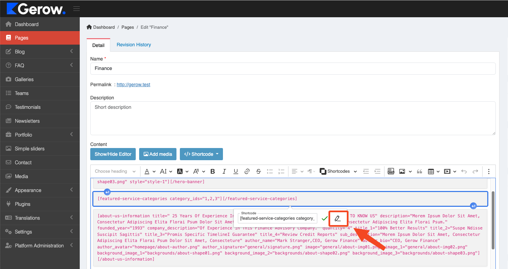
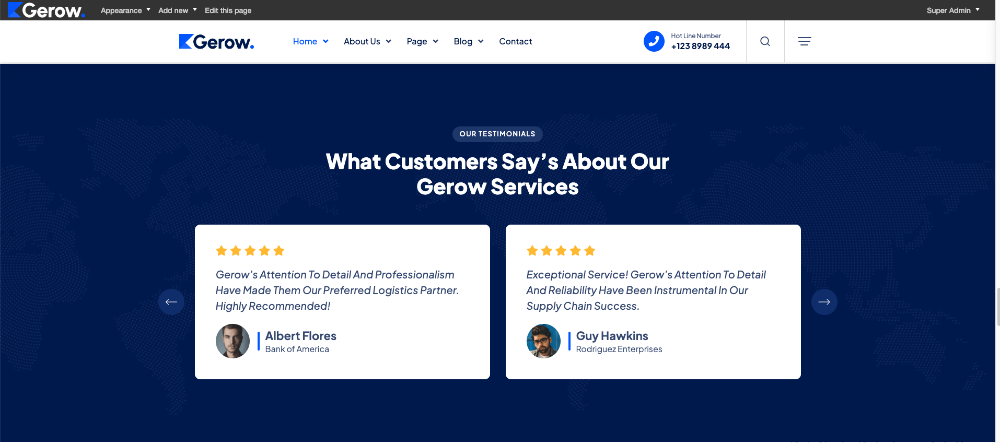

# Homepage

## Setup homepage

Go to Admin -> Appearance -> Theme options (tab Page) to select a homepage.

## Customize homepage

Go to Admin -> Pages -> Select Homepage.

### Hero Banner

It's shortcode `hero-banner` in the page content.

You can set the title, subtitle, image, background image, button label, button action, and options styling.

### Featured Service Categories

It's shortcode `featured-service-categories` in the page content.

You can set the title, subtitle, select service categories, image, background image, and options styling.

### About Us Information

It's shortcode `about-us-information` in the page content.

You can set the title, subtitle, image, background, Founded year, Button Label, Button URL and options styling...

### Brands

It's shortcode `brands` in the page content.

You can set the title, subtitle, add new branch, and options styling.

### Services

It's shortcode `featured-services` in the page content.

You can set the title, subtitle, image, background, services, and options styling.

### Company Overview

It's shortcode `company-overview` in the page content.

You can set the title, subtitle, image, background, author, button label, button URL, and options styling...

### Intro Video

It's shortcode `intro-video` in the page content.

You can set the title, subtitle, image, background, Video YouTube URL, progress bar using tabs and options styling...

### Featured Projects

It's shortcode `featured-projects` in the page content.

You can set the title, subtitle, image, background, projects, and options styling.

### Contact Block

It's shortcode `contact-block` in the page content.

You can set the title, subtitle, image, background, hotline, button label, button URL, and options styling.

### Teams

It's shortcode `teams` in the page content.

You can set the title, subtitle, image, background, teams, and options styling.

### Testimonials

It's shortcode `testimonials` in the page content.

You can set the title, subtitle, image, background, limit testimonials, and options styling.

### Pricing

It's shortcode `pricing` in the page content.

You can set the title, subtitle, image, background, packages, and options styling.

You can custom features and information in packages.

### News

It's shortcode `news` in the page content.

You also can custom items and more attributes in the `news` shortcode.

There are have a lot of shortcodes in the theme. You can check them in the **Shortcode** dropdown menu in the editor.