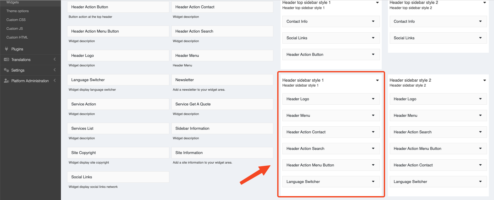

# Theme Options

## Setup theme options

On Admin Bar -> Appearance -> Theme options.

Or go to Admin -> Appearance -> Theme options.

## Header

Customize header

Edit **Favicon**. Go to Admin -> Appearance -> Theme options -> Logo tab.

And **Logo** in header is widget. You can change it. Go to Admin -> Appearance -> Widgets.

And Header have many styles. You can view detail in Widget Tabs.

## Footer

Edit social links, go to Admin -> Appearance -> Theme options -> Social links tab

Edit style, go to Admin -> Appearance -> Theme options -> Styles tab

You can set primary, secondary, text, border color, font, background,...

## Others

Edit **Cookie consent**"

Go to Admin -> Appearance -> Theme options -> Cookie consent tab

