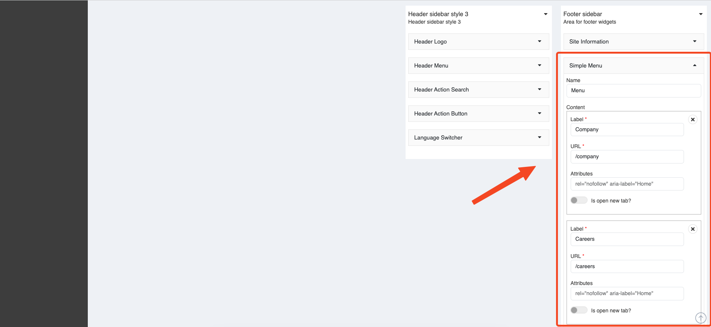
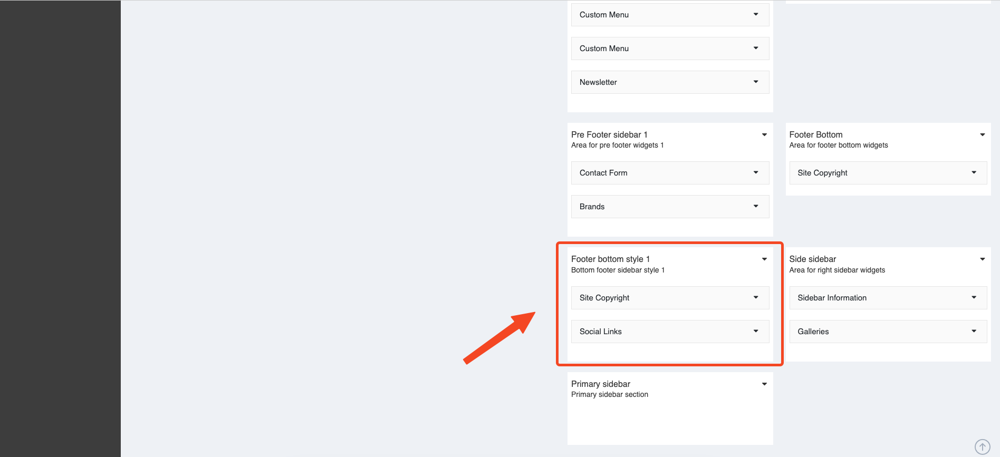

# Usage Widgets

You can customize widgets in `Admin` -> `Appearance` -> `Widgets`.

## Header Top

In the top header, you can see a contact information.

### Contact Info

You can modify it in `Admin` -> `Appearance` -> `Widgets` -> **Header top sidebar style 1**

## Social links

You can modify it in `Admin` -> `Appearance` -> `Widgets` -> **Header top sidebar style 1**

## Header Action Button

You can modify it in `Admin` -> `Appearance` -> `Widgets` -> **Header top sidebar style 1**

### Styles

#### Header top sidebar style 1

That's the style guide above

#### Header top sidebar style 2

You can modify it in `Admin` -> `Appearance` -> `Widgets` -> **Header top sidebar style 2**

## Header

You can custom widgets: ` Header Logo` , ` Header Menu` , ` Header Action Contact` , ` Header Action Search` , ` Header Action Menu Button` , ` Language Switcher` in `Admin` -> `Appearance` -> `Widgets` -> **Header sidebar style 1**, 

And have many style header and header top you can custom it.

### Styles

#### Header sidebar style 1

That's the style guide above

#### Header sidebar style 2

You can modify it in `Admin` -> `Appearance` -> `Widgets` -> **Header sidebar style 2**

#### Header sidebar style 3

You can modify it in `Admin` -> `Appearance` -> `Widgets` -> **Header sidebar style 3**

## Pre footer

Second, below the Popular items is the Contact form.

You can also modify it in **Pre footer sidebar** like Popular items.

## Footer

The footer includes the following widget:

### Site Information

You can modify it in `Admin` -> `Appearance` -> `Widgets` -> **Footer sidebar**

### Custom Menu

You can modify it in `Admin` -> `Appearance` -> `Widgets` -> **Footer sidebar**

### Newsletter

You can modify it in `Admin` -> `Appearance` -> `Widgets` -> **Footer sidebar**

### Style footer sidebar

#### Style footer sidebar default

You can modify it in `Admin` -> `Appearance` -> `Widgets` -> **Footer sidebar**

#### Style footer sidebar 1

You can modify it in `Admin` -> `Appearance` -> `Widgets` -> **Footer sidebar style 1**

## Footer bottom

### Site Copyright

You can modify it in `Admin` -> `Appearance` -> `Widgets` -> **Bottom footer**

### Footer bottom style

#### Style default

You can modify it in `Admin` -> `Appearance` -> `Widgets` -> **Bottom footer**

#### Style footer bottom 1

You can modify it in `Admin` -> `Appearance` -> `Widgets` -> **Bottom footer style 1**

