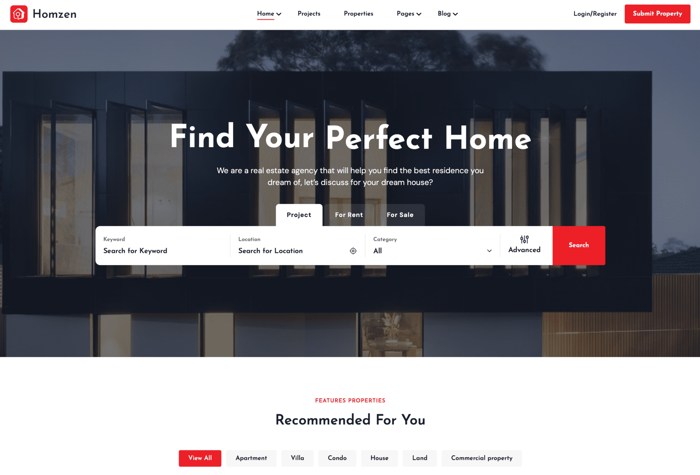

# Homzen - Laravel Real Estate Multilingual System

## Introduction

Homzen is a powerful Laravel-based real estate management system with multilingual support. It offers customizable
homepages, detailed property listings, and an integrated blog, providing a seamless experience for developers and users
alike.

Created: `14/06/2024`

By: [Botble Technologies](https://botble.com)

Email: [contact@botble.com](mailto:contact@botble.com)

Thank you for purchasing this product. If you have any questions that are beyond the scope of this help file,
please feel free to email via my user page contact form [here](https://codecanyon.net.net/user/botble) for quickly
support. Thank you so much!

## Demo

Homepage: [homzen.botble.com](https://homzen.botble.com)

Admin Area: [homzen.botble.com/admin](https://homzen.botble.com/admin)

Username: `admin`

Password: `12345678`

## Features

- Page, blog, menu, contact, real estate.. modules are provided with the use of components to avoid boilerplate code.
- RSS feeds for posts and properties properties
- Agency panel with credit system to post their properties.
- Support payment methods: PayPal, Stripe, Razorpay, and Paystack to buy credits.
- Powerful media system, also support Amazon S3, DigitalOcean Spaces
- SEO & sitemap support: access sitemap.xml to see more.
- RESTful API using Laravel Sanctum.
- Multi language support. Unlimited number of languages.
- Google Analytics: display analytics data in admin panel.
- Translation tool: easy to translate front theme and admin panel to your language.
- Beautiful theme is ready to use.
- Powerful Permission System: Manage user, team, role by permissions. Easy to manage user by permissions.
- Admin template comes with color schemes to match your taste.
- Fully Responsive: Compatible with all screen resolutions.
- Coding Standard: All code follow coding standards PSR-2 and best practices.

## Botble Team

Visit us at [botble.com](https://botble.com)
