# Homepage

To set a page as the homepage, go to **Admin** -> **Theme Options** -> **Page** and select the page you want to set as
the homepage.

## Available UI Blocks

Homzen provides a variety of UI Blocks that you can use to build and customize your homepage. These UI Blocks allow
you to easily add different elements and sections to create a tailored homepage for your real estate website.

### Hero Banner

Use the hero banner UI block for a compelling homepage header with background image or video, overlay text, search box, and action button. It's comes with 5 different styles to choose from.

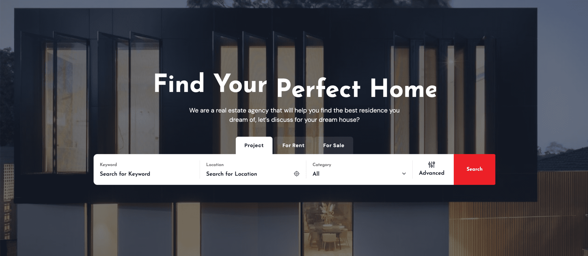

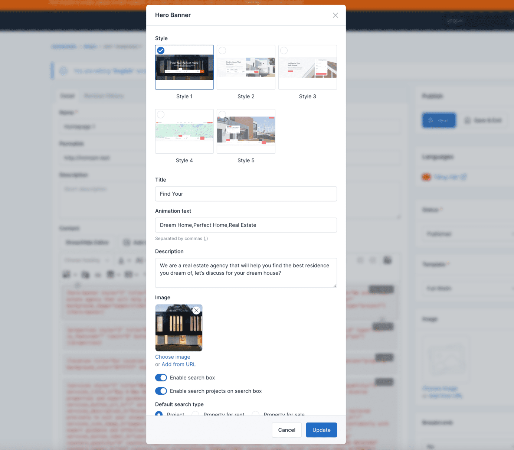

### Properties

Display a list of properties available for sale or rent using the properties UI block.

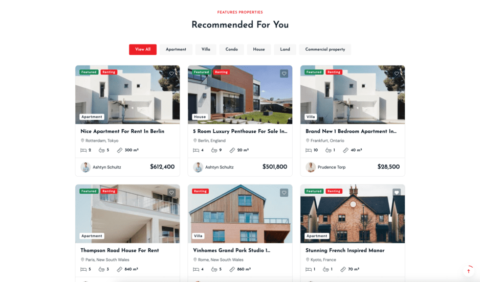

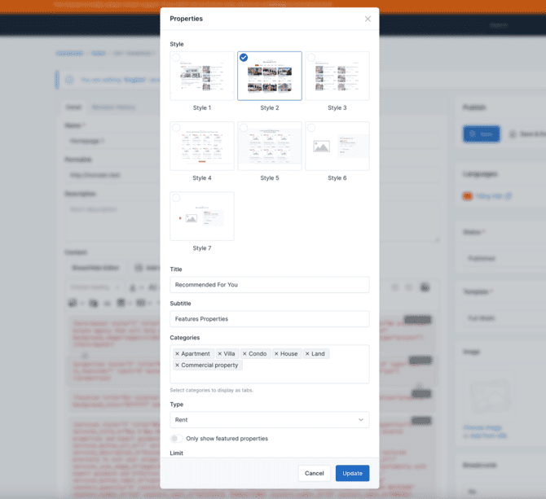

### Location

Highlight key locations or neighborhoods using the location UI block.

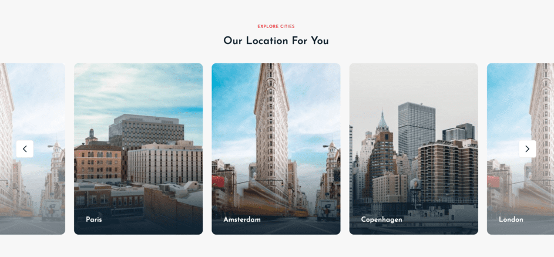

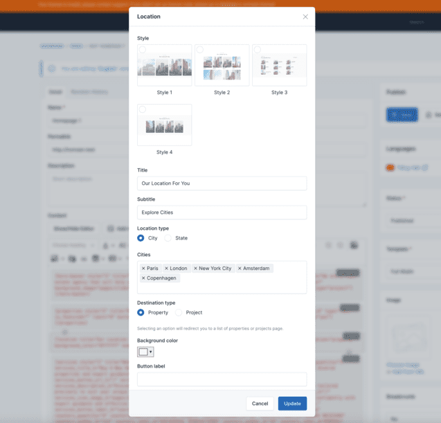

### Testimonials

Showcase client testimonials and reviews with the testimonials UI block. This section helps build trust and credibility by sharing positive feedback from satisfied customers.

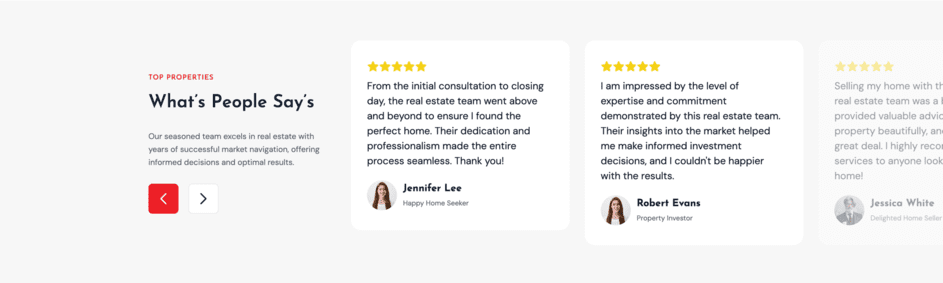

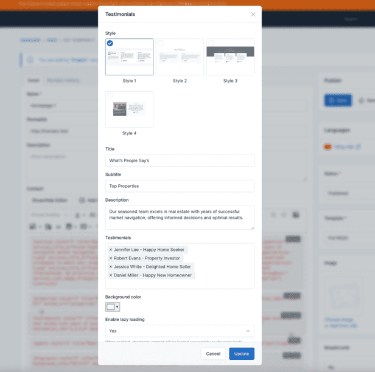

### Agents

Introduce your real estate agents or team members using the agents list UI block. Include their photos, names, roles, and contact information to personalize the user experience.

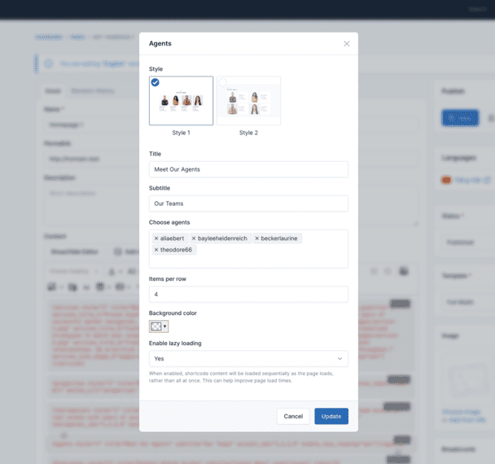

### Blog Posts

Feature recent blog posts or news articles using the blog posts UI block. This section can display article previews with titles, excerpts, publication dates, and read more links.

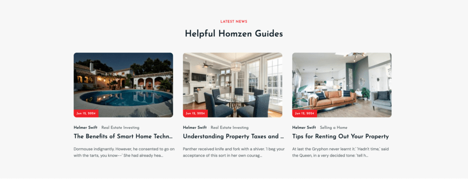

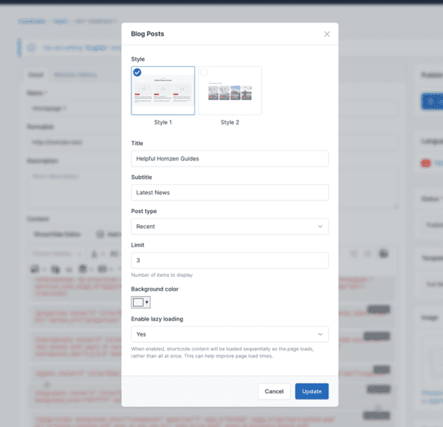

And many more! Explore the available UI Blocks in the Homzen theme to create a unique and engaging homepage for your real estate website.
