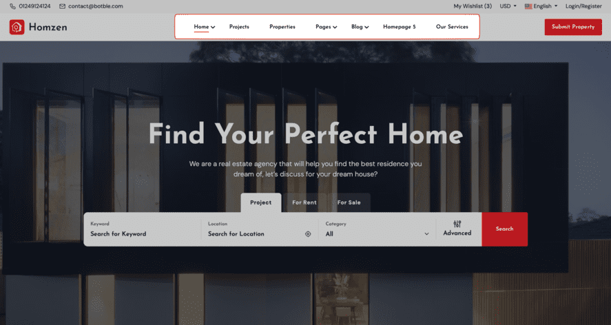
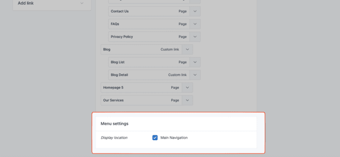

# Menu

To set up the menu, navigate to **Admin** -> **Appearance** -> **Menus**.

## Header Menu

The header menu is the primary navigation area at the top of your website. It allows users to access key sections of
your site easily.

To make the menu appear in the header, you need to assign it to the **Main Navigation** location.

