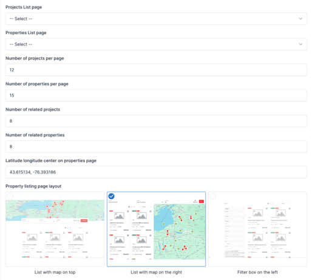

# Theme Options

Homzen comes with a variety of theme options that can be customized to fit your needs. You can access these options by
going to **Admin** -> **Appearance** -> **Theme Options**.

## General

In the **General** settings, you can configure the site's contact information, SEO settings, preloader options, copyright
text, date format, and enable lazy load images. This tab allows you to set up essential information and improve site
performance and SEO.

## Real Estate

In the **Real Estate** settings, you can select project and property listing pages, set the number of items per page,
configure related items, set map coordinates, and choose listing page layouts.

## Logo

In the **Logo** settings, you can change your site's logo and favicon.

## Typography

In the **Typography** settings, you can customize the fonts and sizes used throughout your site.

## Styles

In the **Styles** section, you can adjust the visual aspects of your website:

- **Primary Color**: Define the primary color scheme used throughout your site.
- **Footer Background**: Customize the background color or image for the footer section.
- **Login/Register Modal**: Enable a popup modal for the login/register form instead of redirecting users to another page.

## Social Links

In the **Social Links** section, you can add links to your social media profiles.

## Social Sharing

In the **Social Sharing** section, you can enable social sharing buttons to allow visitors to easily share your projects, properties, or posts on social media platforms.

