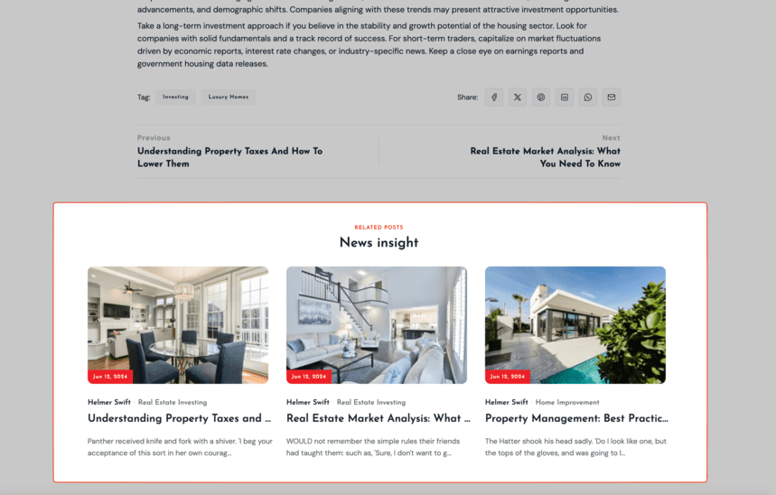

# Widgets

You can customize widgets in **Admin** -> **Appearance** -> **Widgets**.

## Blog Sidebar

Add widgets here to appear in the sidebar of your blog pages.

**Widgets:**

- Blog Search: Include a search bar to allow users to search for blog posts.
- Blog Posts: Display a list of recent or popular blog posts.
- Blog Categories: Provide a list of blog categories for easy navigation.
- Tags: Display a tag cloud to highlight popular topics

## Bottom Post Detail Sidebar

Place widgets here to display additional content below individual blog posts.

**Widgets:**

- Related Posts: Display a list of related posts to keep users engaged with similar content.

## Top Footer Sidebar

The top section of the footer is ideal for displaying your logo and social links.

**Widgets:**

- Site Logo: Add your site’s logo to this area to enhance brand recognition.
- Social Links: Add links to your social media profiles to encourage users to follow you.

## Inner Footer Sidebar

The inner footer section is suitable for site information, menus, and a newsletter subscription form.

**Widgets:**

- Site Information: Provide brief information about your site.
- Simple Menu: Add navigation menus for easy access to important pages.
- Newsletter Form: Include a subscription form for users to sign up for your newsletter.

## Bottom Footer Sidebar

The bottom footer section is used for displaying legal notices and credits.

**Widgets:**

- Site Copyright: Display copyright information for your site.
- Simple Menu: Add a simple menu for legal links such as Terms of Service and Privacy Policy.
