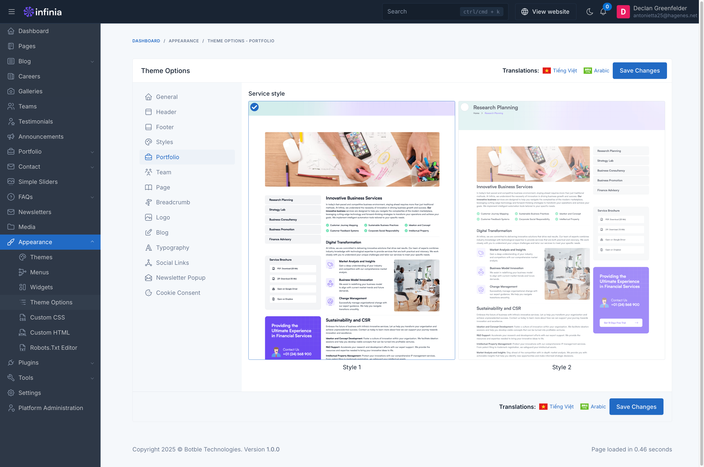
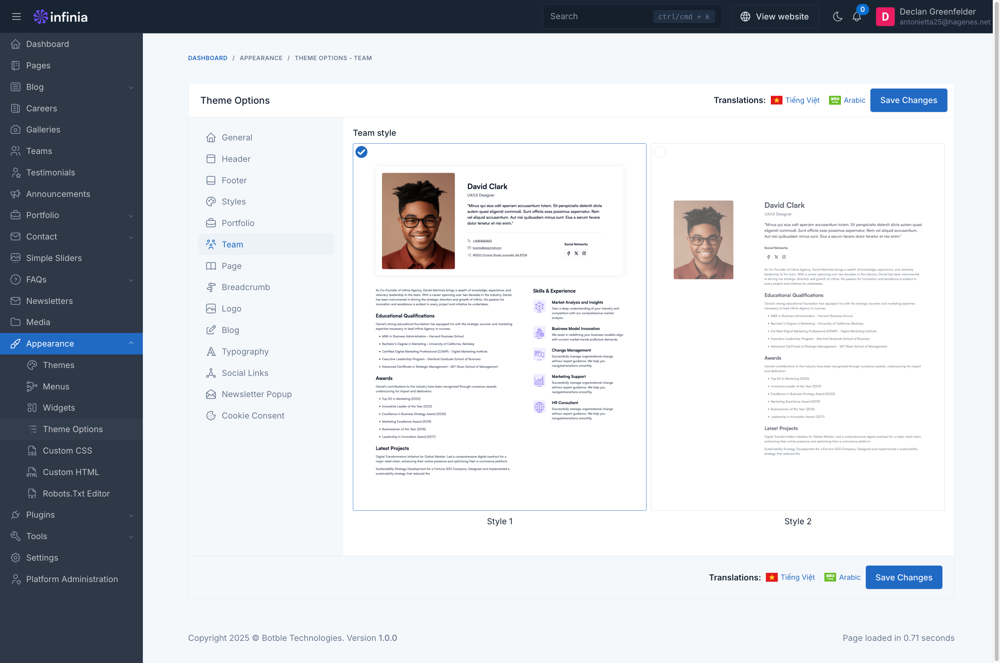
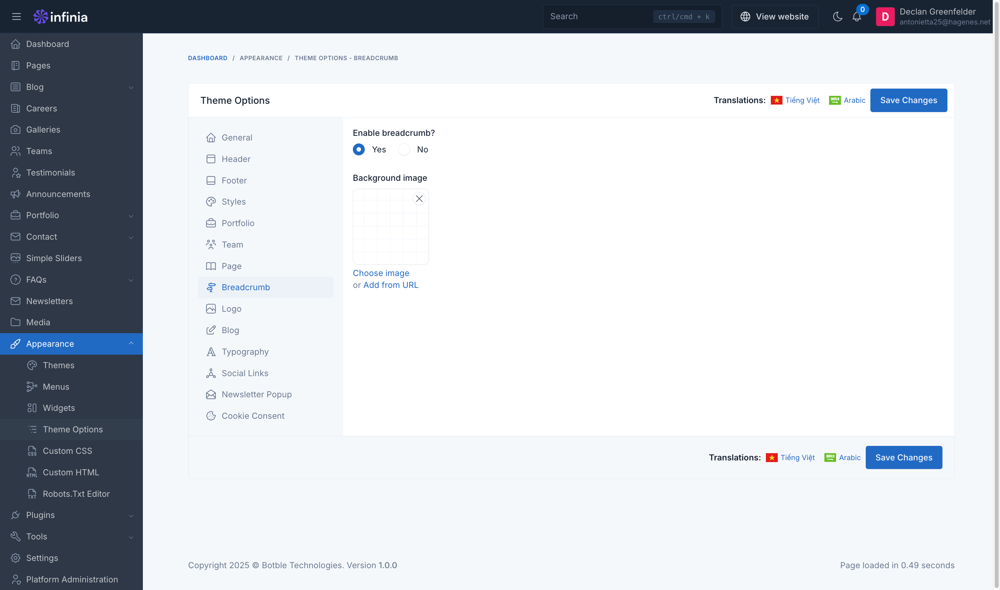
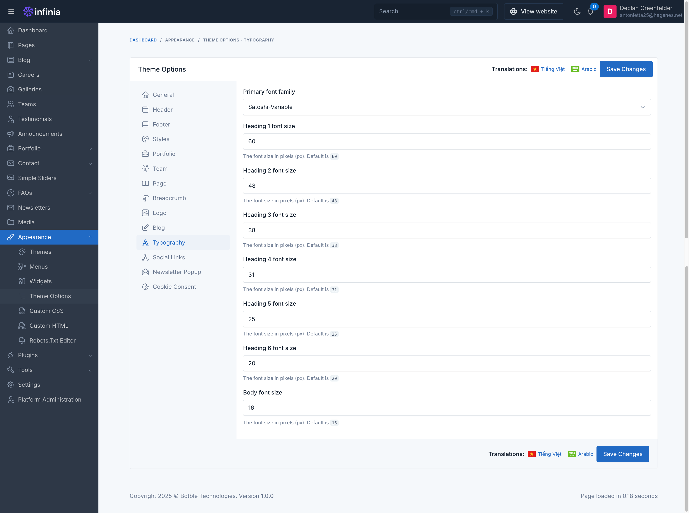

# Theme Options

Theme options are a great way to customize your theme. You can change the color, typography, layout, and more.

To access the theme options, go to `Appearance` -> `Theme Options` in your admin panel.

## General

The **General** tab allows you to configure fundamental settings that shape your website's identity and basic operation.

This section typically includes options for setting your site name, description, and other essential details.

## Header

### Sticky Header Toggle
- Enable/disable sticky header functionality.

### Header Top Display
- Toggle to show/hide the header top section.

### Color Settings
- Header top text color (color picker).
- Header top background color (color picker).

### Layout Configuration
- Dropdown menu with "Full Width" option selected.

*Note: This is part of the Infinia platform's theme customization interface, located under Dashboard > Appearance > Theme Options - Header.*

## Footer

### Color Options
- Background color picker.
- Border color selector.
- Text heading color customization.
- Text color selection.

### Background Image
- Option to choose image.
- Alternative to add from URL.

*Note: These settings allow customization of the footer's visual appearance through colors and background image options in a streamlined interface.*

## Styles

### Theme Mode Options
- Default theme mode selection (System/Light/Dark).
- Theme mode switcher visibility toggle (No/Yes).

### Visual Effects
- Animation toggle switch.
- Back to top button enabler.

### Color Scheme
- Primary color picker.
- Primary color dark variant.
- Primary gradient settings.
    - Gradient start color.
    - Gradient end color.
- Text color selection.

*Note: The interface allows comprehensive customization of the theme's appearance, with Light mode currently selected as default and the theme switcher set to visible (No selected for hiding).*

## Portfolio

Here you can customize the interface of the service detail page.

## Team

This section allows you to configure the team member detail page.

## Pages

This section allows you to configure key display settings for your website:

- **Your Homepage Displays**: Select the page that will serve as your site's homepage. This determines the primary content shown to visitors upon arrival.

- **Galleries Page**: Assign a specific page to display your galleries. If no page is selected, the galleries feature will not be visible.

Use these settings to ensure a seamless and user-friendly experience for visitors navigating your website.

## Breadcrumbs

This section allows you to customize the breadcrumb display and background image for your pages:

- **Enable Breadcrumb?**:
    - Choose **Yes** to display breadcrumbs for easier navigation.
    - Select **No** to hide breadcrumbs from the page.

- **Background Image**:
    - Upload a custom background image to be displayed on the page.

These settings help enhance the visual appeal and usability of your website.

## Typography

The **Typography** settings allow you to configure the font family and sizes for various text elements on your website. This ensures consistent and visually appealing text across your site.

### Notes
- Font sizes are specified in pixels (`px`).
- Adjust these settings to match your design requirements and improve readability.

