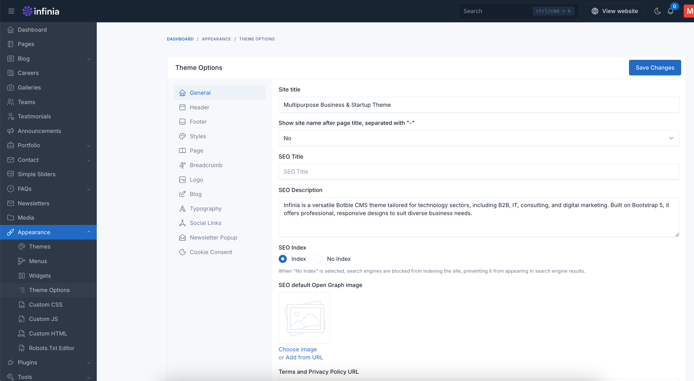
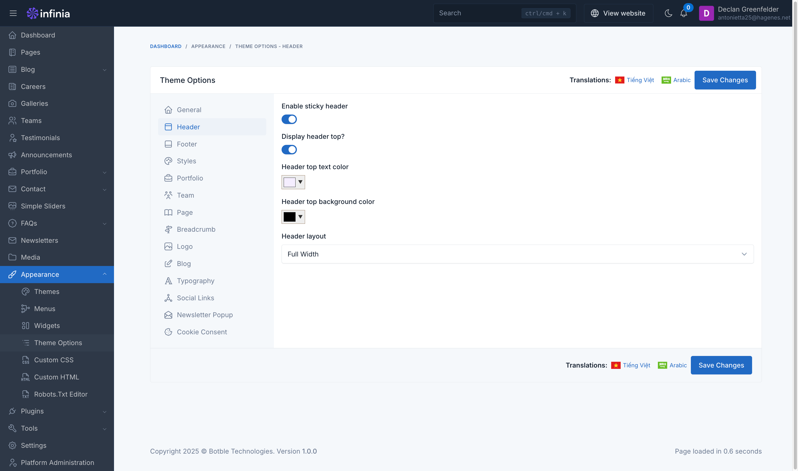
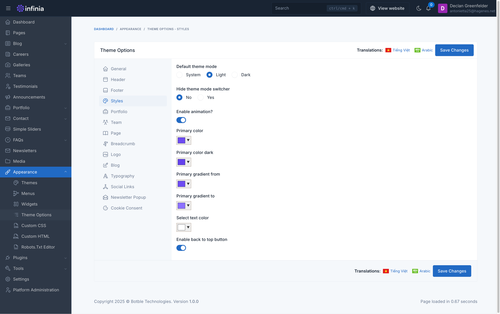

# Theme Options

Theme options are a great way to customize your theme. You can change the color, typography, layout, and more.

To access the theme options, go to `Appearance` -> `Theme Options` in your admin panel.

## General

The **General** tab allows you to configure fundamental settings that shape your website's identity and basic operation.

This section typically includes options for setting your site name, description, and other essential details.

## Header

#### Sticky Header Toggle
- Enable/disable sticky header functionality

#### Header Top Display
- Toggle to show/hide the header top section

#### Color Settings
- Header top text color (color picker)
- Header top background color (color picker)

#### Layout Configuration
- Dropdown menu with "Full Width" option selected

*Note: This is part of the Infinia platform's theme customization interface, located under Dashboard > Appearance > Theme Options - Header.*

## Footer

#### Color Options
- Background color picker
- Border color selector
- Text heading color customization
- Text color selection

#### Background Image
- Option to choose image
- Alternative to add from URL

*Note: These settings allow customization of the footer's visual appearance through colors and background image options in a streamlined interface.*

## Styles

#### Theme Mode Options
- Default theme mode selection (System/Light/Dark)
- Theme mode switcher visibility toggle (No/Yes)

#### Visual Effects
- Animation toggle switch
- Back to top button enabler

#### Color Scheme
- Primary color picker
- Primary color dark variant
- Primary gradient settings
- Gradient start color
- Gradient end color
- Text color selection

*Note: The interface allows comprehensive customization of the theme's appearance, with Light mode currently selected as default and the theme switcher set to visible (No selected for hiding).*

And many more options to customize your theme. Explore them all in the theme options panel.
