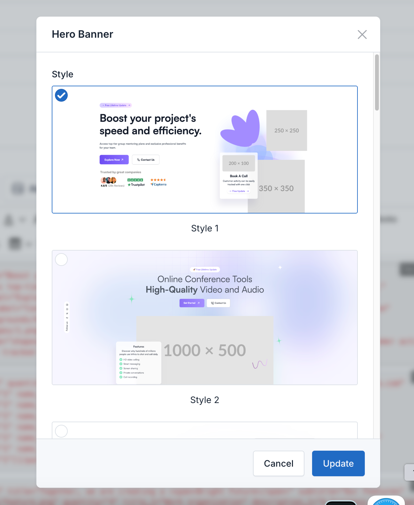
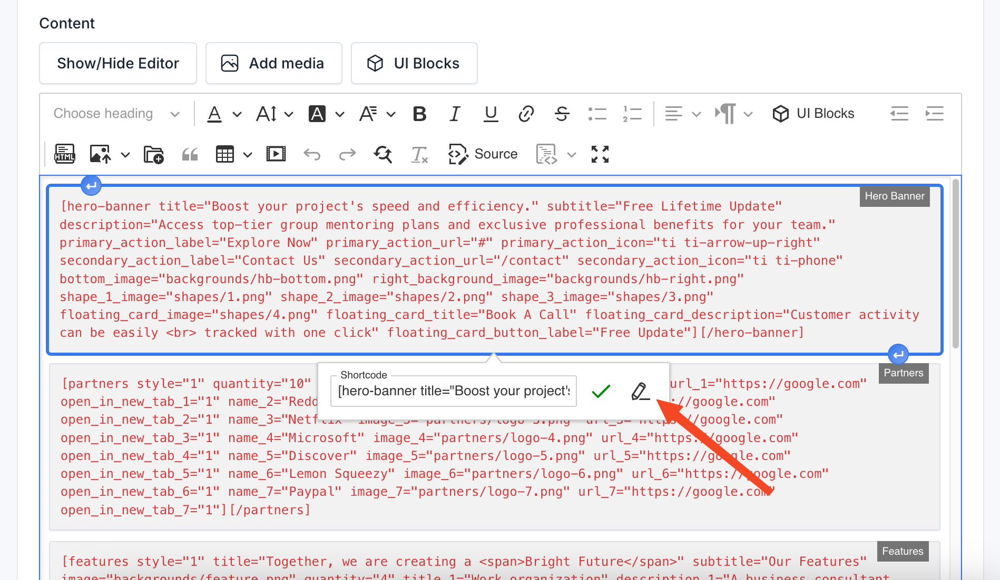

# UI Block (Shortcode)

UI Blocks, also known as Shortcodes, are small pieces of code that allow you to add predefined elements to your website.
They are used to enhance the functionality of your website without the need to write custom code.

## Usage

To use a shortcode, simply add the shortcode to the content of a page or post.

For example, to add a Hero banner to the homepage, use the following button:

Search for Hero banner and click on the **use** button.

Then you can configure the Hero banner block.

You can modify it as needed by click on that block in editor and click on icon pencil to edit.

There are many more shortcodes but the setup is similar.
