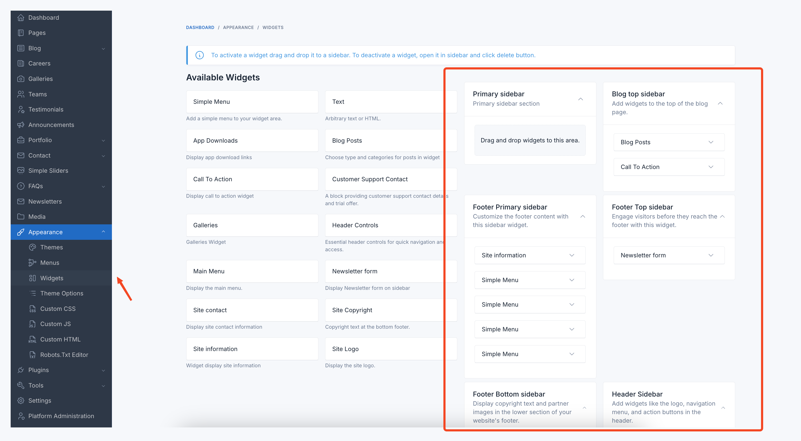
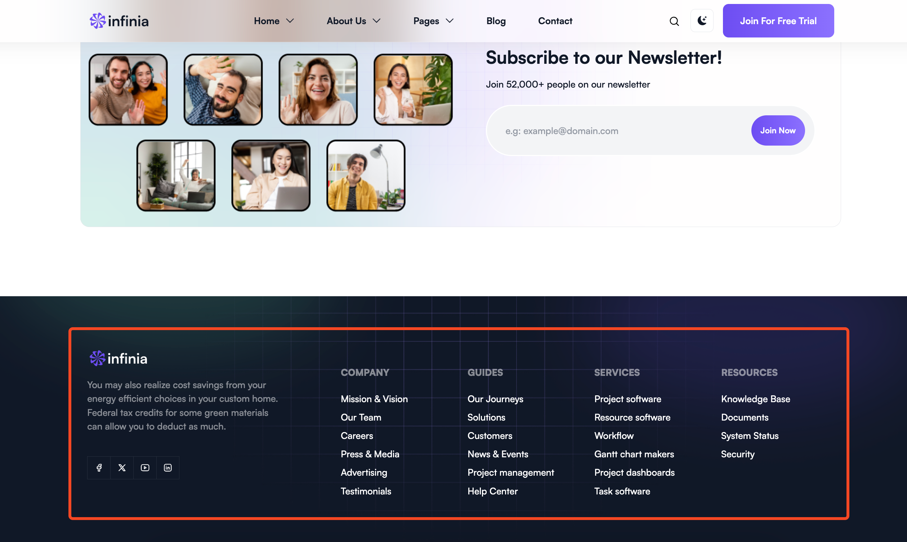
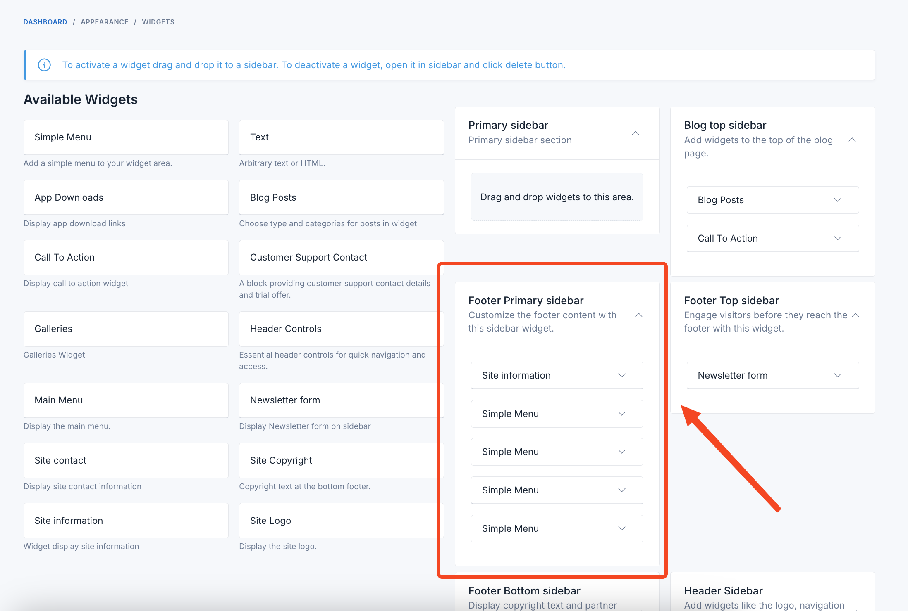
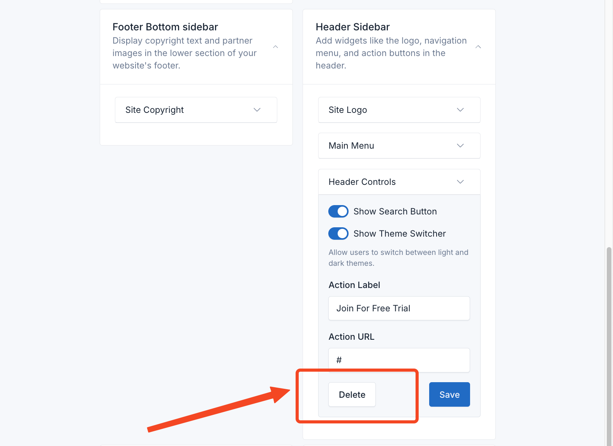

# Widgets

Infinia provides five pre-made widget areas to help you customize the user interface and organize content strategically.

These sidebars offer flexibility in placement and functionality, allowing you to tailor the user experience on different
sections of your website.

## Manage Widgets

To manage the widgets, go to the `Appearance` -> `Widgets` menu in the admin panel.

To add a widget to a sidebar, drag and drop the widget from the left side to the sidebar area on the right side.

## Widget Areas

### 1. Footer primary sidebar

It is displayed at the footer of the page and includes 1 site-information widget and 3 simple menu widgets.

## Delete Widgets

If you don't want to use the widgets in some areas, you can remove them by collapsing the widget and clicking the
**Delete** button.

