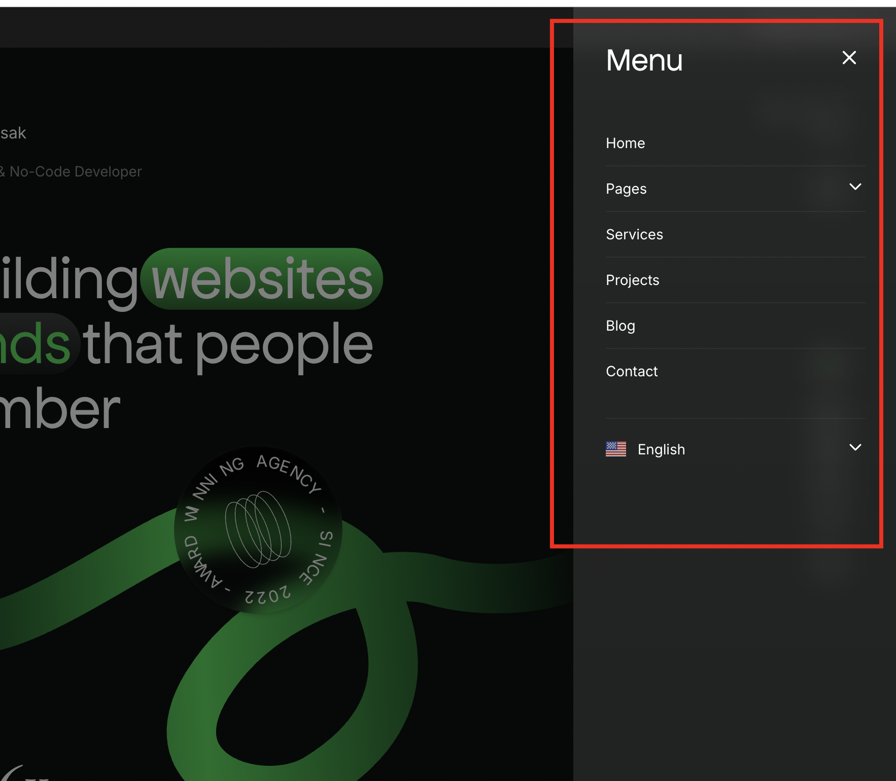
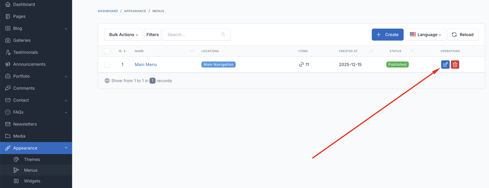

# Menu

Menus are a crucial element for website navigation. In Isak, menus are primarily used for the sidebar navigation and mobile menu.

You can manage your menus from the `Appearance` -> `Menus` in the admin panel.

## Adding a New Menu

To add a new menu, click on `Create` button. Enter a name for the menu and click on `Save` button.

### Adding Menu Items

In the menu edit page, you can add menu items by clicking on the items on the left side and then clicking
on `Add to menu` button.

You can drag and drop the menu items to change their order or create nested menus (level 2, 3, etc).

### Available Menu Items

Here are the available menu items that you can add to the menu:

* **Custom Links**: Create links directing users to external websites or specific sections within your website.
* **Pages**: Add existing pages from your website to the menu.
* **Post Categories**: Display categories of blog posts for navigation.
* **Post Tags**: Allow navigation by individual tags associated with blog posts.
* **Projects**: Link to portfolio projects (if Portfolio plugin is active).
* **Services**: Link to service pages (if Portfolio plugin is active).

## Setting a Menu Location

To set a menu as the primary menu, enable the `Main Navigation` checkbox in the **Display location** section.

## Menu Locations

Isak supports the following menu locations:

| Location | Description |
|----------|-------------|
| Main Navigation | Primary navigation menu |

## Section Navigation

::: tip
In Isak, the sidebar navigation for sections (Home, About, Education, etc.) is automatically generated from the shortcodes added to the homepage. Each shortcode has its own navigation icon and label settings.
:::

The section navigation is not managed through the traditional menu system. Instead, configure the navigation icon and label in each shortcode's settings. See [UI Block](./usage-ui-block.md) for more details.
