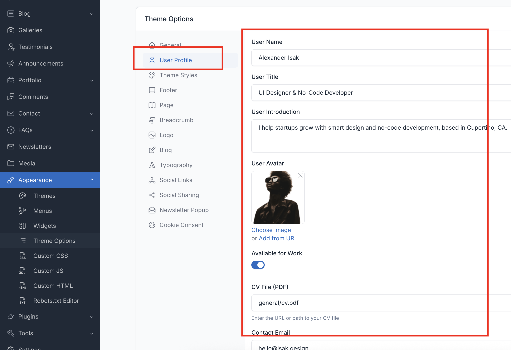
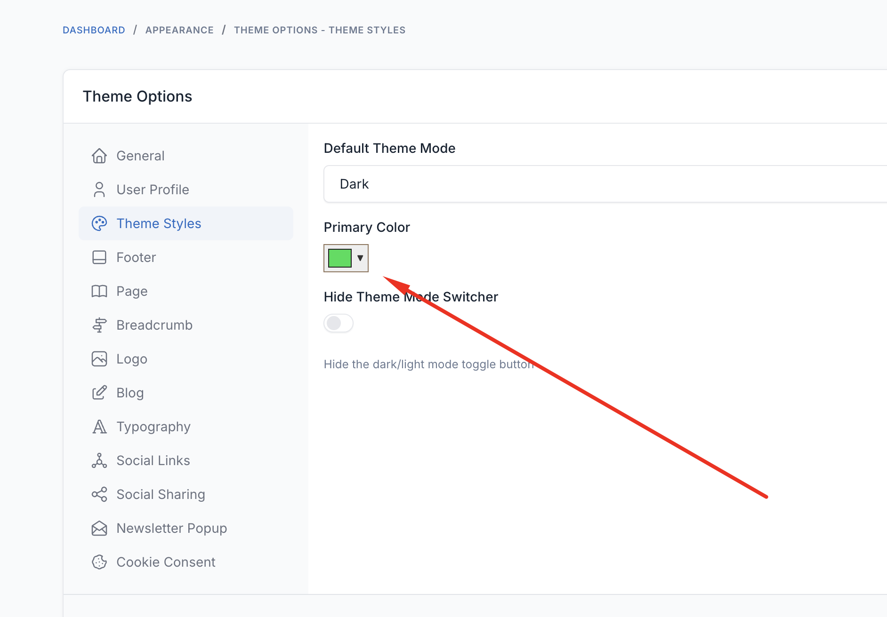
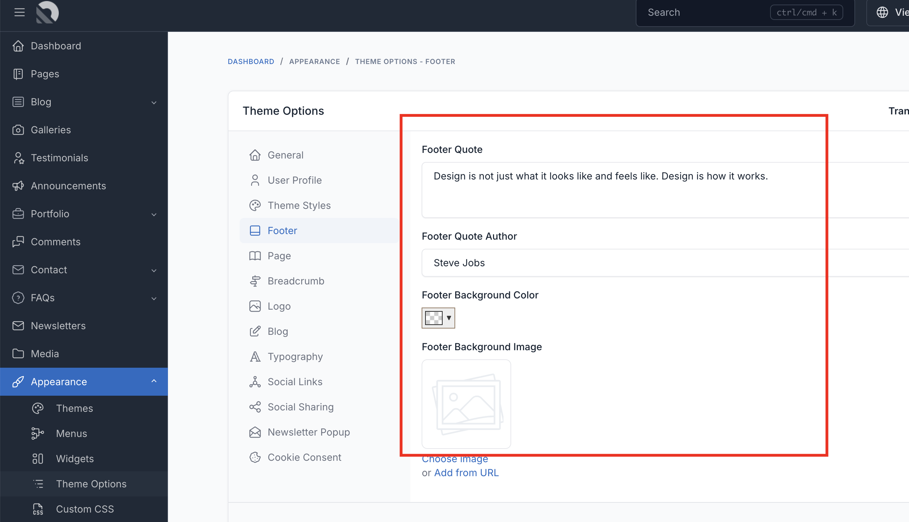
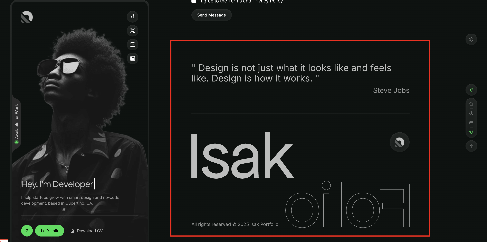

# Theme Options

Theme options allow you to customize your Isak theme without touching any code. You can change colors, user profile, footer settings, and more.

To access the theme options, go to `Appearance` -> `Theme Options` in your admin panel.

## User Profile

Configure your personal information displayed in the sidebar.

| Option | Description |
|--------|-------------|
| User Name | Your name displayed in the sidebar |
| User Title | Your professional title (e.g., "Full Stack Developer") |
| User Introduction | Short bio text |
| User Avatar | Profile photo for the sidebar |
| Available for Work | Toggle to show "Available for Work" badge |
| CV File (PDF) | URL or path to downloadable CV/Resume PDF |
| Contact Email | Email address for contact |
| Show Social Links | Toggle to show/hide social media links in sidebar. If enabled, add links in `Appearance` → `Theme Options` → `Social Links` |

## Theme Styles

Customize the visual appearance of your theme.

| Option | Description |
|--------|-------------|
| Default Theme Mode | Choose between Dark or Light mode |
| Primary Color | Override the default primary/accent color |
| Hide Theme Mode Switcher | Hide the dark/light mode toggle button in the sidebar |

::: tip
Theme variants (V1, V2, V3) and background settings are configured per-page using page meta boxes. See [Theme Variants](./usage-theme-variants.md) for details.
:::

## Logo Settings

Upload different logo variations.

| Option | Description |
|--------|-------------|
| Logo (Light Mode) | Logo displayed in light mode |
| Logo (Dark Mode) | Logo displayed in dark mode |
| Favicon | Browser tab icon |

## Footer Settings

Configure the footer section of your website.

| Option | Description |
|--------|-------------|
| Footer Quote | Inspirational quote displayed in footer |
| Footer Quote Author | Author of the quote |
| Footer Background Color | Custom background color for footer section |
| Footer Background Image | Background image for footer section |

## General Settings

Additional settings available in `Appearance` → `Theme Options` → `General`.

| Option | Description |
|--------|-------------|
| Enable Social Sharing | Show social sharing buttons on posts and projects |
| Preloader Version | Choose between Default or Isak Style preloader |

## Built-in Features

Isak includes these built-in features through ThemeSupport:

| Feature | Description |
|---------|-------------|
| Social Links | Configure social media profile links |
| Preloader | Loading animation (Default or Isak Style) |
| Site Copyright | Copyright text in footer |
| Social Sharing | Share buttons on posts |
| Lazy Load Images | Performance optimization |
| Date Format | Customize date display format |
| Toast Notifications | Notification popups |
| Logo Height | Adjust logo dimensions |
