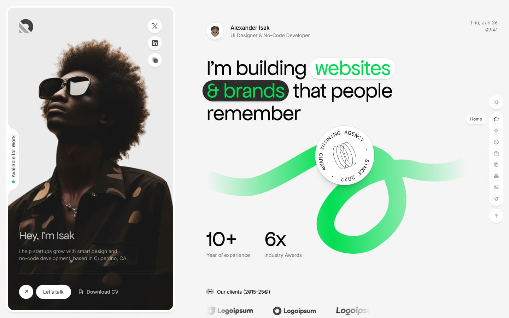
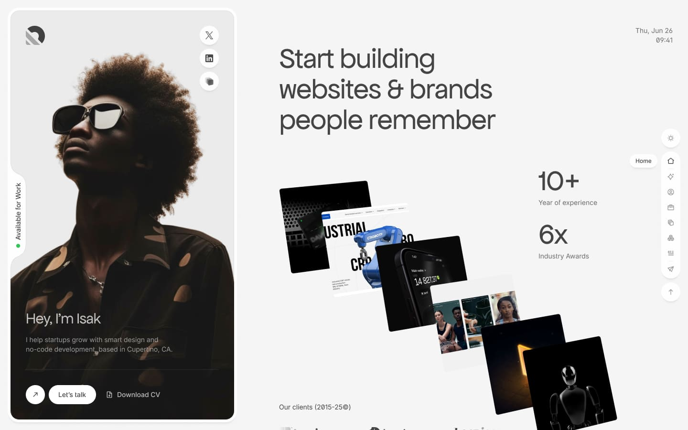
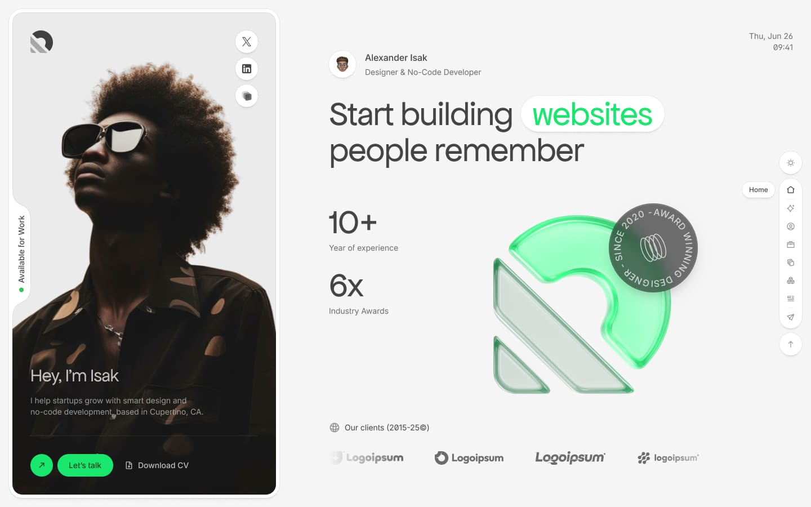
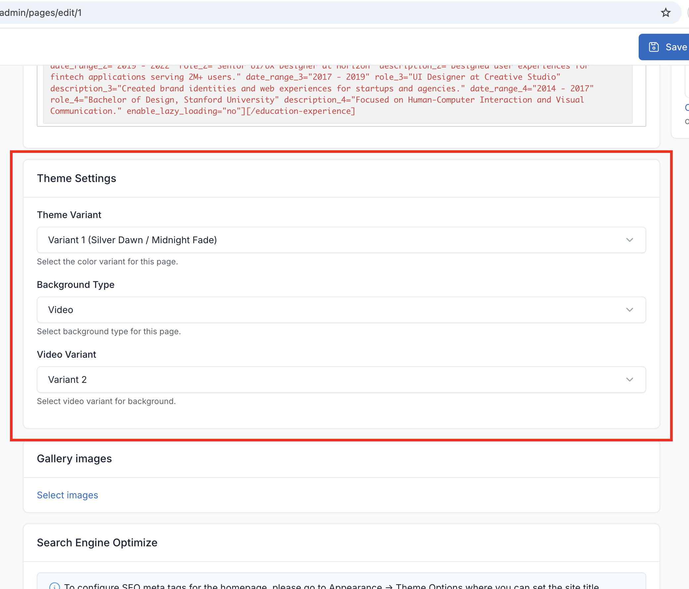

# Theme Variants

Isak comes with 3 beautiful color variants, each with distinct light and dark mode styles. Theme variants are configured per-page using page meta boxes, giving you flexibility to use different variants across your site.

## Available Variants

### Variant 1 (V1) - Silver Dawn / Midnight Fade

The default variant with elegant silver tones in light mode and deep midnight colors in dark mode.

**Light Mode (Silver Dawn)**
- Clean, professional appearance
- Subtle silver and gray tones
- High contrast for readability

**Dark Mode (Midnight Fade)**
- Deep, rich dark backgrounds
- Smooth gradient transitions
- Eye-friendly for extended viewing

### Variant 2 (V2) - Lavender Stone / Charcoal Mist

A sophisticated variant with soft lavender accents in light mode and charcoal tones in dark mode.

**Light Mode (Lavender Stone)**
- Soft, calming lavender highlights
- Modern, trendy appearance
- Subtle purple undertones

**Dark Mode (Charcoal Mist)**
- Warm charcoal background
- Misty, atmospheric feel
- Balanced contrast

### Variant 3 (V3) - Ocean Breeze / Forest Shadow

A nature-inspired variant with ocean blues in light mode and forest greens in dark mode.

**Light Mode (Ocean Breeze)**
- Fresh, energetic blue tones
- Airy, open feel
- Professional yet creative

**Dark Mode (Forest Shadow)**
- Deep forest greens
- Earthy, grounded appearance
- Unique alternative to pure black

## Page Theme Settings

Theme variants and background settings are configured individually for each page using meta boxes.

### Setting Theme Variant

1. Go to `Pages` and edit the desired page
2. In the page editor, find the **Theme Settings** meta box
3. Select your preferred variant (V1, V2, or V3)
4. Save the page

This allows you to use different variants for different pages on your site.

### Background Settings

Each page can have its own background configuration:

| Option | Description |
|--------|-------------|
| Background Type | Choose between `Video` or `Image` background |
| Video Variant | Select video variant (V1 or V2) when using video background |
| Background Image | Upload custom background image when using image background |

**Video Background (Default)**
- Two built-in video variants with animated overlay effects
- Automatically plays, loops, and is muted for performance

**Image Background**
- Upload any image as a static background
- Useful for pages where video may be distracting
- Maintains the same overlay styling as video backgrounds

## How Variants Work

Each variant affects the following elements throughout the page:

- **Background colors**: Main page backgrounds and section backgrounds
- **Text colors**: Headings, body text, and links
- **Accent colors**: Buttons, highlights, and interactive elements
- **Border colors**: Dividers, cards, and form fields
- **Animation colors**: GSAP animation effects and transitions

## Preview Variants

You can preview variants using the theme settings panel in the sidebar:

1. Click the settings gear icon in the sidebar
2. Select a different variant
3. The page will update immediately
4. Note: This only affects your current session for preview purposes

To make the variant permanent for a page, set it in the page meta boxes as described above.
