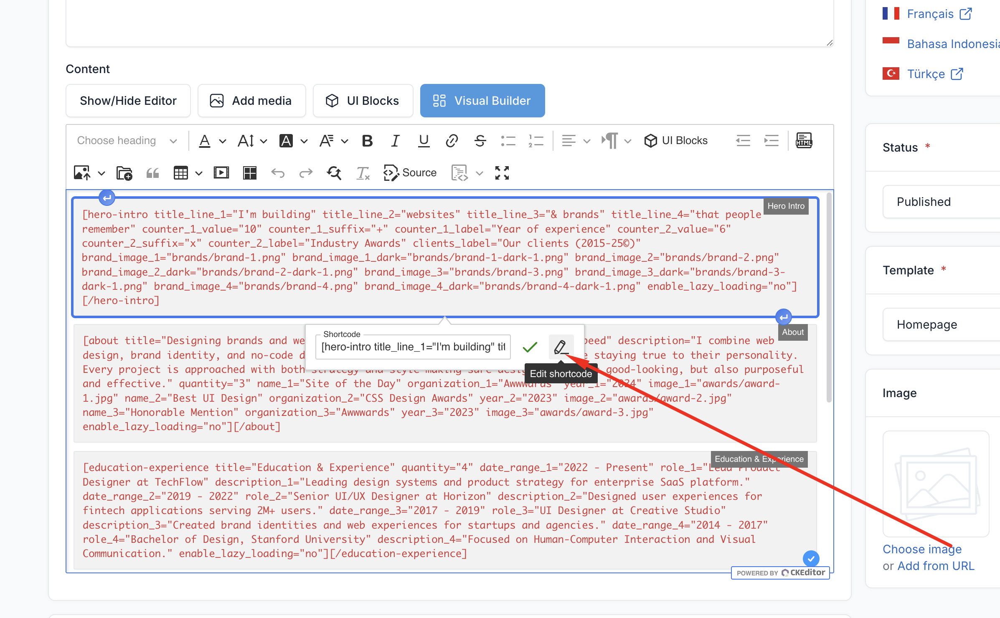
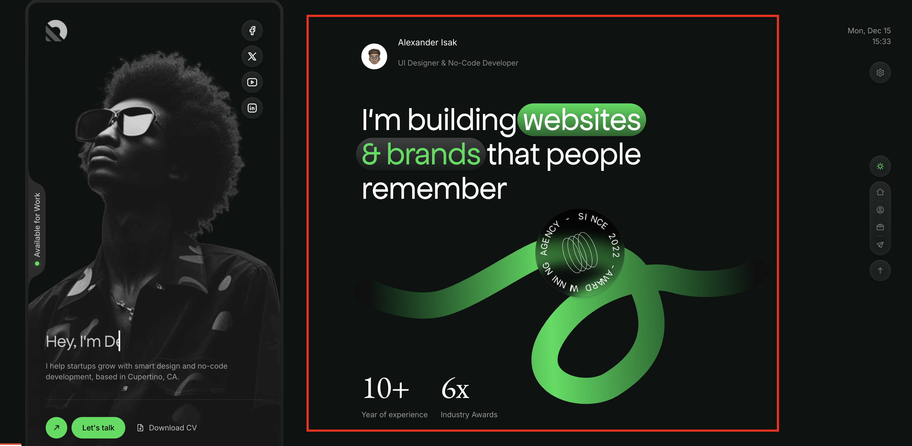
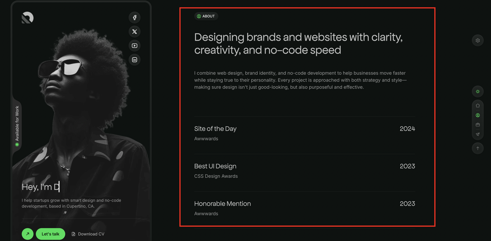
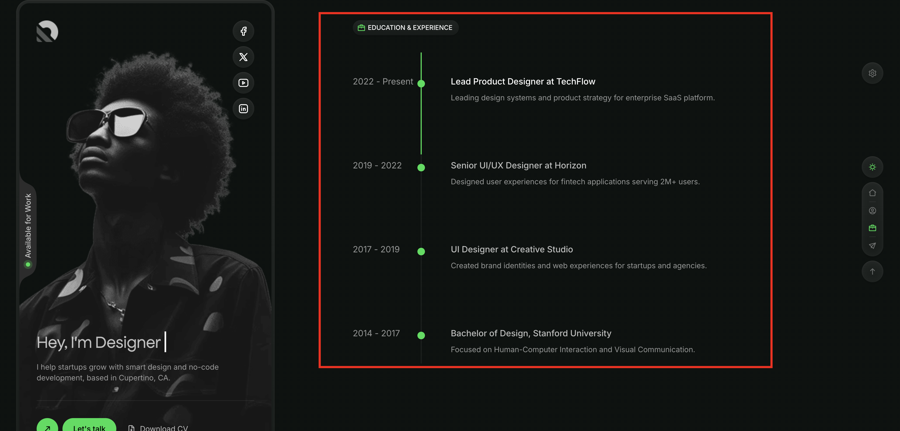
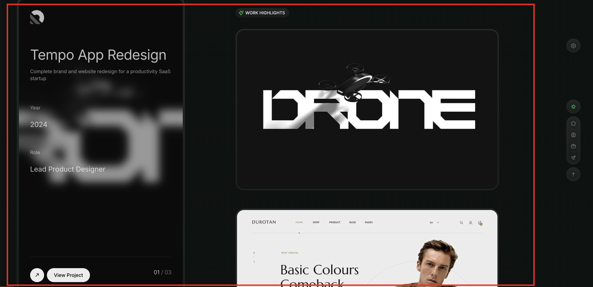
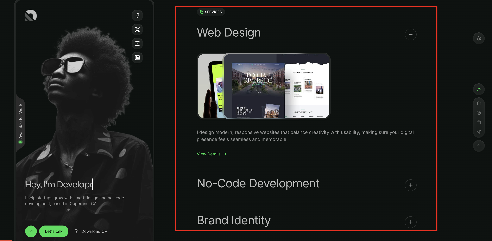
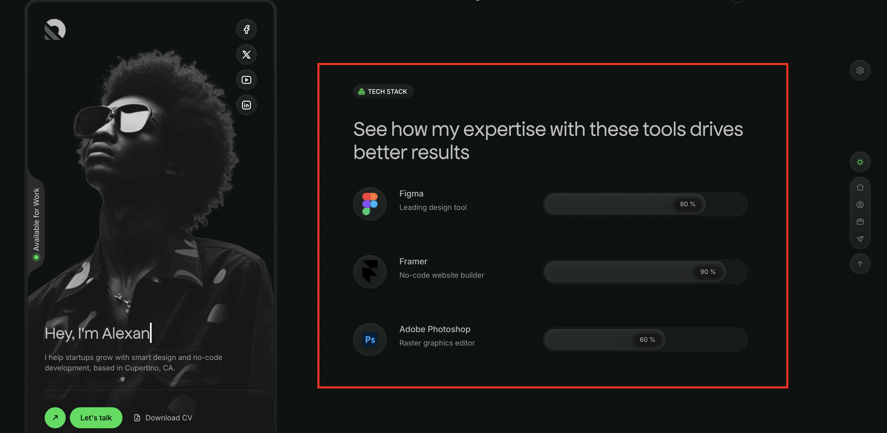
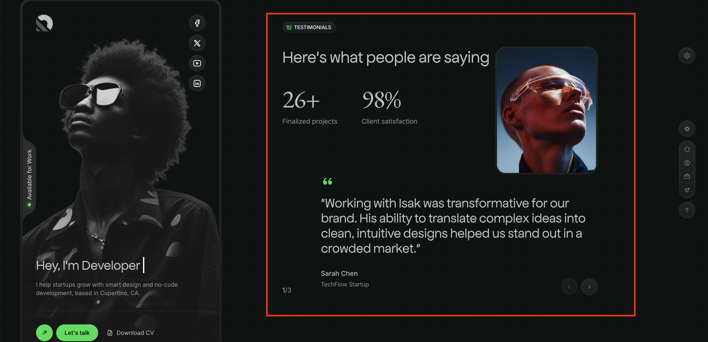
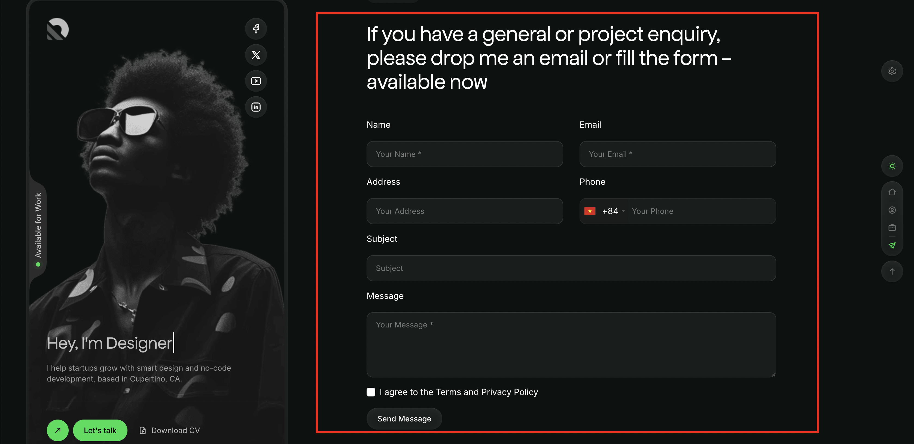

# UI Block (Shortcode)

UI Blocks, also known as Shortcodes, are small pieces of code that allow you to add predefined elements to your website.
They are used to enhance the functionality of your website without the need to write custom code.

## Usage

To use a shortcode, simply add the shortcode to the content of a page or post.

For example, to add a Hero Intro section to the homepage, use the following button:

Search for the shortcode you want and click on the **use** button.

Then you can configure the block settings.

You can modify it as needed by clicking on that block in the editor and clicking on the pencil icon to edit.

## Available Shortcodes

Isak provides 8 main shortcodes for building your portfolio:

### 1. Hero Intro

The main hero section featuring animated text, counters, and client logos.

**Styles Available:**
- Style 1 (Default)
- Style 2 (Flip Images)
- Style 3 (3D Logo)

**Configuration Options:**

| Field | Description |
|-------|-------------|
| Style | Select display style (Default, Flip Images, 3D Logo) |
| Title Highlight Color | Color for animated highlight behind text (default: #00DE51) |
| Title Line 1-4 | Animated headline text lines |
| Counter 1 Value/Suffix/Label | First statistic counter |
| Counter 2 Value/Suffix/Label | Second statistic counter |
| Clients Label | Label for client logos section |
| Brand Image 1-4 (Light) | Client logos for light mode |
| Brand Image 1-4 (Dark) | Client logos for dark mode |
| Flip Images | Images for Style 2 flip animation |
| 3D Logo Image | Logo for Style 3 (light/dark variants) |
| Navigation Icon | Sidebar icon (default: `icon-home`) |
| Navigation Label | Sidebar text (default: "Home") |

### 2. About

Showcase your awards and achievements with an interactive gallery.

**Styles Available:**
- Style 1 (Award List)
- Style 2 (Hover Gallery)

**Configuration Options:**

| Field | Description |
|-------|-------------|
| Style | Select display style |
| Title | Section heading |
| Description | Section description text |
| Awards | Repeatable items with: name, organization, year, image |
| Navigation Icon | Sidebar icon (default: `icon-user-circle`) |
| Navigation Label | Sidebar text (default: "About") |

### 3. Education & Experience

Display your background in a beautiful timeline layout.

**Configuration Options:**

| Field | Description |
|-------|-------------|
| Section Title | Heading for the section |
| Timeline Items | Repeatable entries with: date_range, role, description, icon |
| Navigation Icon | Sidebar icon (default: `icon-edu`) |
| Navigation Label | Sidebar text (default: "Education") |

### 4. Work Highlights

Showcase your portfolio projects with a sticky scroll animation effect.

**Configuration Options:**

| Field | Description |
|-------|-------------|
| Section Title | Heading for the section |
| Number of Projects | Limit of projects to display |
| Navigation Icon | Sidebar icon (default: `icon-high-light`) |
| Navigation Label | Sidebar text (default: "Work") |

::: tip
Projects are loaded from the Portfolio plugin. Make sure to add projects in Admin -> Portfolio -> Projects.
:::

### 5. Services

Display your services in an elegant accordion layout.

**Configuration Options:**

| Field | Description |
|-------|-------------|
| Section Title | Heading for the section |
| Number of Services | Limit of services to display |
| Navigation Icon | Sidebar icon (default: `icon-service`) |
| Navigation Label | Sidebar text (default: "Services") |

::: tip
Services are loaded from the Portfolio plugin. Add services in Admin -> Portfolio -> Services.
:::

### 6. Tech Stack

Show your technical skills with animated progress bars.

**Configuration Options:**

| Field | Description |
|-------|-------------|
| Section Title | Heading for the section |
| Skills | Repeatable items with: name, description, percentage, icon, icon_dark |
| Navigation Icon | Sidebar icon (default: `icon-tech-stack`) |
| Navigation Label | Sidebar text (default: "Tech") |

### 7. Testimonials

Display client testimonials in a carousel with optional counters.

**Configuration Options:**

| Field | Description |
|-------|-------------|
| Section Title | Heading for the section |
| Counter 1 Value/Label | First counter statistic |
| Counter 2 Value/Label | Second counter statistic |
| Testimonials | Select specific testimonials to display |
| Navigation Icon | Sidebar icon (default: `icon-tes`) |
| Navigation Label | Sidebar text (default: "Testimonials") |

::: tip
Testimonials are loaded from the Testimonial plugin. Add testimonials in Admin -> Testimonial.
:::

### 8. Contact

Contact form section with customizable fields.

**Configuration Options:**

| Field | Description |
|-------|-------------|
| Title | Section heading (supports multiline) |
| Contact Email | Email address |
| Button Text | Submit button text |
| Navigation Icon | Sidebar icon (default: `icon-send`) |
| Navigation Label | Sidebar text (default: "Contact") |

## Navigation Icons

Each shortcode supports custom navigation icons. Isak uses custom icon fonts with the following classes:

| Icon Class | Section |
|------------|---------|
| `icon-home` | Home |
| `icon-user-circle` | About |
| `icon-edu` | Education |
| `icon-high-light` | Work |
| `icon-service` | Services |
| `icon-tech-stack` | Tech Stack |
| `icon-tes` | Testimonials |
| `icon-send` | Contact |

These icons are from the Icomoon icon font included with the theme.
