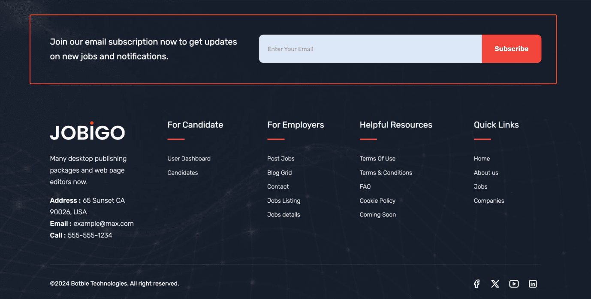
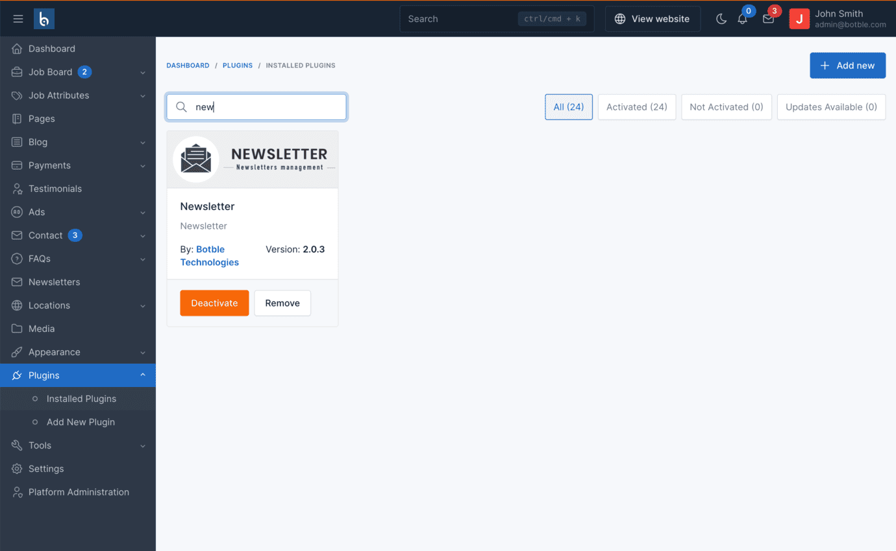
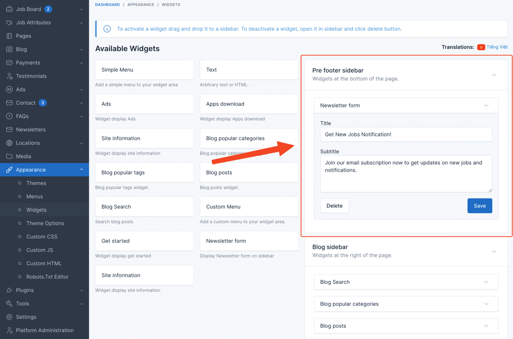
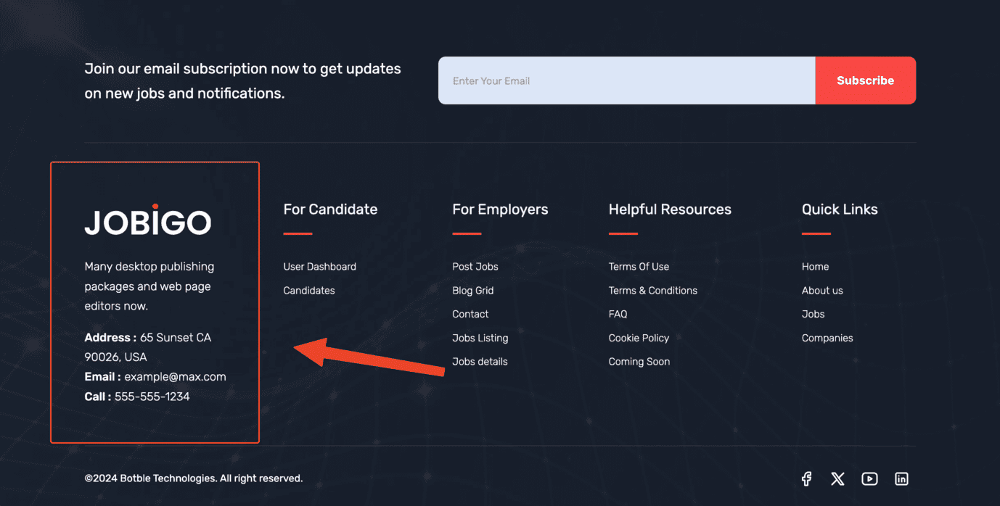
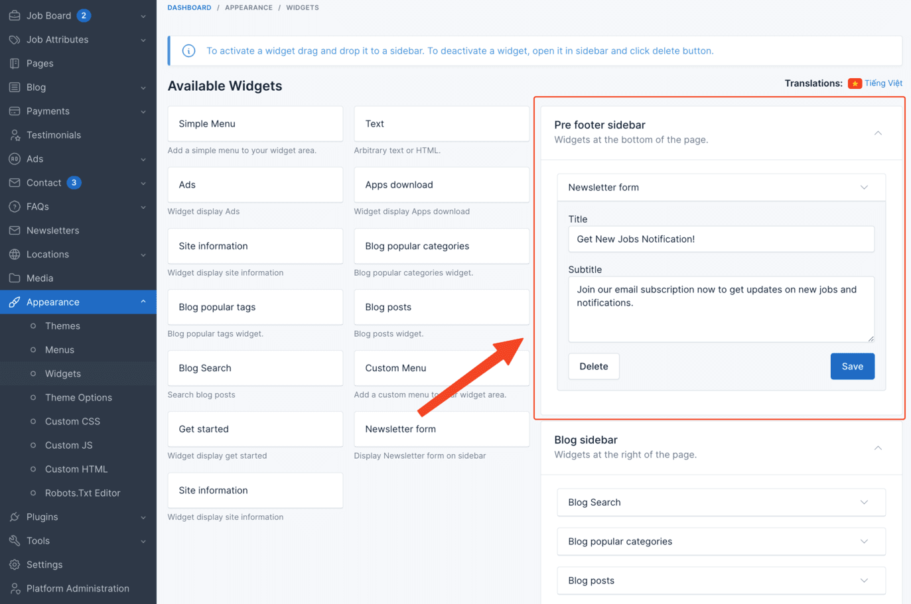
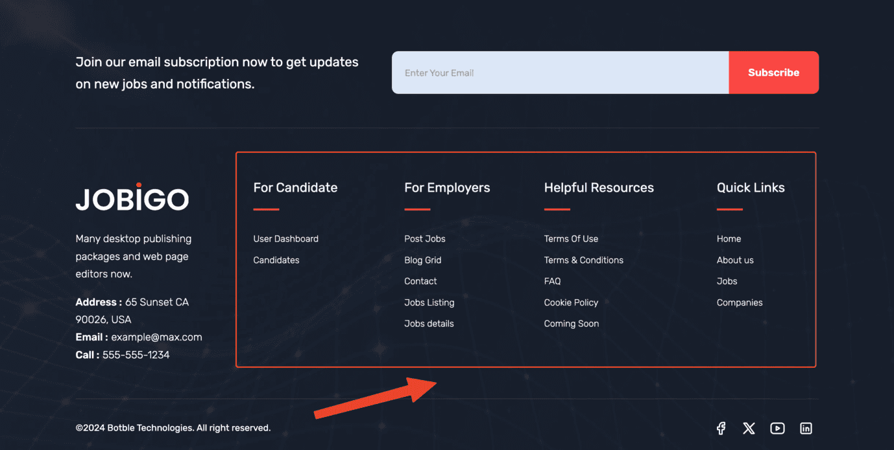
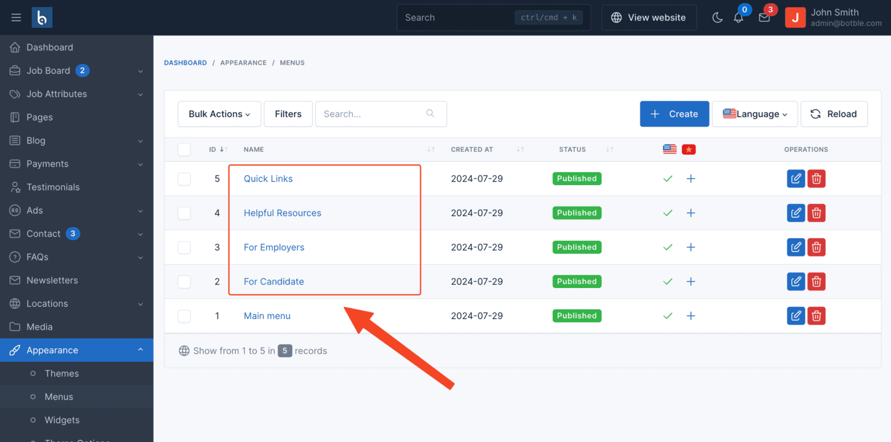
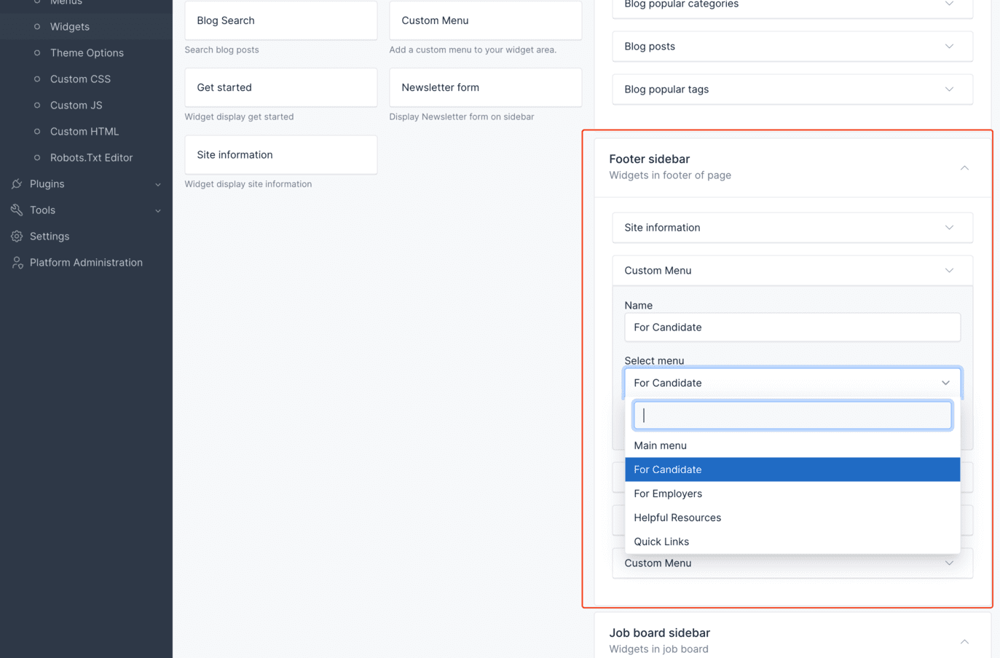
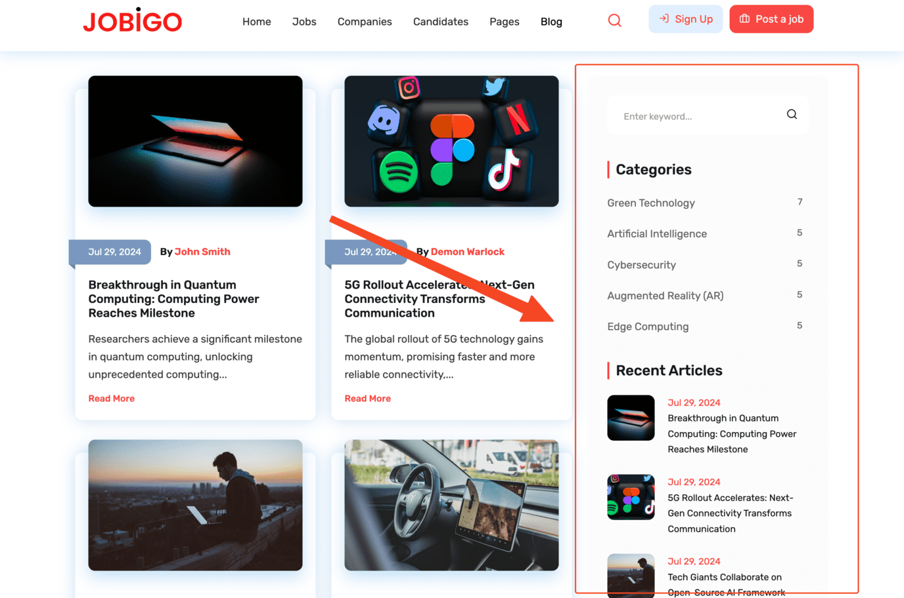
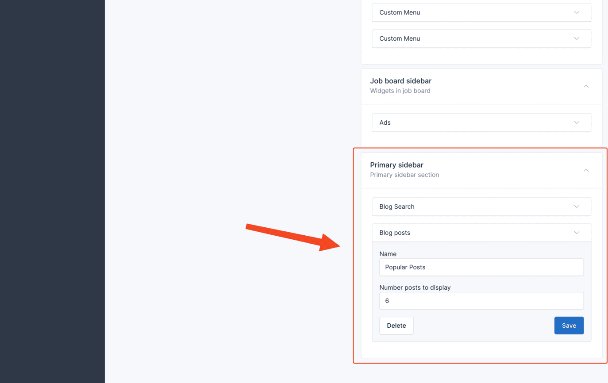

# Widgets

## Newsletter

If you don't need it, you can deactivate plugin Newsletter in Admin -> Plugins.

To change title & description for this section or remove it from footer section, you can change it in Admin ->
Appearance -> Widgets

## Site information

Go to Admin -> Appearance -> Widgets.

You can click on "Delete" button to remove widget from footer sidebar or change content for this widget.

If you want to add more widgets, just drag and drop from the left side to sidebar.

## Footer menu widgets

Go to Admin -> Appearance -> Menus (modify menu Quick Links, Helpful Resources, For Candidates, For Employers)

You can change or remove those menus from footer in Admin -> Appearance -> Widgets.

## Blog sidebar widgets

Go to Admin -> Appearance -> Widgets.

