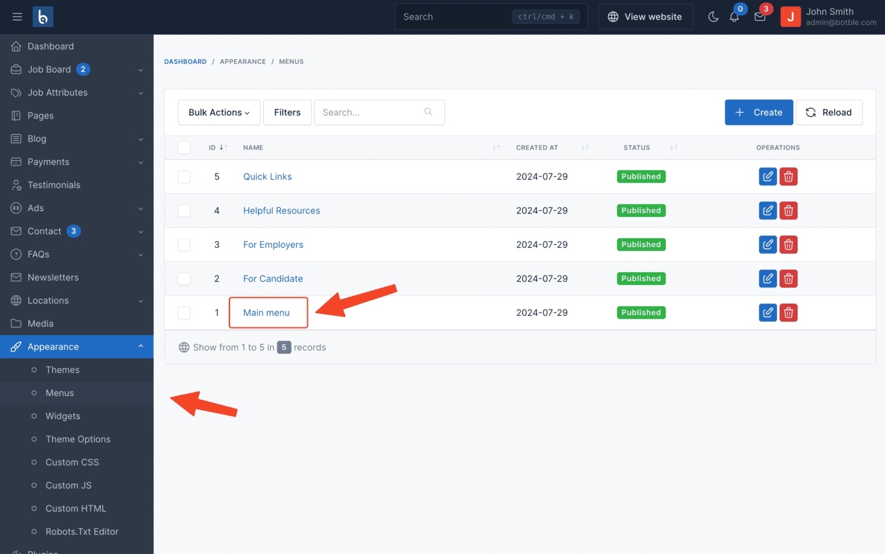
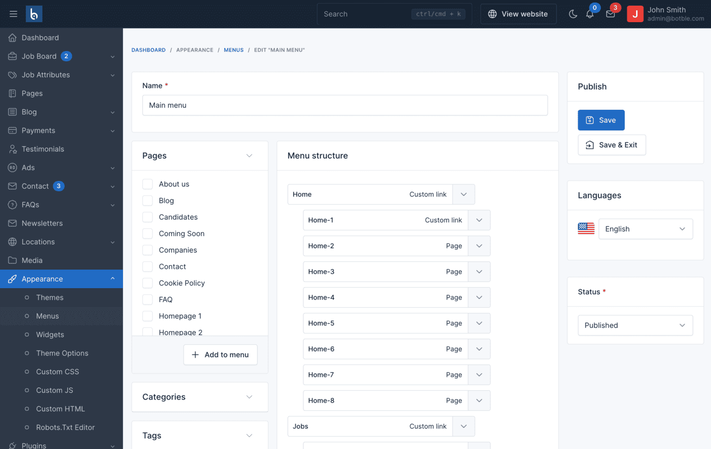
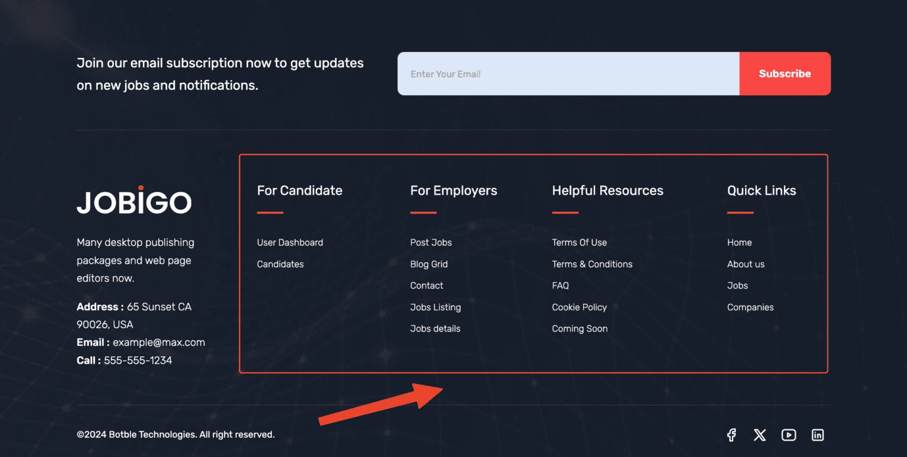
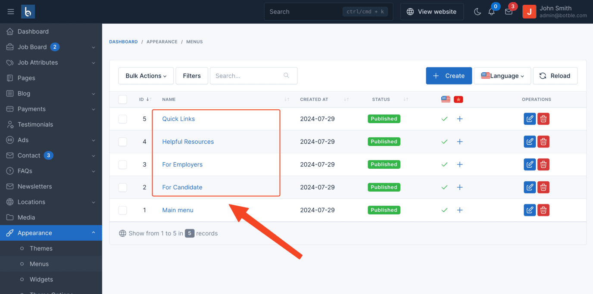
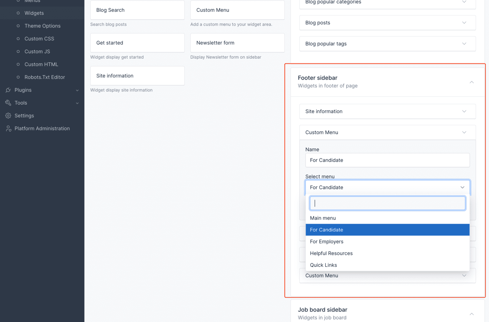

# Menu

## Main menu

Change it in Admin -> Appearance -> Menus -> Main menu:

Drag and drop to change menu position.

To translate menu

## Footer menus

Go to Admin -> Appearance -> Menus (modify menu Company, For Jobs, For Candidates, Support)

You can change or remove those menus from footer in Admin -> Appearance -> Widgets.

