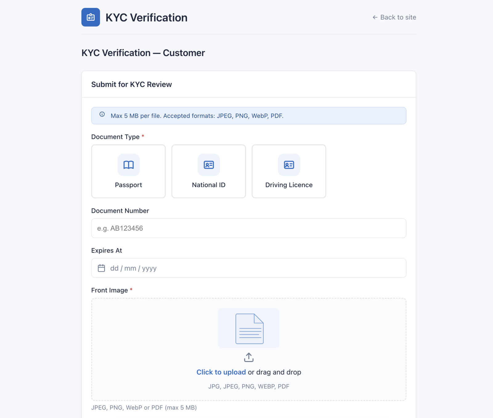
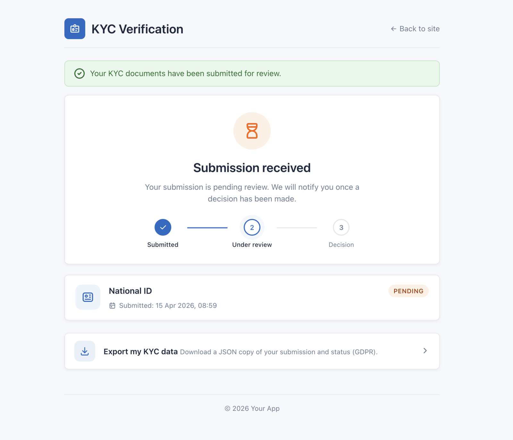

# Ecommerce Integration (Customer KYC)

This guide applies to any Botble ecommerce script that uses `plugins/ecommerce` **without** `plugins/marketplace` — for example **Shofy**, **Nest**, **Farmart**, **Isak**, **Qore**, etc.

The plugin ships a **plugin-owned standalone UI**. There are no theme views to copy and no layout to override. Integration is **one link** on your theme's customer dashboard plus an optional middleware on checkout.



## Prerequisites

- `plugins/ecommerce` installed and active
- `plugins/kyc` installed and active (`php artisan cms:plugin:activate kyc`)

## Step 1 — Enable customer KYC

In **Admin → KYC Verification → Settings**:

- **Enable customer KYC** → `ON`
- **Required for checkout** (optional) → `ON` if you want the middleware to block checkout until the customer has an approved submission
- **Admin notification email** → defaults to your system admin email if blank
- **Customer dashboard URL** → the URL of your theme's account/dashboard page (used as CTA in approval emails)

On save, the plugin registers an Eloquent macro on `Botble\Ecommerce\Models\Customer`. **No host-plugin or theme file is modified.**

## Step 2 — Add a dashboard link (one line)

Open your theme's customer dashboard view — the page that lists "My Orders", "My Addresses", etc. Typically at `platform/themes/{theme}/views/ecommerce/customers/dashboard.blade.php` or similar.

Add:

```blade
@if (setting('kyc_customer_enabled'))
    <a href="{{ route('kyc.submission.index', ['subjectKey' => 'customer']) }}">
        {{ trans('plugins/kyc::kyc.title') }}
    </a>
@endif
```

That's it. Clicking the link opens the plugin's own submission page rendered in the standalone layout.

Optional: show a status badge next to the customer's name:

```blade
{!! auth('customer')->user()?->kycStatusBadge('customer') !!}
```

The badge returns a Tabler `bg-{color} text-{color}-fg` span from `KycStatusEnum::toHtml()`.

## Step 3 — Gate checkout (optional)

To block checkout for customers without an approved KYC submission, wrap your checkout route with the `kyc.required` middleware:

```php
// In your theme's routes/web.php (or wherever your checkout route is registered)
Route::middleware(['kyc.required:customer:checkout'])->group(function () {
    Route::post('checkout', [CheckoutController::class, 'process'])->name('public.checkout.process');
});
```

The middleware:

1. Checks `kyc_customer_enabled` setting → if OFF, passes through
2. Checks `kyc_customer_required_for_checkout` setting → if OFF, passes through
3. Checks authenticated customer's `hasApprovedKyc('customer')` → if true, passes through
4. Otherwise redirects to the KYC submission page with an error flash

See [Checkout & Listing Gates](./gates.md) for a full middleware reference.

## Customer flow

1. Customer logs in, opens the dashboard, clicks **Verify your identity**.
2. Lands on the plugin-owned submission form (Tabler chrome, applied `kyc_form_style`).
3. Picks a document type (passport / national ID / driving licence), uploads front/back/selfie, accepts terms, submits.
4. The plugin:
   - Saves files to `storage/app/private/kyc/{subject_hash}/{token}` with no extension
   - Inserts a `kyc_submissions` row with status `pending`
   - Emails the admin notification address
   - Shows the customer an **Under review** status page
5. Admin reviews in **Admin → KYC Verification → Submissions**, approves or rejects with a note.
6. Customer receives an email:
   - **Approved** → dashboard link CTA
   - **Rejected** → resubmit link + the review note
7. After 3 rejections the customer is automatically locked until an admin unlocks them.



## Retention

- Rejected submissions are deleted (row + files) after 7 days (configurable).
- Approved submissions keep their row forever but files are purged after 7 days (configurable).

Configure via **Admin → KYC Verification → Settings**. See [Retention & Expiry](../usage/retention.md).

## GDPR self-service export

Customers can download a JSON export of their own KYC data via the route `kyc.submission.export`. Rate limited to 10 requests per hour.

```blade
<a href="{{ route('kyc.submission.export', ['subjectKey' => 'customer']) }}">
    {{ trans('plugins/kyc::kyc.export_my_data') }}
</a>
```

See [GDPR Data Export](./gdpr-export.md).

## What this plugin does NOT modify

- `plugins/ecommerce/src/Models/Customer.php` — untouched
- Your theme's views — untouched except for the one `<a>` tag above
- Any Laravel core config — untouched

All integration is via Eloquent macros registered at runtime in the plugin service provider. You can upgrade `plugins/ecommerce` or your theme freely without breaking KYC.

## Troubleshooting

- **"KYC Verification link doesn't appear"** — verify `kyc_customer_enabled` is ON and the `Ecommerce\Customer` model is loaded. Clear config cache: `php artisan config:clear`.
- **"Signed URL 403"** — signed URLs expire after 15 minutes. The customer must be logged in when clicking; if they refresh the detail page the URLs are rotated automatically.
- **"File uploads fail validation"** — allowed MIME types are JPEG, PNG, WebP, PDF. Max 5 MB per file. Configurable via `config/kyc.php`.

## Next step

- [Marketplace Integration](./marketplace.md) — if you also run `plugins/marketplace`
- [Checkout & Listing Gates](./gates.md) — middleware reference
- [Theme Integration](./theme.md) — optional customisations
