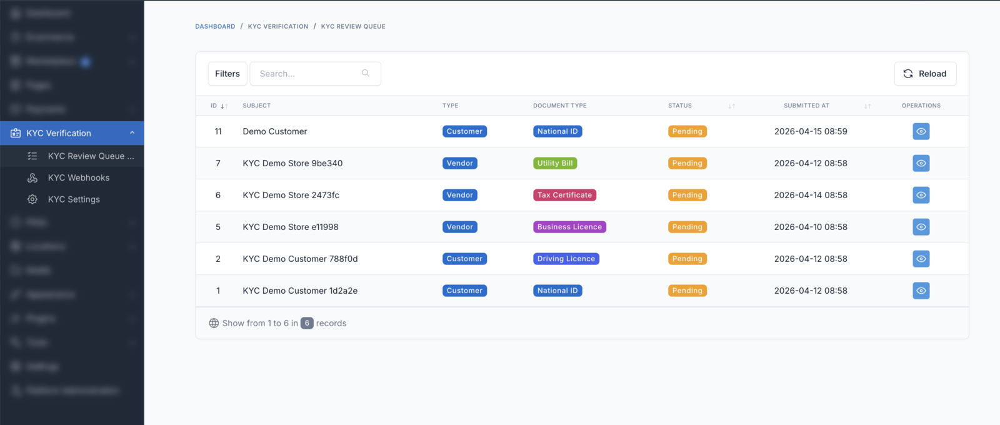
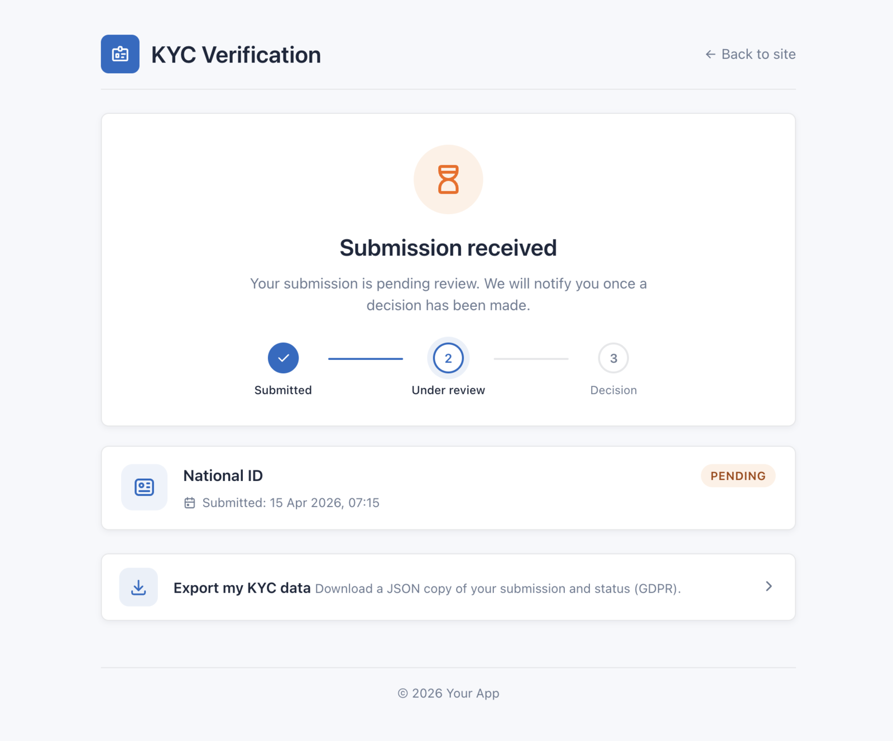

# Review Queue

The **review queue** is the central place where admins see every submission, filter by status or subject type, and drill into individual cases.

## Open the queue

Go to **Admin → KYC Verification → Submissions**.

Requires permission: `kyc.submissions.view`.

## Filters

The top bar exposes two filters, both applied server-side via Botble's DataTables engine:

| Filter | Options |
|---|---|
| **Status** | `Pending`, `Approved`, `Rejected`, `Expired` |
| **Subject type** | `Customer`, `Vendor`, or All |

Combine them — e.g. `Status=Pending` + `Subject type=Vendor` to focus on vendor business verification waiting for you.

## Columns

| Column | What it shows |
|---|---|
| **ID** | Submission primary key — click to open the detail page |
| **Subject** | Name of the customer (for customer KYC) or store (for vendor KYC) |
| **Type** | `Customer` or `Vendor` |
| **Document type** | Passport, National ID, Business Licence, etc. (coloured badge) |
| **Status** | Pending / Approved / Rejected / Expired (coloured badge) |
| **Submitted at** | Human-readable timestamp |
| **Actions** | View, Approve, Reject, Unverify, Unlock (shown per permission) |

Each row respects the admin's permission set — if a role lacks `kyc.submissions.approve`, the Approve button is hidden.

## Sorting & search

- **Sort** any column by clicking the header.
- **Search** uses the Botble DataTables search box — matches against subject name and document type.
- Pagination is controlled via the page-size dropdown.

## Bulk operations

The queue deliberately does **not** expose bulk approve / bulk reject. Every approval is a compliance action and must be reviewed case by case.

## Submission detail page

Click any row to open the [submission detail view](./approve-reject.md) where you see the uploaded files, the full review history, and the approve / reject / unverify / unlock buttons.

## Performance

The queue uses Botble's server-side DataTables. Tested at 10,000 submissions with p95 page render under 500 ms on a 1-core VPS. Indexes are added on `status`, `verifiable_type`, and `verifiable_id` to keep filter/sort performant.

## Next step

- [Approve & Reject](./approve-reject.md) — the detail page actions
- [Lockout & Unlock](./lockout.md) — how auto-lock works
