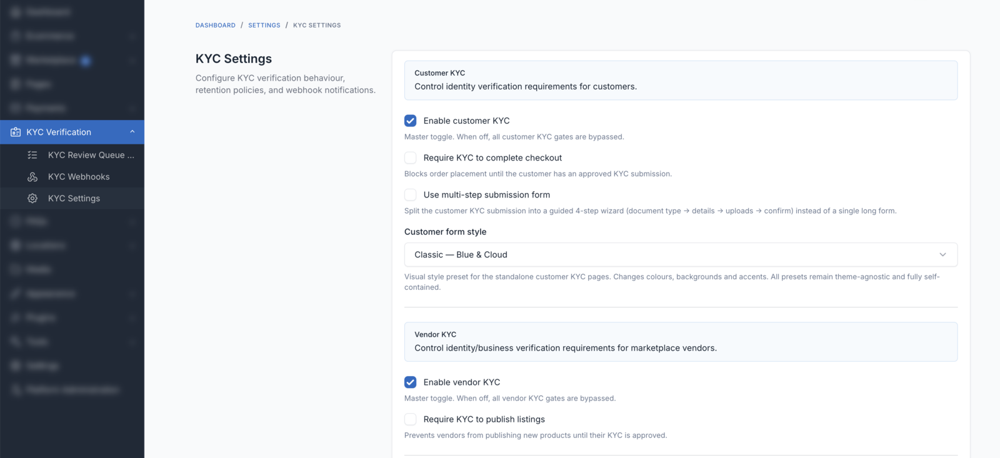

# Settings Reference

All settings live under **Admin → KYC Verification → Settings**. They are stored in the Botble `settings` table and can be overridden via environment variables or the `setting()` helper.



## Scope toggles

| Key | Type | Default | Description |
|---|---|---|---|
| `kyc_customer_enabled` | bool | `false` | Master switch for the **customer** scope (buyer identity). When OFF, customer routes abort 404. |
| `kyc_vendor_enabled` | bool | `false` | Master switch for the **vendor** scope (seller business verification). Requires `plugins/marketplace`. When OFF, vendor routes abort 404. |

## Gates

| Key | Type | Default | Description |
|---|---|---|---|
| `kyc_customer_required_for_checkout` | bool | `false` | When ON and `kyc_customer_enabled=ON`, the `kyc.required:customer:checkout` middleware blocks checkout POST until the customer has an approved submission. |
| `kyc_vendor_required_for_listing` | bool | `false` | When ON and `kyc_vendor_enabled=ON`, the `kyc.required:vendor:listing` middleware blocks the vendor "publish product" route until the store has an approved submission. |

## Retention & lockout

| Key | Type | Default | Range | Description |
|---|---|---|---|---|
| `kyc_rejected_retention_days` | int | `7` | 1–365 | Days after which a **rejected** submission's row AND files are deleted. |
| `kyc_approved_file_retention_days` | int | `7` | 1–365 | Days after which an **approved** submission's files are deleted (the row stays as an audit trail). |
| `kyc_max_rejections_before_lock` | int | `3` | 1–10 | Number of rejections that triggers auto-lock for the subject. |

## Notifications

| Key | Type | Default | Description |
|---|---|---|---|
| `kyc_contact_email` | string (email) | — | Email that receives "New KYC submission" notifications. If blank, the system admin email is used. |
| `kyc_dashboard_link_url` | string (URL) | — | URL to the customer/vendor account dashboard. Used as the CTA link in approval/rejection emails. |

## Form appearance

| Key | Type | Default | Values | Description |
|---|---|---|---|---|
| `kyc_use_multi_step_form` | bool | `false` | 0/1 | Toggle 3-step wizard vs single-page form. |
| `kyc_form_style` | string | `classic` | `classic`, `emerald`, `violet`, `sunset`, `minimal`, `midnight` | Visual preset applied to the customer-facing layout. |

## Webhooks

Outgoing webhooks are managed as records in the `bb_kyc_webhooks` table, not as settings. Go to **Admin → KYC Verification → Webhooks** to create, edit, test, enable/disable, and delete endpoints. Each endpoint has its own URL, HMAC signing secret, and event subscription list (`kyc.submitted`, `kyc.approved`, `kyc.rejected`, `kyc.expired`).

See [Webhook Schema](../developer/webhooks.md) for the payload format and signature verification reference.

## `config/kyc.php` — non-UI overrides

A few technical knobs live in the plugin's config file (not the admin UI). Edit `config/kyc.php` on disk or publish it via `php artisan vendor:publish --tag=config`:

```php
return [
    'storage' => [
        'directory'              => 'private/kyc',
        'disk'                   => 'local',
        'signed_url_ttl_minutes' => 15,
    ],

    'mime_types' => [
        'image/jpeg',
        'image/png',
        'image/webp',
        'application/pdf',
    ],

    'max_file_size_kb' => 5120, // 5 MB per file

    'rate_limit' => [
        'submission' => '5,60',   // 5 POSTs per minute
        'file_serve' => '60,1',   // 60 file fetches per minute
    ],
];
```

::: warning
Do not lower `signed_url_ttl_minutes` below 5 or customers may hit 403s while navigating between the submission detail and file previews.
:::

## Next step

- [Review Queue](./review-queue.md) — how to triage submissions day-to-day
- [Permissions](./permissions.md) — delegate admin actions to specific roles
