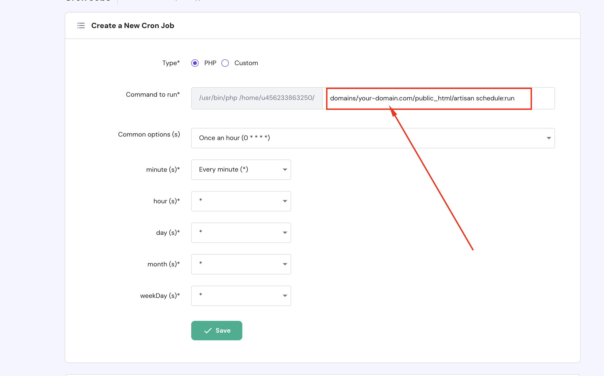

# Setup cronjob

Command:

```bash
* * * * * /usr/local/bin/php /path-to-your-project/artisan schedule:run >> /dev/null 2>&1
```

Check our Cronjob set up instruction in Admin -> Platform administration -> Cronjob.

## Available Commands

The scheduler will run these License Manager commands automatically:

| Command | Frequency | Purpose |
|---------|-----------|---------|
| `process-expirations` | Daily | Check and notify expirations |
| `process-auto-blacklist` | Hourly | Block abusive clients |
| `activity-log:clear` | Monthly | Cleanup old logs |
| `download-log:clear` | Quarterly | Cleanup download history |

## For cPanel hosting

For setting up a cron job in cPanel, watch this video tutorial:

<iframe width="100%" height="400" src="https://www.youtube.com/embed/t5mjWGegE-g" title="YouTube video player" frameborder="0" allow="accelerometer; autoplay; clipboard-write; encrypted-media; gyroscope; picture-in-picture; web-share" allowfullscreen></iframe>

## For Hostinger.com

* Go to Dashboard -> Advanced -> Cron Jobs


If you have more than 1 domain on Hostinger, you need to select the domain you want to set up the cron job.



* Verify your cronjob is running or not.


## Manual Execution

You can also run commands manually:

```bash
# Process license expirations and send warnings
php artisan cms:license-manager:process-expirations

# Process auto-blacklist
php artisan cms:license-manager:process-auto-blacklist

# Clear activity logs
php artisan cms:license-manager:activity-log:clear

# Clear download logs
php artisan cms:license-manager:download-log:clear
```

## Via Admin Panel

Navigate to **License Manager → Manual Cron** to run commands manually:

1. Select command to run
2. Click **Run**
3. View output in interface
