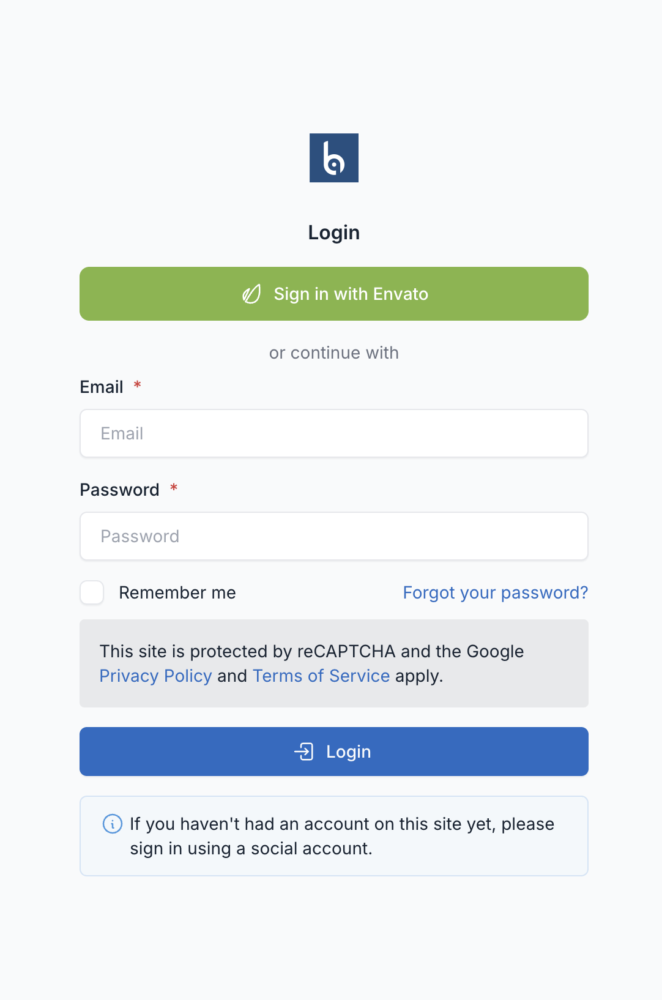

# Customers

Customers are the end users who purchase and use your licensed software. The License Manager provides both admin management and a self-service customer portal.

## Customer Accounts

Each customer has:

| Field | Description |
|-------|-------------|
| Name | Customer's display name |
| Email | Unique email address (login) |
| Password | Hashed authentication password |
| Client ID | Unique identifier for license associations |
| Avatar | Profile photo |
| Confirmed At | Email verification timestamp |
| Last Login | Most recent login time |

## Creating Customers

### Via Admin Panel

1. Navigate to **License Manager → Customers**
2. Click **Create**
3. Fill in details:
   - Name
   - Email (must be unique)
   - Password
   - Client ID (auto-generated if empty)
4. Click **Save**

### Via Self-Registration

If enabled, customers can register at `/customer/register`:

1. Customer fills registration form
2. Email verification sent (if enabled)
3. Account activated after confirmation

### Via Import

Customers can also be created through data import functionality in the admin panel.

## Client ID

The Client ID is a unique identifier used to:

- Associate licenses with customers
- Track activations across products
- Link orders from external systems

### Format

- Auto-generated: UUID format (e.g., `a1b2c3d4-e5f6-7890-abcd-ef1234567890`)
- Custom: Any unique string

### Usage in Licenses

When creating a license, set the `customer_id` field to the customer's Client ID:

```bash
POST /api/internal/product-licenses
{
  "product_reference_id": "PROD-001",
  "license_code": "LICENSE-KEY",
  "customer_id": "CUST-001",  // Links to customer
  "email": "john@example.com"
}
```

## Customer Portal

The customer portal allows self-service management at `/customer`.

### Features

| Feature | Path | Description |
|---------|------|-------------|
| Dashboard | `/customer/dashboard` | Overview of licenses |
| Licenses | `/customer/product-licenses` | View all licenses |
| Activations | `/customer/product-activations` | Manage activations |
| Settings | `/customer/settings` | Account settings |
| Logout | `/customer/logout` | End session |

### Portal Settings

These settings in **Settings → General** control what customers see and can do in the portal:

| Setting | Default | Description |
|---------|---------|-------------|
| Enable Licenses page | On | Show or hide the Licenses page in the customer portal |
| Enable Activations page | On | Show or hide the Activations page in the customer portal |
| Allow customers to deactivate activations | On | When disabled, only admins can deactivate activations |
| Get More Licenses URL | Empty | URL for the "Get More Licenses" button on the Licenses page. Leave empty to hide the button |

When a page is disabled, its sidebar link is hidden and direct URL access returns a 404 page.

### Dashboard

Shows:
- Total licenses owned
- Active vs expired licenses
- Recent activations
- Quick actions

### Managing Licenses

Customers can:
- View license details
- See expiration dates
- Check activation count
- Download license files

::: tip
Set the **Get More Licenses URL** in Settings → General to display a "Get More Licenses" button on this page, linking customers to your storefront or pricing page.
:::

### Managing Activations

Customers can:
- View all active installations
- See domain and IP details
- Deactivate installations (if permitted by admin)
- Free up parallel use slots

::: tip
To prevent customers from deactivating their own activations, disable **Allow customers to deactivate activations** in Settings → General. The deactivation button will be hidden and the endpoint will reject requests.
:::

### Account Settings

Customers can update:
- Name
- Email
- Password
- Avatar/profile photo

## Authentication

### Customer Login

Portal login at `/customer/login`:

1. Enter email and password
2. Optional: CAPTCHA verification
3. Redirect to dashboard

### Social Login

The customer portal supports social login for streamlined authentication. Customers can sign in using their existing social accounts instead of creating new credentials.



**Supported Providers:**

| Provider | Description |
|----------|-------------|
| Envato | Sign in with Envato account (ideal for Envato marketplace products) |
| Google | Google OAuth authentication |
| Facebook | Facebook login integration |
| GitHub | GitHub OAuth for developer-focused products |

**Benefits:**
- Faster onboarding - no password to remember
- Automatic account linking via email
- Reduced support tickets for password resets
- Seamless experience for Envato customers

**Envato Social Login:**

For products sold on Envato marketplace, Envato social login is highly recommended:
- Customers can sign in with the same account used to purchase
- Automatic verification of purchase ownership
- Streamlined license management

::: tip
If a customer hasn't registered yet, they can sign in using a social account to automatically create their portal account.
:::

### Password Reset

1. Click "Forgot Password" at login
2. Enter email address
3. Receive reset link via email
4. Set new password

### Security Options

Configure in Settings:
- **reCAPTCHA**: Google reCAPTCHA on forms
- **Math CAPTCHA**: Simple math verification

## Managing Customers

### Viewing Customer Details

1. Go to **Customers**
2. Click on a customer
3. View:
   - Basic information
   - Associated licenses
   - Activation history
   - Login history

### Editing Customers

1. Click **Edit** on customer row
2. Update fields
3. Save changes

### Deleting Customers

1. Click **Delete** on customer row
2. Confirm deletion

::: warning
Deleting a customer does not delete their licenses. Update license `customer_id` fields as needed.
:::

### Bulk Operations

From Customers list:
- **Delete**: Remove multiple customers

## Customer Statistics

Dashboard widgets show:
- Total customers
- New customers (recent)
- Top customers by licenses
- Customer growth over time

### Top Customers Report

View customers ranked by:
- Number of licenses
- Number of products
- Total activations

## Linking Customers to Licenses

### By Client ID

When customer registers or is created:
1. Note their `client_id`
2. Use this value in license `customer_id` field
3. Licenses appear in customer's portal

### By Email

Alternatively, match by email:
1. Customer email stored in license
2. Portal matches licenses by email
3. Works when client_id not set

## Email Notifications

Customers receive emails for:

- Account registration confirmation
- Password reset requests
- License expiration warnings (if enabled)
- License delivery (manual send)

## Best Practices

1. **Verify Emails**: Enable confirmation for new accounts
2. **Use Client IDs**: Consistent linking across systems
3. **Encourage Portal Use**: Reduces support burden
4. **Monitor Login Activity**: Detect suspicious access
5. **Clean Inactive Accounts**: Remove old unused accounts
6. **Secure Passwords**: Enforce strong password requirements
