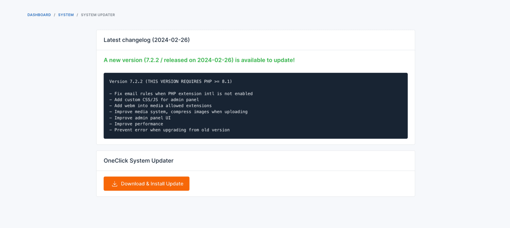
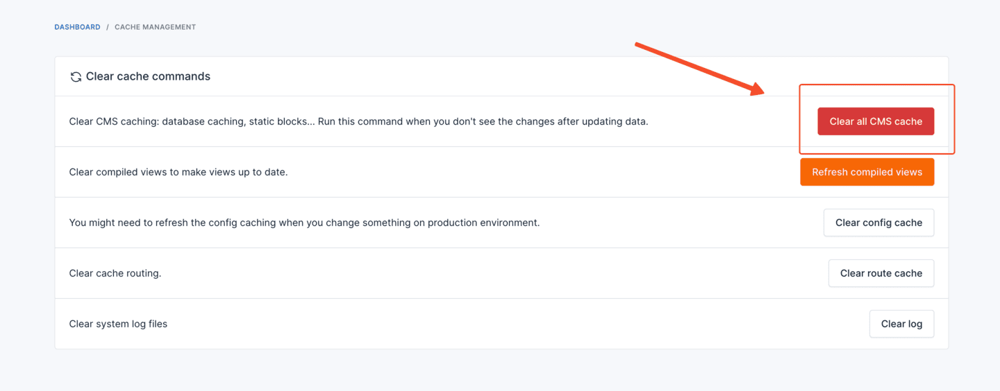
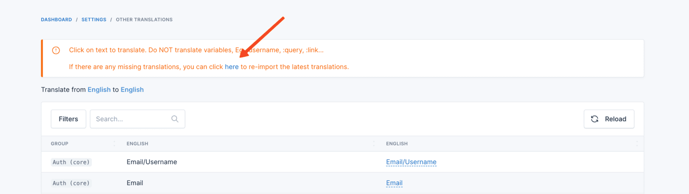

# Upgrade Guide

This guide will walk you through the process of upgrading License Manager. There are two ways to upgrade:

## Automatic Update

To update your product automatically, follow these steps:

1. Log in to your admin panel.
2. Go to `Platform Administration` -> `System Updater`.
3. If there is a new version available, you will see a `Download & Install Update` button. Click on it to start the
   automatic update process.

## Manual Update

This way is a bit more complex, but it gives you more control over the upgrade process. Here are the steps:

1. Download the latest version of the product from CodeCanyon.
2. Extract the downloaded file.
3. Upload the extracted files to your server, overwrite the following directories and files:
   * `app`
   * `database`
   * `config`
   * `platform`
   * `public/themes`
   * `public/vendor`
   * `bootstrap`
   * `vendor`
   * `composer.json`
   * `composer.lock`
   * `public/index.php`
4. Clear the cache by navigating to `Platform Administration` -> `Cache Management` and clicking on
   the `Clear all CMS cache` button.

   
5. Deactivate all plugins by going to `Plugins` -> `Installed Plugins`, and then activate them again.
6. Update the translations by going to `Settings` -> `Localization` -> `Other Translations` and click to the `here` link
   to update the translations.

   
