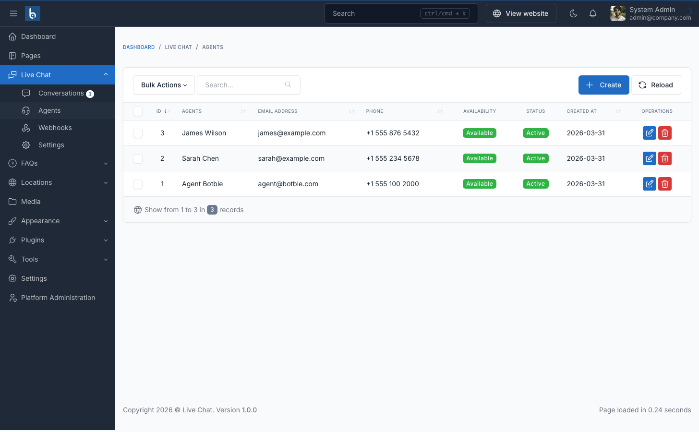

# Agent Management

Manage chat agents from **Admin → Live Chat → Agents**.

## Creating Agents

Click "Create" and fill in:

| Field | Required | Description |
|-------|----------|-------------|
| First Name | Yes | Agent's first name |
| Last Name | Yes | Agent's last name |
| Email | Yes | Login email (must be unique) |
| Password | Yes | Login password (min 8 characters) |
| Phone | No | Contact phone number |
| Active | — | Deactivated agents cannot log in |
| Available | — | Unavailable agents don't receive auto-assignments |

## Agent Statuses

| Status | Badge | Meaning |
|--------|-------|---------|
| Active + Available | Green "Available" | Agent can log in and receives auto-assignments |
| Active + Unavailable | Gray "Unavailable" | Agent can log in but won't receive auto-assignments |
| Inactive | Red "Inactive" | Agent cannot log in at all |

## Auto-assign

Enable in **Admin → Live Chat → Settings → Auto-assign Agent**.

When a visitor starts a new conversation:
1. System finds all agents where `is_active = true` AND `is_available = true`
2. Selects the agent with the fewest open conversations (round-robin)
3. Assigns that agent to the conversation automatically
4. If no agents are available, the conversation remains unassigned

Agents can also self-assign by clicking "Join" on any open conversation in their portal.

## Permissions

| Permission | Description |
|------------|-------------|
| `live-chat.agents.index` | View agent list |
| `live-chat.agents.create` | Create new agents |
| `live-chat.agents.edit` | Edit existing agents |
| `live-chat.agents.destroy` | Delete agents |
