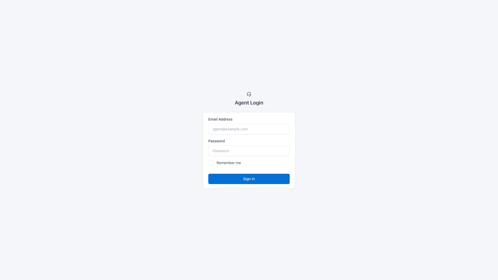
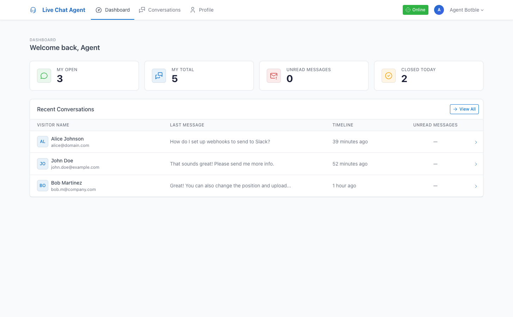
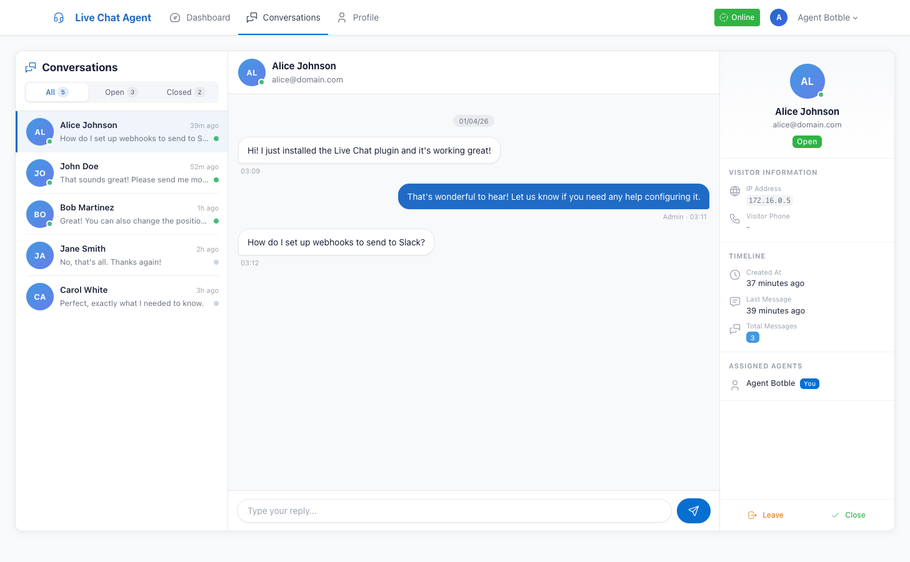
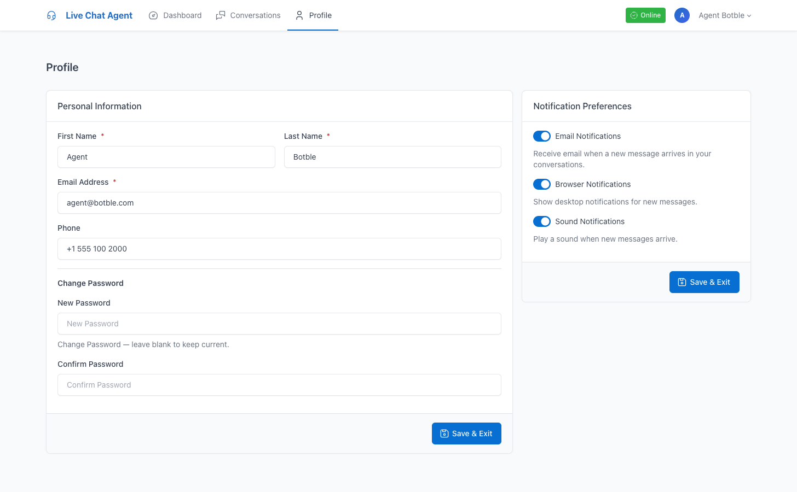

# Agent Portal

The Agent Portal is a dedicated interface for support agents, completely separate from the admin panel. Agents have their own accounts, login page, and workspace.

## Access

| URL | Description |
|-----|-------------|
| `/agent/login` | Agent login page |
| `/agent/dashboard` | Dashboard with stats |
| `/agent/conversations` | Messenger for assigned conversations |
| `/agent/profile` | Profile and notification settings |

## Dashboard

After login, agents see their personal dashboard with:

- **My Open** — Number of open conversations assigned to them
- **My Total** — Total conversations (open + closed) assigned
- **Unread Messages** — Unread visitor messages in assigned conversations
- **Closed Today** — Conversations closed today

Below the stats, a list of recent open conversations with unread counts and quick links.

## Messenger

The agent messenger uses the same 3-panel layout as the admin messenger, but scoped to assigned conversations only.

### Actions

- **Join** — Self-assign to any open conversation
- **Leave** — Remove yourself from a conversation (with confirmation)
- **Reply** — Send messages to visitors
- **Close** — Close a conversation (with confirmation)
- **Browse Available** — View unassigned open conversations and join them

### Filters

- **All** — All assigned conversations
- **Open** — Only open conversations
- **Closed** — Only closed conversations

## Profile & Notifications

Agents can update:

- First name, last name, email, phone
- Password (optional — leave blank to keep current)

### Notification Preferences

Each agent independently controls:

| Setting | Effect |
|---------|--------|
| Email Notifications | Receive email when visitors send messages in assigned conversations |
| Browser Notifications | Desktop notification popups for new messages |
| Sound Notifications | Play a sound when new messages arrive |

## Availability

The navbar shows an **Online/Offline** toggle button. When set to offline:
- Agent won't receive auto-assigned conversations
- Existing assignments are not affected
