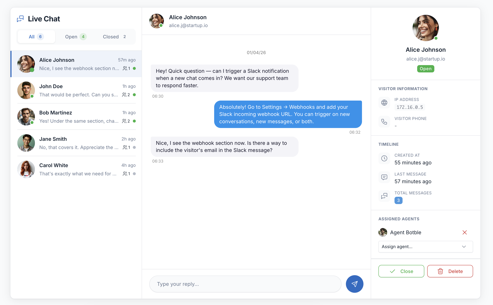

# Conversations

Manage visitor conversations at **Admin → Live Chat → Conversations**.

## Messenger Interface

The conversations page uses a three-panel messenger layout:

- **Left sidebar** — Conversation list with filter tabs (All / Open / Closed), unread badges, and last message preview
- **Center panel** — Chat messages with reply input, close and date dividers
- **Right panel** — Visitor information, timeline, and delete action

Click a conversation in the sidebar to load it. On mobile, the sidebar and chat panel switch views with a back button.

## Replying

Type your message in the input at the bottom of the chat panel and press **Enter** or click the send button. Messages appear instantly for both you and the visitor.

## Closing Conversations

Click the **Close** button in the chat header. Closed conversations:
- Move to the "Closed" filter tab
- No longer accept replies
- Show a "This conversation is closed" banner

## Deleting Conversations

Click **Delete Conversation** in the right info panel. This permanently removes the conversation and all its messages.

## Real-time Updates

The admin panel polls for updates every 5 seconds:
- New conversations appear in the sidebar automatically
- New visitor messages appear in the active chat
- Unread badges update on sidebar items
- Browser notifications fire for new messages (when tab is not focused)

### Browser Notifications

Click the bell icon in the sidebar header to enable desktop notifications. When enabled:
- A notification popup appears for new messages from conversations you're not viewing
- A sound plays for new activity
- The page title blinks with unread count when the tab is not focused

## URL Auto-linking

URLs in messages (both visitor and admin) are automatically converted to clickable links that open in a new tab.

## Convert to Support Ticket

When [DeskHive](https://codecanyon.net/item/deskhive/62441260) (Support Desk plugin) is installed and active, a **Convert to Ticket** button appears in the info panel. Click it to create a DeskHive support ticket from the conversation. See [DeskHive Integration](/live-chat/deskhive-integration) for details.

## Visitor Information

The right panel shows:

| Field | Description |
|-------|-------------|
| Name | Visitor's name (always collected) |
| Email | If email field was enabled |
| Phone | If phone field was enabled |
| IP Address | Visitor's IP |
| Current Page | The page where the visitor started the chat |
| Browser | Detected from user agent (Chrome, Firefox, Safari, Edge) |
| Device | Desktop, Mobile, or Tablet |
| Created At | When the conversation started |
| Last Message | When the last message was sent |
| Total Messages | Message count for the conversation |
