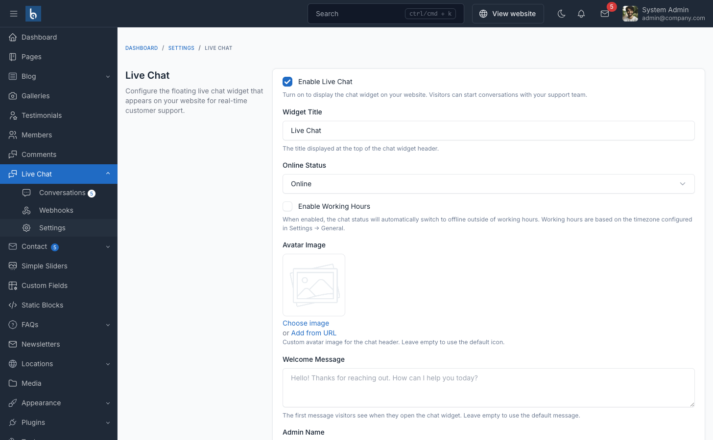

# Settings

Configure the Live Chat plugin at **Admin → Live Chat → Settings**.

## Widget Settings

### Enable/Disable

Toggle the chat widget on or off. When disabled, the widget does not render on any frontend page.

### Widget Title

The title displayed in the chat window header. Defaults to "Live Chat".

### Online Status

Manually set the chat status to Online or Offline. When offline, the widget shows an "Offline" indicator. Visitors can still start conversations.

### Welcome Message

The first message automatically shown when a visitor opens a new chat. Leave empty to use the default: "Hello! Thanks for reaching out. How can I help you today?"

### Admin Name

The name displayed for admin replies. Defaults to "Support". Can be overridden per-conversation by the random admin names feature.

## Visitor Form Fields

### Display Fields

Choose which optional fields to show on the chat start form:
- **Email** — Email address input
- **Phone** — Phone number input

The **Name** field is always shown and required.

### Mandatory Fields

Choose which of the displayed fields are required before a visitor can start chatting. Only fields that are displayed can be made mandatory.

## Appearance

### Colors

- **Primary Color** — Used for the chat button, header, and visitor message bubbles
- **Hover Color** — Applied when hovering over the chat button

### Avatar Image

Upload a custom image for the chat header. When empty, a default user icon is shown.

### Position

Place the widget at one of four screen positions:
- Bottom Right (default)
- Bottom Left
- Center Right
- Center Left

### Offset

Adjust horizontal (X) and vertical (Y) pixel offset from the screen edge. Default is 20px for both.

### Mobile Display

- **Always show** — Widget appears on all devices
- **Hide on mobile** — Widget hidden on screens ≤768px wide

## Visual Effects

### Link Preview

When enabled, URLs shared in messages show a rich preview card with title, description, and image. Enabled by default.

### Pulse Animation

Shows a pulsing ring animation around the chat button to attract visitor attention. Enabled by default.

### Backdrop Blur

Displays a blurred overlay behind the chat window when it is open. Enabled by default.

### Emoji Conversion

Automatically converts text emoticons to Unicode emoji in chat messages. Enabled by default.

Supported emoticons:

| Text | Emoji | Text | Emoji |
|------|-------|------|-------|
| `:)` | 🙂 | `:(` | 🙁 |
| `:D` | 😄 | `;)` | 😉 |
| `:P` | 😛 | `:/` | 😕 |
| `B)` | 😎 | `<3` | ❤️ |
| `XD` | 😆 | `:'(` | 😢 |

Named emoji codes are also supported: `:fire:` `:heart:` `:thumbsup:` `:rocket:` `:star:` `:wave:` `:100:` `:eyes:` `:pray:` `:clap:` `:check:` `:thumbsdown:`

::: tip
Emoticons are only converted when surrounded by spaces (or at the start/end of a message), so URLs and code won't be affected.
:::

## Polling Interval

Controls how frequently the frontend checks for new messages, in milliseconds.

| Value | Use Case |
|-------|----------|
| 2000–3000ms | Small sites, fast response needed |
| 3000–5000ms | Balanced (default: 3000) |
| 5000–10000ms | High-traffic sites |

::: warning
Values below 2000ms are not recommended as they significantly increase server load.
:::
