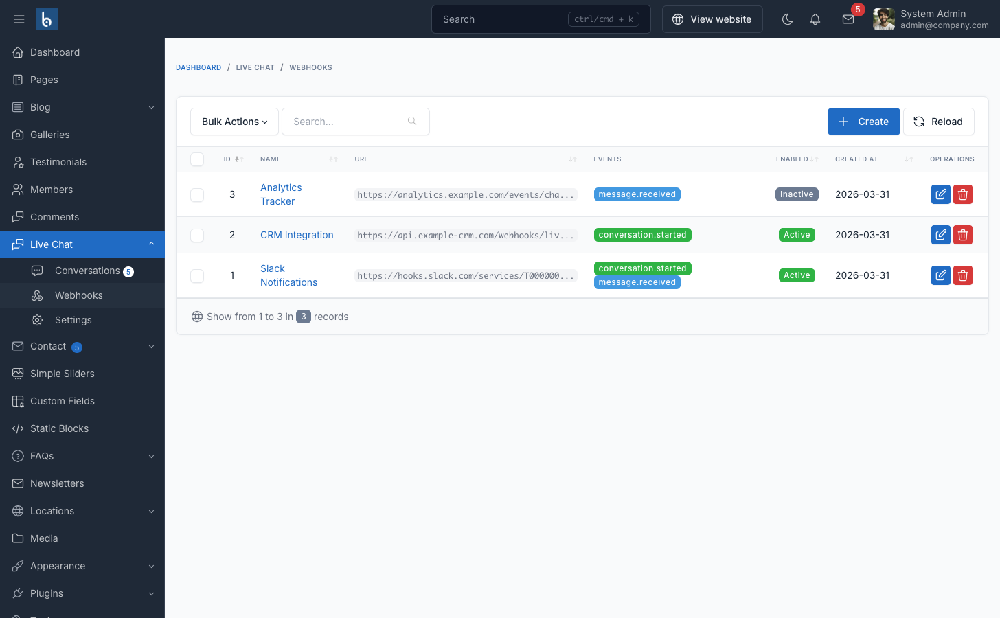

# Webhooks

Send real-time notifications to external services when chat events occur. Manage webhooks at **Admin → Live Chat → Webhooks**.



## Creating a Webhook

1. Go to **Admin → Live Chat → Webhooks**
2. Click **Create**
3. Fill in the form:

| Field | Description |
|-------|-------------|
| Name | Label for this webhook (e.g., "Slack Notifications") |
| URL | HTTPS endpoint that receives POST requests |
| Secret | Optional HMAC-SHA256 signing key |
| Events | Which events trigger this webhook |
| Enabled | Toggle on/off without deleting |

4. Click **Save**

## Events

| Event | Trigger |
|-------|---------|
| `message.received` | A visitor sends a new message |
| `conversation.started` | A visitor starts a new conversation |

You can subscribe to one or both events per webhook. Multiple webhooks can listen to the same event.

## Payload Format

All webhooks receive an HTTP POST with JSON body:

### conversation.started

```json
{
  "event": "conversation.started",
  "timestamp": "2025-01-15T10:30:00+00:00",
  "data": {
    "conversation_id": 123,
    "visitor_name": "John Doe",
    "visitor_email": "john@example.com",
    "visitor_phone": "+1234567890",
    "visitor_ip": "192.168.1.100",
    "current_url": "https://example.com/products",
    "status": "open",
    "created_at": "2025-01-15T10:30:00+00:00"
  }
}
```

### message.received

```json
{
  "event": "message.received",
  "timestamp": "2025-01-15T10:31:00+00:00",
  "data": {
    "message_id": 456,
    "content": "Hello, I need help with my order.",
    "is_from_admin": false,
    "admin_name": null,
    "conversation_id": 123,
    "visitor_name": "John Doe",
    "visitor_email": "john@example.com",
    "visitor_phone": "+1234567890",
    "visitor_ip": "192.168.1.100",
    "current_url": "https://example.com/products",
    "status": "open",
    "created_at": "2025-01-15T10:31:00+00:00"
  }
}
```

## HTTP Headers

Every webhook request includes:

| Header | Description |
|--------|-------------|
| `Content-Type` | `application/json` |
| `X-Webhook-Event` | Event type (e.g., `message.received`) |
| `X-Webhook-Timestamp` | ISO 8601 timestamp |
| `X-Webhook-Signature` | HMAC-SHA256 signature (only if secret is set) |
| `X-Webhook-Test` | `true` (only for test requests) |

## Signature Verification

When a webhook has a **Secret** configured, every payload is signed. To verify:

```php
$payload = file_get_contents('php://input');
$signature = $_SERVER['HTTP_X_WEBHOOK_SIGNATURE'];
$secret = 'your-webhook-secret';

$expected = hash_hmac('sha256', $payload, $secret);

if (hash_equals($expected, $signature)) {
    // Valid signature
}
```

```javascript
const crypto = require('crypto');

function verifySignature(payload, signature, secret) {
    const expected = crypto
        .createHmac('sha256', secret)
        .update(payload)
        .digest('hex');
    return crypto.timingSafeEqual(
        Buffer.from(expected),
        Buffer.from(signature)
    );
}
```

## Endpoint Requirements

Your webhook endpoint must:
- Accept HTTP POST requests
- Respond within 10 seconds (timeout limit)
- Return HTTP 2xx status code for success
- Be publicly accessible over HTTPS

## Testing

Use the **Test** action from the webhooks list to send a test payload to your endpoint. Test requests include the `X-Webhook-Test: true` header.

## Integration Examples

| Service | How to Connect |
|---------|---------------|
| **Slack** | Create an [Incoming Webhook](https://api.slack.com/messaging/webhooks) and use the URL |
| **Discord** | Create a [Webhook](https://support.discord.com/hc/en-us/articles/228383668) in channel settings |
| **n8n** | Use a [Webhook Node](https://docs.n8n.io/integrations/builtin/core-nodes/n8n-nodes-base.webhook/) as trigger |
| **Zapier** | Use [Webhooks by Zapier](https://zapier.com/apps/webhook/integrations) as trigger |
| **Make** | Use the [Webhooks Module](https://www.make.com/en/help/tools/webhooks) |
